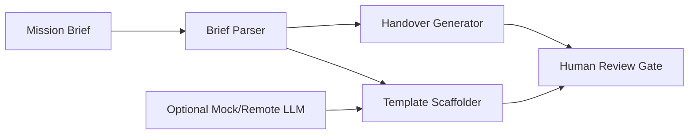

# Architecture

## Packages
- `packages/parser`: Markdown brief to Zod-validated JSON.
- `packages/scaffolder`: template registry, rendering, dry-run tree, approve-gated writes.
- `packages/handover-gen`: mandatory docs and `.env.example`.
- `packages/llm`: mock-first service interface with optional provider placeholders.
- `packages/orchestrator`: package-level facade for future agent orchestration.
- `packages/mcp-server`: POC manifest stub for template tools.
- `apps/cli`: command-line interface.
