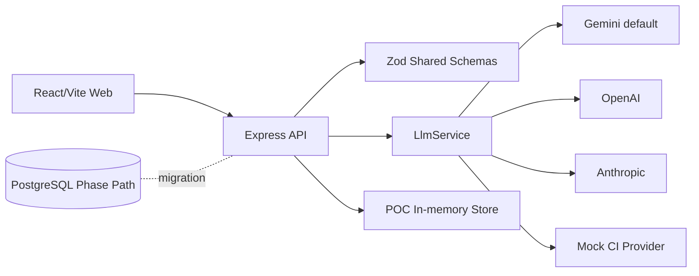

# Iceberg X Intelligence Layer POC

Standalone M1 proof of concept for turning R&D mission ideas into structured, evidence-backed, reviewable and handover-ready work.

## What Is Included

- AI Mission Generator with Zod structured output.
- Evidence Vault for claim/source/reliability tracking.
- Intern Submission Tracker with deliverable checklist.
- Mentor AI Review Assistant with mandatory human review gate.
- Demo Readiness Score with transparent weighted breakdown.
- Handover Checklist Generator that exports markdown content.
- Mock auth role switcher for admin, intern, mentor and leadership.
- CI-ready tests with `LLM_PROVIDER=mock`.

Zoom is intentionally not part of M1.

## Quick Start

```bash
npm install
LLM_PROVIDER=mock npm run dev
```

Open:

- Web: http://localhost:5173
- API: http://localhost:3001/api/health

Docker:

```bash
cp .env.example .env
docker compose up
```

## Environment

Local default is Gemini:

```bash
LLM_PROVIDER=gemini
LLM_MODEL=gemini-2.0-flash
GEMINI_API_KEY=
```

CI and tests must use:

```bash
LLM_PROVIDER=mock
```

Other supported providers: `openai`, `anthropic`.

## Scripts

```bash
npm run lint
npm run typecheck
npm run test -- --coverage
npm run build
```

## Demo Flow

1. Admin generates a mission draft from a rough idea.
2. Admin saves the mission.
3. Intern adds evidence with reliability labels.
4. Intern submits repo/demo links and checklist.
5. Mentor generates AI review, edits it and publishes it.
6. Leadership sees readiness score and dashboard metrics.
7. Mentor/admin generates a handover markdown package.

## Architecture



## API Highlights

- `GET /api/health`
- `POST /api/missions/generate`
- `GET/POST/PATCH/DELETE /api/missions`
- `GET/POST /api/missions/:id/evidence`
- `POST /api/missions/:id/submissions`
- `POST /api/submissions/:id/ai-review`
- `GET /api/missions/:id/readiness`
- `POST /api/missions/:id/handover/generate`
- `GET /api/ai-runs`

## Demo Users

Mock auth is header-based:

```bash
x-user-role: admin | mentor | intern | leadership
```

The web app exposes this as a role selector.
