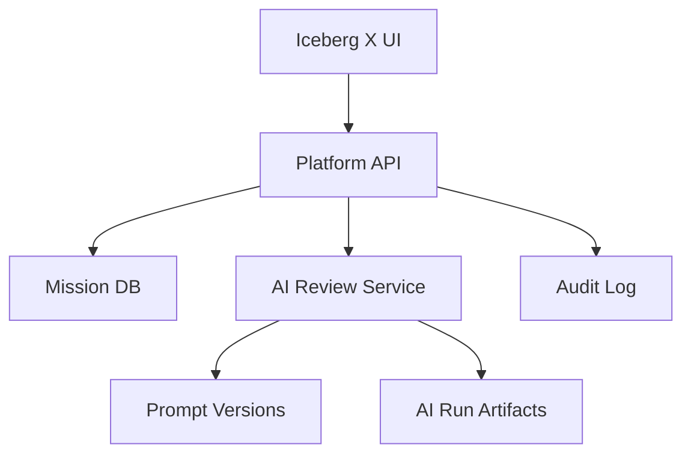

# Iceberg X Platform Improvement — Implementation Prompt

## Bağlam

Iceberg X, R&D mission'larını, intern görevlerini, mentor atamalarını, fikirleri, ilerlemeyi ve proje çıktılarını yöneten internal platformdur. Bu mission'ın hedefi yalnızca UI fikri üretmek değil; admin, mentor, intern ve leadership workflow'larını analiz edip çalışan bir POC ile platformu daha görünür, ölçülebilir ve AI-assisted hale getirmektir.

Ortak araştırma referansı: `SHARED_RESEARCH_REPORT.md`. Özellikle OpenProject, Plane, Taiga, Kanboard, LangGraph, OpenAI Agents SDK ve MCP bulgularını kullan.

## Hedef Ürün

**Iceberg X Intelligence Layer**: mission progress dashboard + submission tracker + AI project review assistant + mentor workload view. Etkileyici demo, tek mission'ın lifecycle'ını uçtan uca göstermeli: mission yaratılır, intern atanır, submission gelir, AI review draft üretir, mentor onaylar, leadership dashboard güncellenir.

## Kapsam

### In Scope

- Platform audit metodolojisi ve rol bazlı pain point matrisi.
- Mission progress dashboard.
- Intern submission tracker.
- AI review assistant POC.
- Mentor workload view.
- Handover-ready teknik proposal.

### Out of Scope

- Mevcut production Iceberg X veritabanına doğrudan migration.
- Tam Slack/SSO entegrasyonu.
- AI kararlarının otomatik final değerlendirme olarak uygulanması.

## Platform Audit Metodolojisi

Interview soruları:

- Admin: Mission nasıl açılıyor, kim onaylıyor, takibi nerede kopuyor?
- Mentor: Hangi submission'lar review bekliyor, context nereden bulunuyor?
- Intern: Başarı kriteri, teslim formatı ve next step net mi?
- Leadership: Hangi mission'lar riskte, hangi çıktı dev team'e devredilebilir?

Heuristic checklist:

- Role-based dashboard var mı?
- Mission status ve due date görünür mü?
- Submission artifact'leri tek yerde mi?
- Review decision audit trail var mı?
- Demo/repo/doc linkleri zorunlu ve doğrulanabilir mi?
- AI output human review ile ayrılmış mı?

## Pain Point Hypothesis Matrix

| Rol | Hipotez | POC karşılığı |
|---|---|---|
| Admin | Mission çok, durum görünürlüğü düşük | Portfolio progress dashboard |
| Mentor | Review queue dağınık | Submission tracker + review queue |
| Intern | Deliverable beklentisi belirsiz | Mission checklist + submission template |
| Leadership | Handover kalitesi değişken | AI-assisted evaluation + readiness score |

## Mimari



## Tech Stack

- Frontend: mevcut Iceberg X stack bilinmiyorsa React + TypeScript POC; Laravel Blade/Vue kullanılıyorsa local pattern'e uy.
- Backend: Laravel veya Node/Express POC; production path için mevcut Iceberg backend tercih edilmeli.
- AI: OpenAI Agents SDK veya direct structured output service. Basit POC için direct provider call daha hızlıdır.
- DB: PostgreSQL/MySQL compatible schema.
- Queue: review summary generation için async job.

## Data Model

```text
missions(id, title, description, category, difficulty, status, owner_id, due_at)
mission_assignments(id, mission_id, intern_id, mentor_id, role, status)
submissions(id, mission_id, intern_id, type, url, notes, submitted_at, status)
reviews(id, submission_id, mentor_id, decision, score, feedback, reviewed_at)
ai_runs(id, target_type, target_id, prompt_version_id, status, model, created_by)
ai_run_artifacts(id, ai_run_id, artifact_type, json_payload, confidence)
badges(id, key, name, criteria_json)
user_badges(id, user_id, badge_id, awarded_at, evidence_url)
```

## API Spesifikasyonu

- `GET /api/x/dashboard/overview`: role-based summary.
- `GET /api/x/missions?status=&mentor=&risk=`: mission list/filter.
- `POST /api/x/missions`: mission create.
- `GET /api/x/submissions/review-queue`: mentor queue.
- `POST /api/x/submissions/{id}/ai-review`: generate review draft.
- `POST /api/x/reviews`: mentor final review.
- `GET /api/x/analytics/mentor-workload`: workload metrics.

## UI/UX Spesifikasyonu

- Admin dashboard: mission counts, risk list, mentor capacity, submission backlog.
- Mission detail: brief, checklist, assigned people, artifacts, timeline.
- Submission tracker: status columns `Draft`, `Submitted`, `AI Reviewed`, `Mentor Reviewed`, `Handover Ready`.
- AI review panel: strengths, risks, missing tests, handover readiness, suggested next steps.
- Leadership view: readiness matrix and demo-day shortlist.

## GitHub'dan Kullanılacak Referanslar

| Repo | URL | Kullanım |
|---|---|---|
| opf/openproject | https://github.com/opf/openproject | Portfolio/work package model ve reporting benchmark. |
| makeplane/plane | https://github.com/makeplane/plane | Modern project UX, issue states, docs integration. |
| kaleidos-ventures/taiga | https://github.com/kaleidos-ventures/taiga | Agile mission board ve user story workflow. |
| kanboard/kanboard | https://github.com/kanboard/kanboard | Minimal kanban workflow, quick POC reference. |
| langchain-ai/langgraph | https://github.com/langchain-ai/langgraph | Daha ileri AI review workflow/human-in-loop. |

## Uygulama Adımları

- [ ] Mevcut Iceberg X ekranları / workflow notlarını çıkar.
- [ ] Rol bazlı pain point matrisi oluştur.
- [ ] POC data seed dosyası hazırla: 5 mission, 8 intern, 3 mentor, 12 submission.
- [ ] Dashboard API endpoint'lerini oluştur.
- [ ] Submission tracker UI kur.
- [ ] AI review assistant için prompt version ve sample output schema tanımla.
- [ ] Mentor final review ekranı ekle.
- [ ] Handover readiness score hesapla.
- [ ] Demo script ve README yaz.

## Test Planı

- Unit: readiness score, status transitions, permission guards.
- API: dashboard filters, review queue, AI artifact persistence.
- UX smoke: admin, mentor, intern path.
- AI safety: missing repo/demo linklerinde düşük confidence; mentor onayı olmadan final status değişmemeli.

## Demo Senaryosu

1. Admin dashboard'da riskteki mission'ları görür.
2. Mentor review queue açar.
3. Intern submission'ı seçilir.
4. AI review draft üretilir.
5. Mentor AI önerisini düzenleyip final review verir.
6. Leadership dashboard'da mission "handover-ready" olur.

## Handover Checklist

- [ ] README, setup, env vars.
- [ ] DB schema/migration taslağı.
- [ ] Seed data.
- [ ] API docs.
- [ ] Prompt template ve output schema.
- [ ] Known limitations.
- [ ] Production path ve migration notları.

## Diğer Mission'lara Bağlantı Noktaları

- M2-M4 mission progress ve handover readiness aynı dashboard'da izlenir.
- M5 Agent Stack, submission review ve handover doc generation'a bağlanabilir.
- Shared AI service layer, M4 transcript extraction ile aynı governance modelini kullanır.

## Kırmızı Çizgiler

- AI review yalnızca draft'tır; mentor final kararının yerine geçmez.
- Mevcut production data model bilinmeden irreversible migration yazma.
- POC kapsamını dashboard + submission + AI review üçlüsüyle sınırlı tut; gamification production'a ertelenebilir.

## Final Recommendation

İlk POC: **Submission Tracker + AI Review Assistant + Leadership Readiness Dashboard**. Bu kombinasyon resmi seçeneklerden B/C/E'yi birleştirir, demo etkisi yüksektir ve main team'e gerçek ürün modülü olarak devredilebilir.
