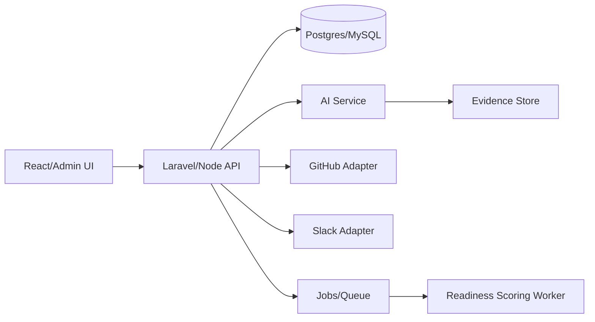

# M1_IMPLEMENTATION_PROMPT.md

# M1 — Iceberg X Platform Improvement Implementation Prompt

## Bağlam

Iceberg X programında farklı R&D mission’lar paralel ilerliyor. Resmi beklenti research + hafif POC olsa da hedef, main development team’e aktarılabilir, ölçülebilir ve demo etkisi yüksek bir internal platform katmanı oluşturmaktır. M1 bu nedenle sadece “dashboard iyileştirme” değil, tüm mission’ların araştırma, POC, mentor feedback ve handover süreçlerini yöneten **Iceberg X Intelligence Layer** olarak ele alınmalıdır.

## Hedef Ürün

Iceberg X Intelligence Layer; intern, mentor, admin ve leadership rollerinin tek platformda çalıştığı, AI destekli mission yönetimi ve POC değerlendirme sistemidir.

### Ürün vaadi

- Intern: Ne yapacağını, hangi kaynaklara bakacağını, nasıl demo hazırlayacağını görür.
- Mentor: POC ilerleyişini, riskleri ve review bekleyen işleri izler.
- Admin: Program kalitesini ve mission’lar arası bağımlılıkları yönetir.
- Leadership: Hangi POC production’a yaklaşabilir, hangisi archive edilmeli görür.

## Kapsam

### In Scope

- Mission detail page
- Research evidence vault
- POC progress tracker
- Mentor review workflow
- AI mission planning assistant
- Demo readiness score
- Handover checklist generator
- Slack/GitHub activity ingest mock’u

### Out of Scope

- Full HR/internship management suite
- Payroll/contract management
- Fully autonomous grading without human review
- Deep LMS/courseware features

## Platform Audit Metodolojisi

### User interview soruları

**Intern**
1. Mission brief’te en belirsiz alanlar neler?
2. Kaynak ve repo bulma sürecinde nerede zaman kaybediyorsun?
3. Mentor’dan feedback almak için kaç farklı kanal kullanıyorsun?
4. Demo day’e hazır olduğunu nasıl anlıyorsun?

**Mentor**
1. Bir POC’nin production potansiyelini nasıl anlarsın?
2. Intern ilerleyişini takip ederken hangi sinyaller eksik?
3. Review yükünü azaltacak en kritik otomasyon ne olurdu?

**Leadership**
1. Hangi mission’lar yatırım almaya değer?
2. Handover dokümanlarında en çok ne eksik oluyor?
3. R&D programının ROI metriği ne olmalı?

### Heuristic evaluation checklist

- [ ] Mission brief net mi?
- [ ] Acceptance criteria ölçülebilir mi?
- [ ] Kaynaklar kanıt standardına bağlı mı?
- [ ] POC scope kontrol edilebilir mi?
- [ ] Riskler görünür mü?
- [ ] Handover artifact’leri otomatik toplanıyor mu?

## Pain Point Hypothesis Matrix

| Rol | Pain point | Kanıt nasıl toplanır? | Feature karşılığı |
|---|---|---|---|
| Intern | Brief belirsiz, scope büyüyor | Interview + activity logs | AI brief decomposer |
| Mentor | Review dağınık ve geç | Review cycle time | Structured review queue |
| Admin | Program görünürlüğü düşük | Dashboard audit | Mission health dashboard |
| Leadership | Production potansiyeli belirsiz | Demo scoring | Readiness score |

## Özellik Karşılaştırma Tablosu

| Modül | MVP hızı | Demo etkisi | Production readiness | Öneri |
|---|---:|---:|---:|---|
| Mission tracker | Yüksek | Orta | Yüksek | İlk sprint |
| Evidence vault | Orta | Yüksek | Yüksek | İlk sprint |
| AI mission generator | Orta | Çok yüksek | Orta | POC’de güçlü |
| Mentor review workflow | Orta | Yüksek | Yüksek | İkinci sprint |
| Demo readiness score | Yüksek | Yüksek | Orta | İlk demo |
| Gamification | Yüksek | Orta | Orta | Kalite metriğine bağlı |

## Mimari



### Data Model

```text
User(id, name, role, team_id)
Mission(id, title, brief, owner_id, mentor_id, status, priority)
MissionMilestone(id, mission_id, title, due_date, status)
Evidence(id, mission_id, claim, source_url, reliability, accessed_at, note)
POCArtifact(id, mission_id, type, url, status)
Review(id, mission_id, reviewer_id, score, comments, decision)
ReadinessScore(id, mission_id, research_score, demo_score, handover_score, risk_score)
AIPlan(id, mission_id, prompt_version, output_md, created_by)
```

### API Endpoint Listesi

| Method | Endpoint | Amaç |
|---|---|---|
| GET | `/api/missions` | Mission listesi |
| POST | `/api/missions` | Mission oluştur |
| GET | `/api/missions/{id}` | Mission detail |
| POST | `/api/missions/{id}/evidence` | Kaynak/kanıt ekle |
| POST | `/api/missions/{id}/ai-plan` | AI plan üret |
| POST | `/api/missions/{id}/reviews` | Mentor review |
| GET | `/api/missions/{id}/readiness` | Demo readiness |
| POST | `/api/missions/{id}/handover` | Handover checklist üret |

### Frontend Page / Component Haritası

- `/missions` — mission board
- `/missions/:id` — overview, milestones, evidence, risks
- `/missions/:id/research` — evidence vault
- `/missions/:id/review` — mentor scoring
- `/missions/:id/demo` — demo script + readiness score
- `/leadership` — portfolio overview

## AI Integration Noktaları

1. **Brief Decomposer:** Mission brief’i tasks, unknowns, acceptance criteria’ye böler.
2. **Evidence Checker:** İddia-kaynak formatını kontrol eder.
3. **Risk Generator:** Kaynaklardan risk register önerir.
4. **Handover Writer:** README, env vars, known issues outline üretir.
5. **Demo Script Writer:** Demo day akışını çıkarır.

## Tech Stack Önerisi

- Backend: Laravel veya Node/NestJS; Iceberg mevcut stack’e göre seçilmeli.
- Frontend: React + TypeScript.
- DB: Postgres tercih; MySQL mevcut stack ise uyumlu kalınabilir.
- Queue: Redis/BullMQ veya Laravel Queue.
- AI: OpenAI Agents SDK / Responses API adapter + model abstraction.
- Auth: Existing SSO/session reuse.

## GitHub Referansları

| Repo | URL | Nasıl kullanılır? |
|---|---|---|
| OpenideaL | https://github.com/linnovate/openideal | Innovation workflow pattern |
| LaraCollab | https://github.com/ilhammeidi/LaraCollab | Laravel/React project dashboard örneği |
| Plane | https://github.com/makeplane/plane | Issue/project management UX referansı |
| OpenProject | https://github.com/opf/openproject | Enterprise PM workflow benchmark |
| openai-agents-python | https://github.com/openai/openai-agents-python | AI planning assistant altyapısı |
| langgraph | https://github.com/langchain-ai/langgraph | Stateful review/evaluation workflows |

## POC Scope

### Minimum

- Mission board
- Mission detail
- Evidence vault
- Manual mentor review
- Readiness score mock

### Etkileyici

- AI brief decomposer
- Evidence quality checker
- Auto-generated handover checklist
- Leadership dashboard

### Production Path

- GitHub/Slack integrations
- Role-based permissions
- Audit logs
- Multi-team reporting
- Rubric versioning

## Uygulama Fazları

### Sprint 1

- [ ] Domain model ve DB migration
- [ ] Mission board + detail UI
- [ ] Evidence vault CRUD
- [ ] Basic review form

### Sprint 2

- [ ] AI brief decomposer
- [ ] Readiness score calculation
- [ ] Handover checklist generator
- [ ] Leadership dashboard MVP

### Sprint 3

- [ ] GitHub activity adapter
- [ ] Slack notification mock/real integration
- [ ] Audit logs
- [ ] Demo polish

## Demo Senaryosu

1. Admin yeni M2 mission brief’i ekler.
2. AI brief’i tasks, risks, missing research alanlarına böler.
3. Intern Zoom kaynaklarını evidence vault’a ekler.
4. Evidence checker bazı kaynakları “community/low reliability” diye işaretler.
5. Mentor review verir ve readiness score güncellenir.
6. Leadership dashboard’da M2 “continue”, M4 “further research” olarak görünür.
7. Platform handover checklist’i otomatik üretir.

## Metrikler

- Research evidence completeness
- Mentor review cycle time
- Demo readiness score
- Handover checklist completion rate
- Mission scope drift count
- Production recommendation ratio

## Riskler ve Mitigasyon

| Risk | Mitigasyon |
|---|---|
| AI yanlış değerlendirme yapar | Human review required |
| Platform PM tool’a dönüşür | R&D-specific evidence/readiness odak korunur |
| Kullanıcı adoption düşük | Mentor/admin workflow ile zorunlu lightweight kullanım |
| Stack uyumsuzluğu | Existing auth ve UI kit reuse |

## Final Recommendation

M1, tüm programın kalitesini artıracak ortak platformdur. İlk demo için “mission tracker + evidence vault + AI handover generator” en güçlü kombinasyondur. Production path’te GitHub/Slack entegrasyonu ve role-based governance eklenmelidir.

## Kırmızı Çizgiler

- AI output hiçbir zaman mentor kararı yerine geçmemeli.
- Evidence kaynaksız kabul edilmemeli.
- Gamification kaliteyi düşürecek hız yarışına dönmemeli.
- Handover dokümanı otomatik üretilse bile owner onayı olmadan final kabul edilmemeli.
