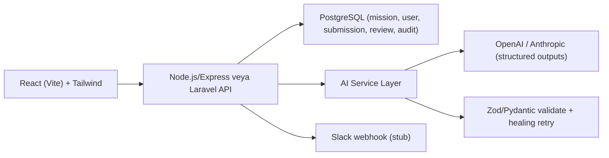

# M1 — Iceberg X Platform Improvement — Implementation Prompt

> **Referans:** `SHARED_RESEARCH_REPORT_opus.md` (§1 Lifesycle ekosistemi, §4 AI, §5 R&D platform benchmark)
> **Tarih:** 2026-06-20
> **Hedef:** Demo'nun ötesinde, main dev team'e handover-ready bir POC.

## Bağlam

Iceberg X, Iceberg Digital'in R&D mission'larını, intern görevlerini, mentor atamalarını, fikirleri ve proje çıktılarını yöneten iç operasyon platformudur. Iceberg'in ürün kültürü **AI-core** (Lifesycle/Predict/Neuron/Uzair). 2026 R&D platform trendi: **AI-native + audit/searchable + (ops.) MCP** (OpenPraxis, Zagrosi, OpenPR, Specivo). İç platform da bu standarda çekilmeli.

## Hedef Ürün — "Iceberg X Intelligence Layer"

Tek bir küçük POC yerine, birbirine bağlı AI modüllerinden oluşan bir katman. POC olarak **2 modül** uçtan uca çalışır halde gösterilecek:

1. **AI Mission Generator** (Resmi Option A): Admin kaba bir fikir girer → sistem title, description, context, problem statement, expected deliverables, difficulty, category üretir → admin düzenleyip kaydeder.
2. **AI Project Review Assistant** (Resmi Option E): Submission (repo/demo/notlar) girilir → sistem review soruları, güçlü/zayıf yönler, önerilen mentor feedback üretir.

İkisi ortak bir **AI service layer** (structured outputs + validation) ve ortak veri modeli üzerine kurulur — bu, "tek özellik değil, katman" mesajını verir.

## Kapsam

### In Scope
- AI Mission Generator (üretim + edit + save)
- AI Project Review Assistant (submission → structured review)
- Mission Progress Dashboard (status'a göre gruplama, blocked/inactive highlight) — hafif
- Roller: Admin / Mentor / Intern / Leadership (RBAC)
- Audit log (her AI çıktısı ve aksiyon kaydedilir — 2026 platform standardı)

### Out of Scope (POC)
- Tam gamification/badge ekonomisi (sadece veri modeli stub)
- Slack production entegrasyonu (webhook stub)
- Gerçek Iceberg X production DB'sine yazma (mock/ayrı şema)

## Mimari



- **AI Service Layer:** Tüm LLM çağrıları tek serviste; `response_format`/`output_config.format` ile schema-constrained; sonuç Zod ile validate; hata → healing retry (bkz. SHARED §4.4).
- **Permissions:** Admin (mission CRUD, generator), Mentor (review, feedback), Intern (submission), Leadership (read-only analytics).

## Tech Stack
- **Frontend:** React + Vite + TypeScript + Tailwind (Iceberg muhtemelen React; uyum için). Alternatif: Blade (Laravel uyumu).
- **Backend:** Node.js/Express + TypeScript (AI SDK ergonomisi) — veya Laravel (mevcut stack uyumu, doğrulanmalı).
- **DB:** PostgreSQL (pgvector ops. semantic search için, bkz. Specivo).
- **AI:** OpenAI `parse` + Zod **veya** Anthropic `output_config.format`.
- **Gerekçe:** SHARED §4.4 structured outputs; §5 AI-native trend.

## Data Model

```
User(id, name, role[admin|mentor|intern|leadership], ...)
Mission(id, title, description, context, problemStatement, deliverables[], difficulty, category, status[draft|active|blocked|done], mentorId, createdBy, aiGenerated:bool)
Submission(id, missionId, internId, repoUrl, demoUrl, notes, submittedAt)
Review(id, submissionId, mentorId, aiQuestions[], aiStrengths[], aiWeaknesses[], suggestedFeedback, finalFeedback, status)
AuditEvent(id, actorId, action, entityType, entityId, aiModel?, promptHash?, createdAt)
```

## API Spesifikasyonu

- `POST /api/missions/generate` — body: `{ idea }` → AI ile mission taslağı (structured). 
- `POST /api/missions` — düzenlenmiş mission kaydet.
- `GET /api/missions?status=` — dashboard verisi.
- `POST /api/submissions` — intern submission.
- `POST /api/reviews/generate` — body: `{ submissionId }` → AI review (questions/strengths/weaknesses/feedback).
- `POST /api/reviews/:id` — mentor final feedback.
- `GET /api/analytics/overview` — leadership özet (mission counts, mentor workload).
- `GET /api/audit?entityId=` — audit trail.

## UI/UX Spesifikasyonu
- **Admin:** "New Mission (AI)" → idea textarea → "Generate" → düzenlenebilir form (tüm alanlar) → Save.
- **Mentor:** Submission listesi → "Generate Review" → AI çıktısı kartları → düzenle → Submit feedback.
- **Dashboard:** Kanban benzeri status kolonları; blocked/inactive kırmızı rozet.
- **Leadership:** Özet kartlar + mentor workload bar.

## GitHub'dan Kullanılacak Referanslar
1. **specivo/specivo** (https://github.com/specivo/specivo) — wiki + pgvector hybrid search; submission semantic search ilhamı.
2. **openprx/openpr** (https://github.com/openprx/openpr) — AI review + governance pattern; review assistant akışı.
3. **k8nstantin/OpenPraxis** (https://github.com/k8nstantin/OpenPraxis) — idea→product→task DAG; mission lifecycle modeli.
4. **zagrosi-code/zagrosi** (https://github.com/zagrosi-code/zagrosi) — Slack/Teams bridge; notification stub.
5. **openai/openai-node** veya **anthropics/anthropic-sdk-typescript** — structured outputs implementasyonu.

## Uygulama Adımları
- [ ] Repo + monorepo iskeleti (web + api)
- [ ] PostgreSQL şema + seed (mock mission/user)
- [ ] RBAC middleware (4 rol)
- [ ] AI service layer (provider abstraction + Zod schema + healing retry)
- [ ] Mission Generator endpoint + UI
- [ ] Project Review endpoint + UI
- [ ] Dashboard + Analytics (read)
- [ ] Audit log her AI/aksiyon
- [ ] README + demo seed script + screenshot/video

## Test Planı
- AI service: schema validation unit testleri (mock LLM).
- Generator: boş/uç fikir input'larında graceful fallback.
- RBAC: her endpoint için rol bazlı erişim testi.
- Review: deterministik mock ile snapshot.

## Demo Senaryosu
1. Admin "Müşterilerin valuation randevularındaki Plaud kayıtlarını CRM'e bağlamak" fikrini girer.
2. AI tam mission taslağı üretir (M4'e benzeyen!) → admin küçük düzenleme → kaydeder.
3. Intern bir submission ekler (repo + demo link).
4. Mentor "Generate Review" → AI güçlü/zayıf + sorular üretir → mentor onaylar.
5. Leadership dashboard'da yeni mission ve mentor workload'u görür.
6. Audit trail gösterilir: "her AI çıktısı izlenebilir."

## Handover Checklist
- [ ] README (setup, env, mimari diyagram)
- [ ] `.env.example` (LLM key, DB URL)
- [ ] Known issues / limitations
- [ ] Production effort tahmini (T-shirt: M)
- [ ] Iceberg X gerçek stack ile entegrasyon notları (varsayımlar işaretli)

## Diğer Mission'lara Bağlantı Noktaları
- **M5:** AI service layer ve mission generator pattern'i, M5 dev assistant'ın temelini paylaşır.
- **M3/M4:** Bu platformda yönetilen mission'lar; "unified timeline" fikri M1 analytics'e besleme yapar.

## Kırmızı Çizgiler
- LLM çıktısı **her zaman** schema-validate edilecek; ham JSON parse'a güvenme.
- Iceberg X gerçek production verisine POC'de yazma; mock/ayrı şema kullan.
- AI çıktıları human-in-the-loop (admin/mentor onayı) olmadan kalıcı kabul edilmez.
