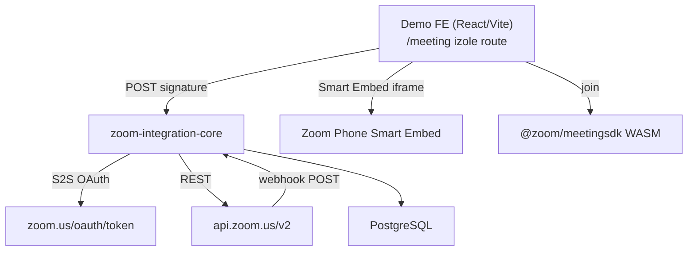

# M2 — Zoom Integration Core: Demo ve Yol Haritası Planı

> **Mission:** Zoom SDK & Phone Integration Research POC  
> **Servis adı:** `zoom-integration-core`  
> **Demo ürün adı:** Zoom Capability Lab  
> **Plan tarihi:** 21 Haziran 2026  
> **Kapsam:** Yalnızca M2 — bağımsız planlama belgesi  
> **Plan v1.1 (21 Haz 2026):** **Zoom dev + şirket test hesabı + Zoom Phone ERTELENDİ.** Ay 1 = `ZOOM_MODE=mock` + gerçek mimari + `MockZoomAdapter`. **Testler zorunlu.** → `shared/plans/SHARED_PLAN_CONSTRAINTS.md`

---

## 1. Mission Özeti ve Demo Submit Hedefi

### 1.1 Mission Özeti

Iceberg Digital resmi Zoom Partner statüsüyle Zoom'un geliştirici ekosistemine erişim kazanmıştır. M2'nin amacı, Zoom Meetings, gömülü toplantı deneyimleri ve Zoom Phone iş akışlarının **teknik olarak neleri desteklediğini** kanıtlamak, **nelerin mümkün olmadığını** dürüstçe belgelemek ve Iceberg ürün ailesi için **yeniden kullanılabilir bir entegrasyon çekirdeği** (`zoom-integration-core`) üretmektir.

Mission brief'in çekirdek soruları:

- Kullanıcılar kendi arayüzümüzden Zoom toplantısı başlatabilir / katılabilir mi?
- Meeting SDK ile toplantı deneyimi ürün içine gömülebilir mi? (Video SDK değil.)
- Zoom Phone aramaları tamamen Zoom Desktop'a bağımlı olmadan yönetilebilir mi?
- Phone olayları webhook ile yakalanıp iş akışları tetiklenebilir mi?
- OAuth, lisans, marketplace ve partner gereksinimleri nelerdir?

### 1.2 Kritik Teknik Gerçekler (Planın Temeli)

| Gerçek | Etki |
|--------|------|
| **Zoom Phone'da sunucu taraflı outbound call API yoktur** | Backend'den istemci olmadan arama başlatılamaz; Smart Embed, URI scheme veya kullanıcı etkileşimi gerekir |
| **CRM embed için Meeting SDK kullanılır, Video SDK değil** | Gerçek Zoom meeting/webinar deneyimi = Meeting SDK; tam özel video odası = Video SDK (farklı ürün, farklı lisans) |
| **Phone entegrasyonu = Smart Embed + webhooks** | Click-to-call UI Smart Embed iframe/postMessage ile; olaylar REST Phone API + webhook ile |
| **SDK secret ve OAuth credential'lar yalnızca backend'de** | Frontend yalnızca signature ve public SDK key alır |
| **AI notetaker / bot Meeting SDK ile yapılmaz** | RTMS veya recording/transcript pipeline ayrı değerlendirilir |

### 1.3 Demo Submit Hedefi (1 Ay)

**Teslim tarihi hedefi:** Demo Submit — ay sonu (Hafta 4)

**Demo Submit paketinde kanıtlanması gereken minimum:**

1. Çalışan `zoom-integration-core` backend servisi (S2S OAuth, signature, meeting create, webhook ingest)
2. React demo arayüzü: meeting oluştur → Meeting SDK Component View ile sayfa içi join
3. Webhook akışı: `meeting.ended` / `recording.completed` → event log + transcript fetch denemesi
4. Zoom Phone sekmesi: Smart Embed feasibility + click-to-call POC veya lisans yoksa graceful fallback
5. **17+ maddelik Capability Map** (Possible Now / Needs License / Not Possible / Escalate)
6. Partner escalation listesi + README (kurulum, env, bilinen kısıtlar)
7. 5–7 dakikalık Demo Day senaryosu için hazır akış

**Başarı kriteri:** Bir değerlendirici, Zoom Desktop'a geçmeden demo arayüzünden toplantı oluşturup gömülü katılabilmeli; Phone sekmesinde neden sunucu taraflı arama olmadığı net anlatılabilmeli.

---

## 2. Faz 0 — Hazırlık (Mock-First; Zoom Credentials Ertelendi)

> **v1.1:** Zoom Developer Console, S2S OAuth, SDK Key ve şirket test hesabı **şimdilik kurulmaz**. Faz 0 odak: repo + `MockZoomAdapter` + interface sözleşmesi + test suite. Gerçek credential'lar Faz 2'de `RealZoomAdapter` takılır.

### 2.1 Mock-First Kurulum (Ay 1)

| Adım | Açıklama | Sorumlu | Süre |
|------|----------|---------|------|
| 0.1 | `ZOOM_MODE=mock` env + `ZoomProvider` interface tanımı | Backend | 0.5 gün |
| 0.2 | `MockZoomAdapter` — create meeting, signature, webhook payload fixture | Backend | 0.5 gün |
| 0.3 | Vitest: mock adapter unit + API integration testleri | Backend | 0.5 gün |
| 0.4 | Capability map + escalation doc (dokümantasyon — canlı API yok) | Tech Lead | 0.5 gün |
| 0.5 | Frontend: mock join URL + "Simulated embed" UI (gerçek WASM yok) | Frontend | 0.5 gün |
| 0.6 | Phone sekmesi: **yalnızca feasibility doc + mock call event log** | Backend | 0.25 gün |

### 2.1b Zoom Developer Console (Faz 2 — Ertelendi)

| Adım | Açıklama | Durum |
|------|----------|-------|
| Marketplace S2S OAuth app | Gerçek meeting CRUD | ⏸ Ertelendi |
| Meeting SDK credentials | Gerçek embed | ⏸ Ertelendi |
| Webhook HTTPS endpoint | ngrok + live events | ⏸ Ertelendi |

### 2.2 Gerekli OAuth Scope'ları (Minimum)

**Server-to-Server OAuth:**

| Scope | Amaç |
|-------|------|
| `meeting:write:meeting` | Toplantı oluşturma |
| `meeting:read:meeting` | Toplantı metadata okuma |
| `recording:read` | Kayıt ve transcript dosyalarına erişim |
| `user:read` | Host/user bilgisi |
| `phone:read` | Call log okuma (Phone lisansı varsa) |
| `phone:write` | Sınırlı call control (lisans + scope doğrulaması gerekir) |

**Meeting SDK:** SDK Key/Secret ayrı üretilir; join için backend HMAC-SHA256 signature üretir.

**User OAuth (opsiyonel — Faz 1 sonu karar):** Kullanıcı adına meeting oluşturma gerekiyorsa `meeting:write` + refresh token yönetimi eklenir. Demo için S2S OAuth yeterlidir.

### 2.3 Partner Access Doğrulaması

| Kontrol | Aksiyon |
|---------|---------|
| Iceberg Partner hesabı aktif mi? | Partner portal erişimini doğrula |
| ISV / embed lisansı Workplace planı kapsıyor mu? | Partner support'a sor (Escalation #1) |
| Zoom Phone lisansı demo tenant'ta var mı? | Yoksa Phone sekmesi feasibility-only modda çalışır |
| Cloud recording + AI Companion transcript açık mı? | Host/account settings kontrol |
| Rate limit / private endpoint avantajı var mı? | Partner escalation |

### 2.4 Ortam Değişkenleri

```bash
# Server-to-Server OAuth
ZOOM_ACCOUNT_ID=
ZOOM_CLIENT_ID=
ZOOM_CLIENT_SECRET=

# Meeting SDK
ZOOM_SDK_KEY=
ZOOM_SDK_SECRET=

# Webhook
ZOOM_WEBHOOK_SECRET_TOKEN=
ZOOM_WEBHOOK_VERIFICATION_TOKEN=

# App
APP_BASE_URL=https://zoom-lab.dev.iceberg.digital
WEBHOOK_CALLBACK_URL=${APP_BASE_URL}/api/zoom/webhooks
NODE_ENV=development

# Database
DATABASE_URL=postgresql://...

# Opsiyonel — User OAuth
ZOOM_OAUTH_REDIRECT_URI=
```

### 2.5 Altyapı Hazırlığı

| Bileşen | Demo | Not |
|---------|------|-----|
| PostgreSQL | Docker Compose | meetings, recordings, phone_events, webhook_events |
| ngrok / Cloudflare Tunnel | Zorunlu (dev) | Zoom webhook HTTPS callback |
| Node.js 20 LTS | Zorunlu | Resmi Zoom sample'ları Node tabanlı |
| React + Vite | Zorunlu | `@zoom/meetingsdk` Component View |
| CI smoke test | Önerilir | signature + webhook verify unit test |

### 2.6 Faz 0 Çıkış Kriterleri (v1.1 — Mock-First)

- [ ] `ZOOM_MODE=mock` ile `MockZoomAdapter` tüm meeting/signature/webhook akışlarını simüle ediyor
- [ ] Vitest: mock adapter + API integration testleri yeşil
- [ ] `.env.example` + README mock kurulum adımlarını içeriyor
- [ ] Capability map dokümantasyonu (gerçek API olmadan feasibility notları)
- [ ] CI: `lint + typecheck + test` yeşil

> Gerçek S2S OAuth, webhook URL validation, ngrok — **Faz 2'ye ertelendi** (şirket Zoom hesabı yok).

**Faz 0 süresi:** 3–5 iş günü (Hafta 1'in ilk yarısı ile örtüşür)

### 2.7 Git ve Push Disiplini (Zorunlu)

Her faz/hafta milestone'ı sonunda: testler yeşil → `git commit` → `git push origin main`. Aşamalar arasında birikmiş commit'siz kod bırakma. Detay: `shared/plans/SHARED_PLAN_CONSTRAINTS.md` §2.6

---

## 3. Faz 1 — 1 Aylık Plan (Hafta 1–4): `zoom-integration-core`

### 3.1 Servis Mimarisi

```
zoom-integration-core/
├── auth/          # S2S OAuth token cache (1 saat TTL, otomatik yenileme)
├── meetings/      # REST create / read / update proxy
├── sdk/           # JWT signature endpoint (HMAC-SHA256, jsrsasign)
├── webhooks/      # verify + idempotent ingest + event routing
├── phone/         # Smart Embed config + event adapter + capability probe
├── recordings/    # cloud recording + AI Companion transcript fetch
├── crm-adapter/   # TimelineEvent payload generator (generic, domain-agnostic)
└── api/           # Express route handlers + OpenAPI spec
```



### 3.2 Hafta 1 — OAuth, Signature, Meeting Create

**Hedef:** Backend iskeleti çalışır; API ile meeting oluşturulabilir.

| Gün | Görev | Çıktı |
|-----|-------|-------|
| 1–2 | Repo iskeleti, TypeScript, Express, env validation | `zoom-integration-core` boot |
| 2–3 | S2S OAuth token servisi (in-memory cache + expiry refresh) | `POST /internal/oauth/token` |
| 3–4 | SDK JWT signature endpoint (`zoom/meetingsdk-auth-endpoint-sample` fork) | `POST /api/zoom/signature` |
| 4–5 | Meeting create proxy `POST /v2/users/me/meetings` | `POST /api/zoom/meetings` |
| 5 | DB migration: `zoom_meetings` tablosu | İlk kayıt persist |

**Hafta 1 API hedefleri:**

```
POST /api/zoom/meetings
  body: { topic, type, start_time?, timezone?, duration?, settings? }
  response: { id, uuid, join_url, start_url, password, host_id, status }

POST /api/zoom/signature
  body: { meetingNumber, role }  // role: 0=participant, 1=host
  response: { signature, sdkKey }

GET /api/zoom/health
  response: { oauth: "ok"|"expired", sdk: "configured", db: "ok" }
```

**Hafta 1 test:** Postman/curl ile meeting create + signature JWT decode doğrulaması.

### 3.3 Hafta 2 — Meeting SDK Embed, Webhooks, Capability Map v1

**Hedef:** Demo UI'dan gömülü join; webhook event'leri loglanıyor.

| Gün | Görev | Çıktı |
|-----|-------|-------|
| 1–2 | React `/meeting` izole route + `@zoom/meetingsdk` Component View | Embed join happy path |
| 2–3 | Webhook receiver + HMAC signature verification | `POST /api/zoom/webhooks` |
| 3 | Idempotency: `event_id` unique constraint | Duplicate webhook güvenli |
| 4 | Event log API + demo timeline UI | `GET /api/zoom/events` |
| 5 | Capability Map sayfası v1 (17 madde iskelet) | `/capability-map` |

**Webhook hedef event'ler:**

| Event | Aksiyon |
|-------|---------|
| `endpoint.url_validation` | Challenge response |
| `meeting.started` | `zoom_meetings.status = 'started'` |
| `meeting.ended` | status güncelle + transcript fetch job queue |
| `recording.completed` | recording metadata kaydet |
| `phone.callee_call_log_completed` | `phone_events` insert (lisans varsa) |
| `phone.caller_call_log_completed` | `phone_events` insert |

**Meeting SDK embed kuralları:**

- Component View (Client View değil) — CRM slide-over / dashboard panel için uygun
- Dedicated route veya iframe izolasyonu — host app CSS çakışması önlenir
- CSP: Zoom SDK asset domain'leri allowlist'e eklenir
- **Video SDK bu fazda kullanılmaz** — yalnızca karşılaştırma notu capability map'te

### 3.4 Hafta 3 — Phone Smart Embed Feasibility, Recording/Transcript, Escalation Doc

**Hedef:** Phone sekmesi çalışır veya lisans eksikliğini şeffaf gösterir; transcript pipeline kanıtlanır.

| Gün | Görev | Çıktı |
|-----|-------|-------|
| 1–2 | `/phone` sekmesi: Smart Embed iframe entegrasyonu | Click-to-call UI |
| 2 | `zp-make-call` postMessage + numara input | Outbound UI (kullanıcı tıklamasıyla) |
| 3 | Phone webhook event adapter + event tablosu | Canlı veya mock event log |
| 3–4 | Recording fetch: `GET /meetings/{uuid}/recordings` | Transcript dosya URL |
| 4 | AI Companion transcript (instance UUID, double-encode) | Alternatif transcript yolu |
| 5 | Partner escalation doc finalize | `docs/ZOOM_PARTNER_ESCALATION.md` |

**Zoom Phone Smart Embed — Feasibility Notları:**

| Senaryo | Durum | Demo davranışı |
|---------|-------|----------------|
| Zoom Phone lisansı + Smart Embed enabled | Tam demo | iframe + click-to-call + webhook events |
| Lisans yok | Feasibility-only | Mock event inject + "Needs License" banner |
| Desktop audio dependency | Escalate | Dokümante et; tarayıcı/OS matrisi |
| `tel:` / `zoomphonecall://` URI | Possible Now | Zoom client açılır — headless değil |

**Kritik:** Sunucu taraflı outbound call bu hafta da **implement edilmez** — capability map'te **Not Possible** olarak işaretlenir ve demo sırasında açıkça anlatılır.

### 3.5 Hafta 4 — Demo Polish, Test, Submit Paketi

**Hedef:** Demo Submit paketi tamamlanır.

| Gün | Görev | Çıktı |
|-----|-------|-------|
| 1 | Capability map final (gerçek test bulgularıyla güncelle) | 17+ madde, filtreleme UI |
| 2 | E2E demo rehearsal (5 dk senaryo) | Script + backup video |
| 2–3 | README, `.env.example`, architecture diagram | Handover docs |
| 3 | Security audit: secret leak scan, webhook replay test | Checklist signed |
| 4 | `crm-adapter` stub: generic TimelineEvent payload | JSON schema export |
| 5 | **Demo Submit** | Tüm checklist maddeleri ✅ |

### 3.6 Faz 1 Demo Uygulama Ekranları

| Route | İçerik |
|-------|--------|
| `/` | Credential status, capability özet kartları |
| `/meeting` | Create meeting form → meeting card → Join embedded |
| `/events` | Webhook event timeline (filtre: meeting / phone / recording) |
| `/phone` | Smart Embed + click-to-call + event log |
| `/capability-map` | 17+ özellik, durum filtresi |
| `/diagnostics` | Token expiry, SDK version, scope list, known limitations |

---

## 4. Demo Submit Paketi Checklist

### 4.1 Kod ve Servis

- [ ] `zoom-integration-core` repo (veya monorepo alt paketi) erişilebilir
- [ ] `docker-compose.yml` — PostgreSQL + app tek komutla ayağa kalkar
- [ ] `.env.example` tüm zorunlu değişkenlerle
- [ ] `README.md`: kurulum, Zoom Console adımları, ngrok webhook setup
- [ ] OpenAPI veya route dokümantasyonu

### 4.2 Fonksiyonel Kanıt

- [ ] S2S OAuth token alınıyor ve cache'leniyor
- [ ] `POST /api/zoom/meetings` ile toplantı oluşturuluyor
- [ ] `POST /api/zoom/signature` ile Meeting SDK join çalışıyor
- [ ] Component View embed — Chrome'da happy path
- [ ] Webhook `meeting.ended` alınıyor ve loglanıyor
- [ ] Transcript fetch denemesi (başarılı veya "settings required" hata mesajı dokümante)
- [ ] Phone sekmesi: Smart Embed veya graceful fallback

### 4.3 Dokümantasyon

- [ ] Capability Map (17+ madde, 4 kategori)
- [ ] Meeting SDK vs Video SDK karar ağacı
- [ ] Zoom Phone kısıtları (server-side outbound yok)
- [ ] Partner escalation listesi (açık sorular + ticket referansı)
- [ ] Browser/OS destek matrisi
- [ ] Bilinen riskler ve mitigasyonlar

### 4.4 Demo Day Materyali

- [ ] 5–7 dk canlı demo script
- [ ] Yedek kayıt videosu (webhook gecikmesi durumunda)
- [ ] 1 sayfa executive özet (Türkçe)
- [ ] Architecture diagram (mermaid veya PNG)

### 4.5 Güvenlik

- [ ] SDK Secret / Client Secret frontend bundle'da yok
- [ ] Webhook imza doğrulaması zorunlu
- [ ] `start_url` (host-only) demo UI'da maskelenmiş veya gizli
- [ ] Audit log'da PII maskeleme

---

## 5. Demo Day Senaryosu

**Süre:** 5–7 dakika  
**Sunucu:** Tek presenter + yedek ekran kaydı

### Akış

| Dakika | Adım | Ekran | Anlatı noktası |
|--------|------|-------|----------------|
| 0:00–0:45 | Giriş | `/` dashboard | "Iceberg Zoom Partner — Capability Lab" |
| 0:45–1:30 | Credential status | Diagnostics | S2S OAuth aktif, scope'lar minimum |
| 1:30–2:30 | Create meeting | `/meeting` | Topic: "Valuation Demo Call" → REST API create |
| 2:30–4:00 | Embedded join | `/meeting` | Meeting SDK Component View — **Video SDK değil** |
| 4:00–4:45 | Webhook + transcript | `/events` | `meeting.ended` → transcript fetch |
| 4:45–5:30 | Phone demo | `/phone` | Smart Embed click-to-call → event log |
| 5:30–6:30 | Capability map | `/capability-map` | "Server-side outbound call: Not Possible" vurgusu |
| 6:30–7:00 | Kapanış | Escalation slide | Partner soruları + Faz 2 yol haritası |

### Yedek Plan

- Webhook gecikmesi: önceden kaydedilmiş event JSON ile replay
- Embed başarısız: join URL redirect fallback göster
- Phone lisansı yok: mock event + escalation doc walkthrough

### İzleyiciye Net Mesajlar

1. **Meeting SDK** = gerçek Zoom meeting, CRM içinde embed
2. **Video SDK** = ayrı ürün; bu mission'da CRM embed için seçilmedi
3. **Zoom Phone** = Smart Embed + webhooks; sunucudan arama başlatılamaz
4. `zoom-integration-core` = production'a taşınabilir paylaşımlı servis

---

## 6. Faz 2 — Post-Demo (Ay 2–3): Production Microservice

### 6.1 Hedef

Demo POC'yi **production-grade mikroservise** dönüştürmek: HA, gözlemlenebilirlik, güvenlik sertleştirme, multi-tenant hazırlık.

### 6.2 Ay 2 — Sertleştirme

| Alan | Çalışma |
|------|---------|
| Auth | User OAuth ekleme (kullanıcı adına meeting); refresh token vault |
| Token | Redis token cache (in-memory yerine); distributed lock |
| Webhook | Dead letter queue; retry exponential backoff |
| DB | Migration versioning; index optimizasyonu |
| API | Rate limiting; request validation (Zod); OpenAPI 3.1 |
| Security | Secrets Manager (AWS/GCP); CSP production policy |
| Observability | Structured logging, Prometheus metrics, health/readiness probes |

### 6.3 Ay 3 — Entegrasyon Hazırlığı

| Alan | Çalışma |
|------|---------|
| `crm-adapter` | Generic `TimelineEvent` contract — HTTP veya message bus |
| Multi-tenant | `tenant_id` + Zoom credential mapping tablosu |
| Deployment | Kubernetes / ECS manifest; CI/CD pipeline |
| Phone | Production Zoom Phone tenant mapping; extension ↔ user ID |
| Compliance | UK GDPR — call recording consent flag; retention policy |
| Load test | 100 concurrent signature request; webhook burst |

### 6.4 Faz 2 Çıkış Kriterleri

- [ ] SLA: 99.5% uptime hedefi (staging'de kanıt)
- [ ] p95 signature latency < 200ms
- [ ] Webhook processing p95 < 2s
- [ ] Zero secret in logs (otomatik scan)
- [ ] Runbook: token expiry, webhook failure, Zoom API 429

---

## 7. Faz 3 — Uç Nokta: Full Zoom Partner Integration Platform

### 7.1 Vizyon

Iceberg Digital'in tüm ürünlerinin tükettiği **merkezi Zoom entegrasyon platformu**:

```
┌─────────────────────────────────────────────────────────┐
│           Zoom Partner Integration Platform              │
├─────────────┬─────────────┬──────────────┬──────────────┤
│ Meeting Svc │ Phone Svc   │ Recording Svc│ RTMS Gateway │
├─────────────┴─────────────┴──────────────┴──────────────┤
│ OAuth Broker │ Webhook Hub │ Credential Vault │ Audit Log │
├─────────────────────────────────────────────────────────┤
│ Marketplace App │ Partner API Tier │ Analytics Dashboard│
└─────────────────────────────────────────────────────────┘
```

### 7.2 Yetenekler (Ay 4–6)

| Modül | Özellik |
|-------|---------|
| Meeting Service | Schedule, recurring, webinar, waiting room policy |
| Phone Service | Smart Embed token broker, call timeline, missed call routing |
| Recording Service | Transcript pipeline, AI summary hook, retention |
| RTMS Gateway | Realtime media/transcript (ayrı consent + lisans) |
| OAuth Broker | S2S + User OAuth + ZAK token yönetimi |
| Webhook Hub | Multi-subscriber event routing, schema registry |
| Marketplace | Public Zoom App listing, OAuth install flow |
| Admin | Per-tenant credential, scope audit, usage billing |

### 7.3 Faz 3 Başarı Kriterleri

- 3+ Iceberg ürünü aynı platform API'sini tüketiyor
- Zoom Marketplace'te listelenmiş veya private app olarak dağıtılmış
- Partner escalation maddelerinin %80'i yanıtlanmış ve dokümante

---

## 8. Tech Stack, API Endpoints, Data Model (Detaylı)

### 8.1 Tech Stack

| Katman | Seçim | Gerekçe |
|--------|-------|---------|
| Backend runtime | Node.js 20 LTS | Zoom resmi sample'ları Node; hızlı POC |
| Backend framework | Express + TypeScript | Minimal, sample fork uyumu |
| SDK signature | `jsrsasign` | Zoom auth endpoint sample standardı |
| HTTP client | `axios` | Retry interceptor desteği |
| Frontend | React 18 + Vite | `@zoom/meetingsdk` React uyumu |
| Meeting embed | `@zoom/meetingsdk` Component View | CRM panel embed için |
| Database | PostgreSQL 15 | JSONB webhook payload, güvenilir |
| Cache (Faz 2) | Redis | OAuth token + idempotency |
| Queue (Faz 2) | BullMQ / SQS | Transcript fetch async |
| Tunnel (dev) | ngrok | Webhook HTTPS |
| Container | Docker Compose → K8s | Demo → production path |
| Test | Vitest + Supertest | Unit + API integration |
| Docs | OpenAPI 3.1 + README | Handover kalitesi |

**Bilinçli olarak seçilmeyenler (bu mission):**

- Video SDK — CRM embed ihtiyacı yok
- Laravel/Go — resmi sample eşleşmesi Node lehine; Faz 2'de polyglot adapter mümkün

### 8.2 API Endpoints (Tam Liste)

#### Public API (Demo + Production)

| Method | Path | Açıklama | Auth |
|--------|------|----------|------|
| `GET` | `/api/zoom/health` | Servis ve OAuth durumu | None |
| `POST` | `/api/zoom/meetings` | Toplantı oluştur | API key / session |
| `GET` | `/api/zoom/meetings` | Toplantı listesi | API key / session |
| `GET` | `/api/zoom/meetings/:id` | Toplantı detay | API key / session |
| `PATCH` | `/api/zoom/meetings/:id` | Toplantı güncelle | API key / session |
| `DELETE` | `/api/zoom/meetings/:id` | Toplantı iptal | API key / session |
| `POST` | `/api/zoom/signature` | Meeting SDK JWT üret | API key / session |
| `GET` | `/api/zoom/meetings/:uuid/recordings` | Kayıt dosyaları | API key / session |
| `GET` | `/api/zoom/meetings/:uuid/transcript` | Transcript metni | API key / session |
| `POST` | `/api/zoom/webhooks` | Zoom webhook receiver | Zoom signature |
| `GET` | `/api/zoom/events` | Event log listesi | API key / session |
| `GET` | `/api/zoom/events/:id` | Event detay | API key / session |
| `GET` | `/api/zoom/phone/capabilities` | Phone lisans/scope durumu | API key / session |
| `GET` | `/api/zoom/capability-map` | Yetenek matrisi JSON | None |
| `POST` | `/api/zoom/oauth/connect` | User OAuth başlat (Faz 2) | Session |
| `GET` | `/api/zoom/oauth/callback` | User OAuth callback (Faz 2) | Zoom |

#### Internal API

| Method | Path | Açıklama |
|--------|------|----------|
| `POST` | `/internal/oauth/refresh` | S2S token zorla yenile |
| `POST` | `/internal/jobs/transcript-fetch` | Transcript async job tetikle |

#### CRM Adapter Contract (Generic Output)

| Method | Path | Açıklama |
|--------|------|----------|
| `POST` | `/internal/crm-adapter/timeline-event` | Webhook → TimelineEvent JSON |

**TimelineEvent payload şeması (domain-agnostic):**

```json
{
  "event_type": "zoom.meeting.ended | zoom.phone.call.completed | zoom.recording.ready",
  "occurred_at": "2026-06-21T10:00:00Z",
  "source": "zoom-integration-core",
  "external_id": "zoom:event_id",
  "title": "Valuation Demo Call ended",
  "summary": "Meeting duration 32 min",
  "metadata": {
    "zoom_meeting_uuid": "...",
    "join_url": "...",
    "transcript_available": true
  },
  "related_entity": {
    "type": "contact | property | appointment | null",
    "id": "optional-external-id"
  }
}
```

### 8.3 Data Model (PostgreSQL)

```sql
-- OAuth token cache (Faz 1: in-memory veya DB)
CREATE TABLE zoom_oauth_tokens (
  id            UUID PRIMARY KEY DEFAULT gen_random_uuid(),
  token_type    VARCHAR(20) NOT NULL DEFAULT 's2s',
  access_token  TEXT NOT NULL,  -- encrypted at rest (Faz 2)
  expires_at    TIMESTAMPTZ NOT NULL,
  scopes        TEXT[],
  created_at    TIMESTAMPTZ NOT NULL DEFAULT NOW()
);

-- Meetings
CREATE TABLE zoom_meetings (
  id                UUID PRIMARY KEY DEFAULT gen_random_uuid(),
  zoom_meeting_id   BIGINT NOT NULL UNIQUE,
  zoom_meeting_uuid VARCHAR(255) NOT NULL,
  topic             VARCHAR(500) NOT NULL,
  type              SMALLINT NOT NULL DEFAULT 2,  -- 2=scheduled
  start_time        TIMESTAMPTZ,
  duration          INT,
  timezone          VARCHAR(100),
  join_url          TEXT NOT NULL,
  start_url         TEXT,  -- host-only, masked in API responses
  password          VARCHAR(100),
  host_id           VARCHAR(100),
  status            VARCHAR(50) NOT NULL DEFAULT 'created',
  related_entity_type VARCHAR(50),
  related_entity_id   VARCHAR(255),
  created_at        TIMESTAMPTZ NOT NULL DEFAULT NOW(),
  updated_at        TIMESTAMPTZ NOT NULL DEFAULT NOW()
);

CREATE INDEX idx_zoom_meetings_uuid ON zoom_meetings(zoom_meeting_uuid);
CREATE INDEX idx_zoom_meetings_status ON zoom_meetings(status);

-- Recordings & Transcripts
CREATE TABLE zoom_recordings (
  id              UUID PRIMARY KEY DEFAULT gen_random_uuid(),
  meeting_uuid    VARCHAR(255) NOT NULL REFERENCES zoom_meetings(zoom_meeting_uuid),
  recording_id    VARCHAR(255),
  file_type       VARCHAR(50),  -- MP4, TRANSCRIPT, etc.
  download_url    TEXT,
  transcript_text TEXT,
  file_size       BIGINT,
  fetched_at      TIMESTAMPTZ,
  created_at      TIMESTAMPTZ NOT NULL DEFAULT NOW()
);

-- Webhook events (idempotent)
CREATE TABLE zoom_webhook_events (
  id              UUID PRIMARY KEY DEFAULT gen_random_uuid(),
  zoom_event_id   VARCHAR(255) NOT NULL UNIQUE,
  event_type      VARCHAR(100) NOT NULL,
  event_ts        TIMESTAMPTZ NOT NULL,
  payload         JSONB NOT NULL,
  processed       BOOLEAN NOT NULL DEFAULT FALSE,
  processed_at    TIMESTAMPTZ,
  error_message   TEXT,
  created_at      TIMESTAMPTZ NOT NULL DEFAULT NOW()
);

CREATE INDEX idx_webhook_events_type ON zoom_webhook_events(event_type);
CREATE INDEX idx_webhook_events_processed ON zoom_webhook_events(processed);

-- Phone events
CREATE TABLE zoom_phone_events (
  id              UUID PRIMARY KEY DEFAULT gen_random_uuid(),
  zoom_call_id    VARCHAR(255),
  event_type      VARCHAR(100) NOT NULL,
  direction       VARCHAR(20),  -- inbound | outbound
  from_number     VARCHAR(50),
  to_number       VARCHAR(50),
  duration_seconds INT,
  occurred_at     TIMESTAMPTZ NOT NULL,
  payload         JSONB NOT NULL,
  created_at      TIMESTAMPTZ NOT NULL DEFAULT NOW()
);

CREATE INDEX idx_phone_events_call_id ON zoom_phone_events(zoom_call_id);
CREATE INDEX idx_phone_events_occurred ON zoom_phone_events(occurred_at);

-- Capability map (runtime güncellenebilir)
CREATE TABLE zoom_capability_items (
  id              SERIAL PRIMARY KEY,
  feature_key     VARCHAR(100) NOT NULL UNIQUE,
  title           VARCHAR(255) NOT NULL,
  description     TEXT,
  status          VARCHAR(50) NOT NULL,  -- possible_now | needs_license | not_possible | escalate
  notes           TEXT,
  tested_at       TIMESTAMPTZ,
  updated_at      TIMESTAMPTZ NOT NULL DEFAULT NOW()
);

-- Audit log (Faz 2)
CREATE TABLE zoom_audit_log (
  id              UUID PRIMARY KEY DEFAULT gen_random_uuid(),
  action          VARCHAR(100) NOT NULL,
  actor           VARCHAR(255),
  resource_type   VARCHAR(50),
  resource_id     VARCHAR(255),
  metadata        JSONB,
  created_at      TIMESTAMPTZ NOT NULL DEFAULT NOW()
);
```

### 8.4 Meeting SDK vs Video SDK — Karar Özeti

| Kriter | Meeting SDK | Video SDK |
|--------|-------------|-----------|
| Gerçek Zoom meeting | ✅ | ❌ (ayrı session) |
| CRM dashboard embed | ✅ **Seçildi** | ❌ |
| Zoom UI / özellikleri | Tam | Yok — custom build |
| Lisans | Workplace / ISV | Build Platform credits |
| AI bot / notetaker | ❌ (RTMS gerekir) | RTMS ayrı |

---

## 9. Capability Map (17+ Özellik)

| # | Özellik | Durum | Notlar |
|---|---------|-------|--------|
| 1 | Backend'den meeting create (REST API) | ✅ **Possible Now** | S2S OAuth + `meeting:write:meeting` |
| 2 | Web'de Zoom meeting embed (Meeting SDK Component View) | ✅ **Possible Now** | Signature backend'de; CRM için doğru SDK |
| 3 | Meeting join URL saklama ve paylaşma | ✅ **Possible Now** | En hızlı MVP yolu |
| 4 | Başka kullanıcı adına meeting (ZAK token) | ✅ **Possible Now** | Host delegation — dokümante et |
| 5 | Meeting metadata ve participant listesi | ✅ **Possible Now** | REST API |
| 6 | `meeting.started` / `meeting.ended` webhook | ✅ **Possible Now** | Idempotent ingest |
| 7 | Cloud recording tamamlandı event | ✅ **Possible Now** | `recording.completed` webhook |
| 8 | Cloud recording transcript çekme | ✅ **Possible Now** | Cloud recording + ayar gerekli |
| 9 | AI Companion transcript (kayıtsız) | ⚠️ **Needs License** | Instance UUID, account setting |
| 10 | Webinar embed | ✅ **Possible Now** | Meeting SDK, type=5 |
| 11 | Tam custom video UI (white-label oda) | ⚠️ **Needs License** | **Video SDK** — CRM embed için değil |
| 12 | Meeting SDK tam UI re-skin | ❌ **Not Possible** | Sınırlı CSS; Zoom branding kuralları |
| 13 | AI notetaker bot olarak meeting'e katılma | ❌ **Not Possible** | Meeting SDK policy; RTMS ayrı yol |
| 14 | Zoom Phone click-to-call (web) | ✅ **Possible Now** | Smart Embed + kullanıcı tıklaması |
| 15 | `zoomphonecall://` / tel URI ile arama | ✅ **Possible Now** | Zoom client açılır — headless değil |
| 16 | **Sunucu taraflı outbound call (istemci olmadan)** | ❌ **Not Possible** | **API yok** — escalate ile doğrula |
| 17 | Call ended → workflow tetikleme | ✅ **Possible Now** | Webhook + Smart Embed events |
| 18 | Missed call → harici follow-up (SMS/WhatsApp) | ✅ **Possible Now** | Event + 3rd party API |
| 19 | Call log / call history API | ⚠️ **Needs License** | Zoom Phone lisansı + scope |
| 20 | Smart Embed SMS (`zp-input-sms`) | ⚠️ **Needs License** | Phone lisansı |
| 21 | Realtime transcript/media (RTMS) | ⚠️ **Needs License** | App config + consent |
| 22 | Marketplace public app yayını | ⚠️ **Needs License** | Security review süreci |
| 23 | Desktop client olmadan Phone audio | 📞 **Escalate** | Smart Embed docs dependency |
| 24 | ISV `custCreate` user provisioning | 📞 **Escalate** | Partner-only scope |
| 25 | Partner-only rate limit / private endpoint | 📞 **Escalate** | Partner avantajı netleştir |
| 26 | Deep call automation (IVR, auto-dialer) | 📞 **Escalate** | Enterprise + partner |
| 27 | Meeting kaydını generic timeline'a loglama | ✅ **Possible Now** | `crm-adapter` TimelineEvent |

**Durum açıklamaları:**

- ✅ **Possible Now:** Mevcut scope ve lisansla Faz 1'de kanıtlanabilir
- ⚠️ **Needs License:** Ek Zoom lisansı, account ayarı veya marketplace onayı gerekir
- ❌ **Not Possible:** Mevcut API/SDK ile yapılamaz; alternatif yol belirtilir
- 📞 **Escalate:** Zoom Partner Support'tan netleştirme gerekir

---

## 10. Zoom Partner Escalation Listesi

Aşağıdaki sorular Faz 0'da ticket açılmalı; yanıtlar capability map'i günceller.

| # | Soru | Öncelik | Etkilenen özellik |
|---|------|---------|-------------------|
| E1 | Partner statüsü ISV embed lisansını mevcut Workplace planına dahil ediyor mu? | P0 | Meeting SDK embed |
| E2 | Server-side outbound Zoom Phone call için partner-only API veya roadmap var mı? | P0 | Phone automation |
| E3 | Smart Embed için minimum lisans tier ve enablement adımları nelerdir? | P0 | Phone click-to-call |
| E4 | Smart Embed'de desktop client / native helper audio dependency kesin mi? | P1 | Browser-only Phone |
| E5 | Cloud recording + AI Companion transcript için account-level ön koşullar? | P1 | Transcript pipeline |
| E6 | `custCreate` ve bulk user provisioning partner scope'u nasıl alınır? | P1 | Multi-tenant |
| E7 | RTMS erişimi partner app'ler için hızlandırılmış onay var mı? | P2 | Realtime transcript |
| E8 | Phone call recording/transcript API erişimi hangi account seviyesinde? | P1 | Compliance |
| E9 | UK estate agency için önerilen call recording consent pattern? | P1 | GDPR |
| E10 | Partner app'ler için ek rate limit veya private API endpoint var mı? | P2 | Scale |
| E11 | Meeting SDK Component View için resmi CSP domain listesi güncel mi? | P2 | Security |
| E12 | Webhook event retry politikası ve max delivery süresi? | P2 | Reliability |
| E13 | Zoom Phone SMS API scope'ları ve Smart Embed dışı erişim? | P2 | SMS workflow |
| E14 | Marketplace security review ortalama süresi ve blockers? | P3 | Public app |

**Ticket şablonu:**

```
Konu: Iceberg Digital Partner — M2 Integration Clarifications
Partner ID: [Iceberg Partner ID]
App Type: Server-to-Server OAuth + Meeting SDK + Webhooks
Sorular: E1, E2, E3 (öncelikli)
Use case: CRM-embedded Zoom meetings + Phone Smart Embed
```

---

## 11. Test Planı

> **v1.1 ZORUNLU:** Tüm milestone'lar CI'da `lint + typecheck + test` geçmeden kapanmaz. `ZOOM_MODE=mock` ile credential'sız tam test suite. Coverage ≥70% services.

### 11.1 Unit Testler

| Test | Beklenen |
|------|----------|
| S2S token cache hit | İkinci istek Zoom'a gitmez |
| S2S token expiry refresh | Expired token otomatik yenilenir |
| Signature JWT format | `sdkKey`, `mn`, `role`, `iat`, `exp`, `tokenExp` alanları |
| Signature HMAC | Bilinen test vector ile eşleşme |
| Webhook signature valid | 200 + event processed |
| Webhook signature invalid | 401, event işlenmez |
| Webhook idempotency | Aynı `event_id` iki kez → tek kayıt |
| Env validation | Eksik `ZOOM_CLIENT_SECRET` → boot fail |

### 11.2 Integration Testler

| Test | Araç |
|------|------|
| `POST /api/zoom/meetings` → Zoom API | Supertest + test account |
| `GET /api/zoom/meetings/:uuid/recordings` | Supertest |
| Webhook `endpoint.url_validation` | Zoom Console verify |
| CRM adapter payload | Snapshot test |

### 11.3 E2E / Manuel Testler

| Senaryo | Tarayıcı | Beklenen |
|---------|----------|----------|
| Create + embedded join | Chrome 120+ | Meeting görünür, audio/video |
| Create + embedded join | Safari 17+ | WASM uyumluluk |
| Create + embedded join | Firefox | Bilinen kısıt varsa dokümante |
| Mobile responsive | iOS Safari | Embed kısıtları not edilir |
| Phone Smart Embed | Chrome + Phone lisansı | Click-to-call + event |
| Phone fallback | Lisans yok | "Needs License" UI |
| Webhook end-to-end | Canlı meeting bitir | Event timeline güncellenir |
| Transcript fetch | Recording açık meeting | Metin veya ayar hatası |

### 11.4 Security Testler

| Test | Kriter |
|------|--------|
| Frontend bundle secret scan | 0 eşleşme |
| `start_url` API response | Host olmayan kullanıcıya expose edilmez |
| Webhook replay attack | Eski timestamp reddedilir |
| Rate limit (Faz 2) | 429 döner |

### 11.5 Regression Checklist (Her Release)

- [ ] OAuth token alınıyor
- [ ] Meeting create + join çalışıyor
- [ ] Webhook verify geçiyor
- [ ] Capability map API 200
- [ ] README kurulum adımları güncel

---

## 12. Riskler

| # | Risk | Olasılık | Etki | Mitigasyon |
|---|------|----------|------|------------|
| R1 | **Zoom Phone sunucu taraflı outbound API yok** | Kesin | Yüksek | Smart Embed + URI; capability map'te Not Possible; müşteriye yanlış vaat yok |
| R2 | Smart Embed desktop audio dependency | Orta | Yüksek | Escalate E4; browser matrisi; fallback tel link |
| R3 | Zoom Phone lisansı demo tenant'ta yok | Orta | Orta | Mock event + feasibility UI; escalation doc |
| R4 | Meeting SDK WASM tarayıcı uyumsuzluğu | Düşük | Orta | Redirect join fallback; supported browser list |
| R5 | Webhook dev ortamında HTTPS zorunluluğu | Düşük | Düşük | ngrok/Cloudflare Tunnel standart |
| R6 | Cloud recording kapalı → transcript yok | Orta | Orta | Account settings checklist; AI Companion alternatif |
| R7 | OAuth scope yetersizliği | Orta | Orta | Minimum scope dokümantasyonu; erken test |
| R8 | SDK secret sızıntısı | Düşük | Kritik | Backend-only; bundle scan CI |
| R9 | Zoom API rate limit (429) | Orta | Orta | Exponential backoff; token cache |
| R10 | Partner escalation gecikmesi | Orta | Orta | Demo'da "pending" etiketi; yedek mock |
| R11 | Meeting SDK CSS/host app çakışması | Orta | Düşük | İzole route/iframe |
| R12 | GDPR — call recording consent | Orta | Yüksek | Faz 2 compliance; consent flag tasarımı |
| R13 | AI notetaker beklentisi | Orta | Orta | RTMS ayrı mission; Meeting SDK ≠ bot |
| R14 | Video SDK ile Meeting SDK karışıklığı | Orta | Orta | Karar ağacı dokümantasyonu; demo script |

**En kritik risk (R1):** Ürün veya satış ekibinin "API ile otomatik arama başlatma" beklentisi. M2 demo'su bunu açıkça **imkansız** olarak göstermeli; alternatif olarak Smart Embed click-to-call ve webhook-driven workflow sunulmalıdır.

---

## 13. Effort and Resources

### 13.1 Faz 1 (1 Ay) — İnsan Kaynağı

| Rol | FTE | Süre | Sorumluluk |
|-----|-----|------|------------|
| Backend Engineer | 1.0 | 4 hafta | OAuth, API, webhook, DB |
| Frontend Engineer | 0.75 | 3 hafta | Demo UI, Meeting SDK embed, Phone tab |
| Tech Lead / Architect | 0.25 | 4 hafta | Mimari, code review, escalation |
| DevOps | 0.25 | 1 hafta | Docker, ngrok, CI |
| Product / Demo | 0.25 | 1 hafta | Demo script, capability map içerik |

**Toplam:** ~2.5 FTE-ay

### 13.2 Faz 2 (Ay 2–3)

| Rol | FTE | Süre |
|-----|-----|------|
| Backend Engineer | 1.0 | 2 ay |
| DevOps / SRE | 0.5 | 2 ay |
| Security review | 0.25 | 2 hafta |

**Toplam:** ~3 FTE-ay

### 13.3 Faz 3 (Ay 4–6)

| Rol | FTE | Süre |
|-----|-----|------|
| Platform team | 2.0 | 3 ay |
| Partner liaison | 0.25 | 3 ay |

**Toplam:** ~6.75 FTE-ay

### 13.4 Maliyet Tahmini (Aylık Altyapı — Demo)

| Kalem | Tahmini |
|-------|---------|
| Cloud hosting (staging) | $50–150/ay |
| PostgreSQL managed | $30–80/ay |
| ngrok Pro (dev) | $20/ay |
| Zoom lisansları | Mevcut Iceberg Workplace + Phone (varsa) |
| Video SDK credits | **Kullanılmıyor** (M2 scope dışı) |

### 13.5 Zaman Çizelgesi Özeti

```
Hafta 1    ████████░░  OAuth + signature + meeting create
Hafta 2    ██████████  Embed + webhook + capability v1
Hafta 3    ████████░░  Phone Smart Embed + transcript + escalation
Hafta 4    ██████████  Polish + test + DEMO SUBMIT
Ay 2-3     ██████████  Production microservice
Ay 4-6     ██████████  Full partner platform
```

---

## 14. External Dependencies (Yalnızca Dış Bağımlılıklar)

| Bağımlılık | Tip | Bloklayıcı mı? | Aksiyon |
|------------|-----|----------------|---------|
| Zoom Partner hesap statüsü | Platform | Evet | Partner portal erişimini doğrula |
| Zoom Developer Console app onayı | Platform | Evet | S2S OAuth + Meeting SDK app oluştur |
| Zoom Workplace / meeting lisansı | Lisans | Evet | Mevcut Iceberg hesabı |
| Zoom Phone lisansı | Lisans | Hayır (demo) | Yoksa Phone sekmesi feasibility-only |
| Cloud Recording lisansı | Lisans | Hayır | Transcript demo için önerilir |
| AI Companion özelliği | Account setting | Hayır | Transcript alternatif yolu |
| HTTPS webhook endpoint | Altyapı | Evet (dev) | ngrok / staging SSL |
| PostgreSQL | Altyapı | Evet | Docker Compose |
| Zoom API erişilebilirliği | Network | Evet | `api.zoom.us` outbound |
| Zoom resmi GitHub sample'ları | Referans | Hayır | Fork başlangıç noktası |
| Zoom Partner Support yanıt süresi | Organizasyon | Hayır | Escalation paralel yürür |
| UK GDPR / call recording regülasyonu | Compliance | Hayır (Faz 1) | Faz 2'de ele alınır |

**Dış bağımlılık olarak sayılmayanlar:** Diğer Iceberg mission planları, Lifesycle CRM kod tabanı, Plaud entegrasyonu, internal timeline modelleri — bunlar M2 demo submit için gerekli değildir; `crm-adapter` generic contract yeterlidir.

---

## Ek: GitHub Referans Repoları

| Repo | Kullanım |
|------|----------|
| [zoom/meetingsdk-auth-endpoint-sample](https://github.com/zoom/meetingsdk-auth-endpoint-sample) | Signature endpoint — doğrudan fork |
| [zoom/meetingsdk-react-sample](https://github.com/zoom/meetingsdk-react-sample) | React embed iskeleti |
| [zoom/meetingsdk-web-sample](https://github.com/zoom/meetingsdk-web-sample) | Component vs Client View |
| [zoom/webhook-sample](https://github.com/zoom/webhook-sample) | Webhook imza doğrulama |
| [zoom/zoom-server-to-server-oauth-starter](https://github.com/zoom/zoom-server-to-server-oauth-starter) | S2S OAuth backend |
| [zoom/skills](https://github.com/zoom/skills) | REST/OAuth/recording pipeline örnekleri |

---

## Ek: Resmi Zoom Dokümantasyon Referansları

| Konu | URL |
|------|-----|
| Meeting SDK Web | https://developers.zoom.us/docs/meeting-sdk/web/ |
| Server-to-Server OAuth | https://developers.zoom.us/docs/internal-apps/s2s-oauth/ |
| Zoom Phone API | https://developers.zoom.us/docs/api/phone/ |
| Zoom Phone Smart Embed | https://developers.zoom.us/docs/zoom-phone/smart-embed/ |
| Webhook Reference | https://developers.zoom.us/docs/api/rest/webhook-reference/ |
| RTMS | https://developers.zoom.us/docs/rtms/ |

---

*Belge sonu — M2 Zoom Integration Core Demo ve Yol Haritası Planı*
