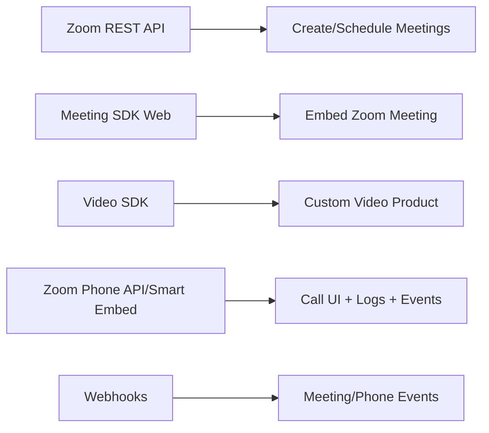
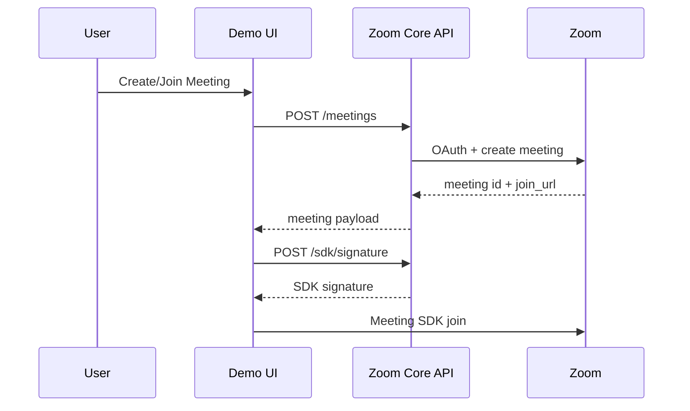

# Zoom SDK & Phone Integration — Implementation Prompt

## Bağlam

Iceberg Digital resmi Zoom Partner olduğu için M2'nin amacı Zoom Meeting SDK, Video SDK, REST API, OAuth ve Zoom Phone yeteneklerini haritalamak ve platform-agnostic bir POC üretmektir. M3'ün Lifesycle CRM entegrasyonu bu core modül üzerine kurulmalıdır.

Ortak araştırma referansı: `SHARED_RESEARCH_REPORT.md`. Zoom resmi kaynak iddialarını oradaki claim bloklarından kullan.

## Hedef Ürün

**zoom-integration-core**: Backend token/signature/OAuth service + frontend embedded meeting demo + Zoom Phone Smart Embed feasibility + capability matrix. Demo, bir kullanıcının meeting oluşturup/join edip activity log görebildiği net bir akış göstermeli.

## Kapsam

### In Scope

- Meeting SDK Web embed POC.
- REST API ile create/schedule meeting akışı.
- Server-to-Server OAuth ve user OAuth karar dokümanı.
- Zoom Phone Smart Embed / webhook feasibility.
- Product capability map.

### Out of Scope

- Production marketplace approval.
- Gerçek müşteri tenant migration.
- Tam custom Zoom Video SDK consultation product.

## Zoom Ürün Ailesi Haritası

## Yetenek Matrisi

| Özellik | Durum | Not |
|---|---|---|
| Meeting create/schedule | Possible Now | OAuth/Server-to-Server OAuth gerekir. |
| Meeting join URL store | Possible Now | En hızlı MVP. |
| Meeting SDK embed | Possible Now | Browser/component limitations test edilmeli. |
| Full custom Zoom-like UI | Use Video SDK | Meeting SDK ile sınırlı customization. |
| Zoom Phone call UI web embed | Needs License | Smart Embed + Zoom Phone license. |
| Desktop client olmadan audio path | Escalate | Smart Embed docs desktop audio dependency belirtir. |
| Call logs / missed calls | Possible with Phone APIs | Scope/license gerekir. |
| Call event workflow trigger | Possible with webhooks | Event coverage test edilmeli. |
| Meeting transcript | Needs License/Settings | Recording/transcript availability host/account settings'e bağlı. |
| AI notetaker bot | Not Meeting SDK | RTMS/recording path araştırılmalı. |

## Auth & Security Architecture

- Backend secret owner: SDK key/secret, client secret ve Server-to-Server OAuth credential'ları yalnızca backend'de.
- Frontend token alır, secret asla görmez.
- OAuth accounts tenant/user bazlı saklanır.
- Access token yenileme ve retry job standardize edilir.
- Webhook events idempotency key ile işlenir.
- CSP, allowed origins ve SDK asset domains production checklist'e eklenir.

## POC Mimarisi

## Meeting SDK vs Video SDK Karar Ağacı

- Kullanıcı Zoom meeting/webinar'a katılacaksa: Meeting SDK.
- Klasik Zoom UI/meeting semantics isteniyorsa: Meeting SDK.
- Branded/custom consultation room isteniyorsa: Video SDK.
- CRM MVP sadece randevu/link/timeline istiyorsa: REST API + join URL.
- AI notetaker/realtime media stream isteniyorsa: RTMS/recording path; Meeting SDK değil.

## API Spesifikasyonu

- `POST /api/zoom/oauth/connect`: user OAuth başlat.
- `GET /api/zoom/oauth/callback`: OAuth callback.
- `POST /api/zoom/meetings`: topic, start_time, timezone, related_entity.
- `POST /api/zoom/sdk/signature`: meeting_number, role.
- `POST /api/zoom/webhooks`: event receiver.
- `GET /api/zoom/phone/capabilities`: tenant license/scope status.
- `GET /api/zoom/capability-map`: possible/needs-license/escalate matrix.

## UI/UX Spesifikasyonu

- Demo home: credential status + capability tiles.
- Meeting tab: create meeting, display join/start URL, embedded SDK area.
- Phone tab: Smart Embed status, webhook event log, call log mock/real list.
- Diagnostics tab: scopes, token expiry, SDK version, known limitations.

## GitHub'dan Kullanılacak Referanslar

| Repo | URL | Kullanım |
|---|---|---|
| zoom/meetingsdk-web-sample | https://github.com/zoom/meetingsdk-web-sample | Official Web Meeting SDK sample; signature/join flow. |
| zoom/meetingsdk-react-sample | https://github.com/zoom/meetingsdk-react-sample | React component integration. |
| zoom/videosdk-web-sample | https://github.com/zoom/videosdk-web-sample | Video SDK comparison and custom room path. |
| zoom/videosdk-ui-toolkit-react-sample | https://github.com/zoom/videosdk-ui-toolkit-react-sample | Fast branded room UI exploration. |
| zoom/appssdk-sample-react | https://github.com/zoom/appssdk-sample-react | Zoom app/event ecosystem reference. |

## Uygulama Adımları

- [ ] Zoom dev app credential modelini seç: Server-to-Server OAuth + Meeting SDK.
- [ ] Backend config/env validation ekle.
- [ ] `POST /meetings` endpoint'i oluştur.
- [ ] SDK signature endpoint'i oluştur.
- [ ] React/Vue/HTML embed demo ekranı kur.
- [ ] Webhook receiver ve event log tablosu ekle.
- [ ] Zoom Phone Smart Embed docs'a göre feasibility ekranı ekle.
- [ ] Capability matrix'i gerçek bulgularla doldur.
- [ ] README ve partner escalation list yaz.

## Test Planı

- API: token refresh, meeting create, signature generation.
- Frontend: embed join smoke test desktop Chrome/Safari.
- Security: no secret in browser bundle/logs.
- Webhook: replay/idempotency test.
- Phone: license yoksa graceful "needs license" state.

## Demo Senaryosu

1. Demo UI credential status gösterir.
2. User "Create meeting" der.
3. Meeting payload ve join URL görünür.
4. User embedded area içinde join eder.
5. Backend event log / mock webhook listesi güncellenir.
6. Phone tab'da Smart Embed capability ve escalation questions gösterilir.

## Handover Checklist

- [ ] Environment variables and Zoom app setup screenshots.
- [ ] API route docs.
- [ ] OAuth/scope matrix.
- [ ] SDK version notes.
- [ ] Capability map.
- [ ] Partner escalation list.
- [ ] Known limitations and browser matrix.

## Diğer Mission'lara Bağlantı Noktaları

- M3 bu core API'yi `related_entity_type/contact/property/viewing` alanlarıyla Lifesycle'a bağlar.
- M4 timeline'a Zoom meeting ve Plaud transcript event'lerini birlikte işler.
- M5 boilerplate generator bu service'i mission templates'e ekleyebilir.

## Kırmızı Çizgiler

- "Zoom Phone tamamen desktop client olmadan çalışır" deme; Smart Embed audio path bağımlılığını açık yaz.
- Meeting SDK'i AI notetaker olarak konumlandırma.
- Partner-only belirsizlikleri "Zoom Partner support'a escalate" etiketiyle ayır.

## Final Recommendation

M2'nin ilk teslimi **REST meeting create + Meeting SDK embed + Phone Smart Embed feasibility** olmalı. Bu hem M3 için reuse edilebilir altyapı üretir hem de demo etkisi yüksek bir Zoom Partner capability map sağlar.
