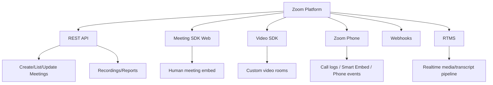
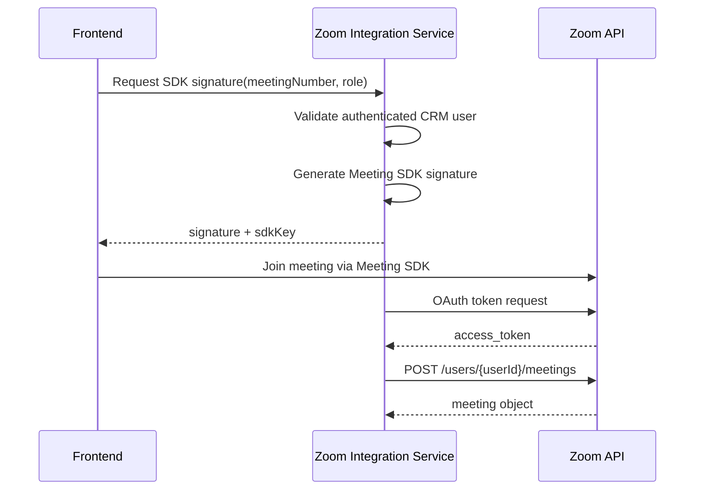

# M2_IMPLEMENTATION_PROMPT.md

# M2 — Zoom SDK & Phone Integration Implementation Prompt

## Bağlam

M2’nin amacı Zoom ekosisteminin Partner-level capability map’ini çıkarmak, Meeting SDK/Video SDK/REST API/Phone/Webhooks/RTMS sınırlarını netleştirmek ve Iceberg Digital’in daha sonra Lifesycle CRM içinde kullanabileceği ortak Zoom Integration Service için POC üretmektir.

## Hedef Ürün

**Zoom Capability Lab:** Zoom meeting oluşturma, Meeting SDK embed, webhook event capture ve opsiyonel Zoom Phone event/click-to-call akışını tek demo uygulamasında gösteren modüler integration service.

## Kapsam

### In Scope

- Zoom REST API meeting create/list/read
- Server-to-Server OAuth backend token flow
- Meeting SDK Web signature endpoint
- Frontend embed demo
- Webhook receiver + verification + event log
- Phone capability map
- Phone mock veya gerçek lisans varsa call event demo

### Out of Scope

- Production Marketplace approval tamamlama
- Zoom Phone enterprise rollout
- AI notetaker bot olarak meeting’e katılma
- Full custom video product geliştirme

## Zoom Ürün Ailesi Haritası



## Yetenek Matrisi

| Capability | Status | Not |
|---|---|---|
| Backend meeting create | Possible Now | S2S OAuth veya User OAuth |
| Web embed meeting | Possible Now | Meeting SDK signature gerekli |
| Join as normal participant | Possible Now | User-facing UI |
| AI bot/notetaker via Meeting SDK | Not recommended / policy risk | RTMS kullanılmalı |
| Realtime transcript/media | Possible via RTMS | App config ve consent gerekir |
| Recording completed event | Possible Now | Webhook |
| Phone call logs | Needs License | Zoom Phone lisansı |
| Web app phone client | Needs License | Smart Embed doğrulanmalı |
| Deep call automation | Escalate | Partner/support gerekebilir |
| Marketplace public app | Needs Review | Security/app review |

## Auth & Security Architecture



### Security rules

- SDK secret sadece backend’de tutulur.
- Webhook signature doğrulanmadan event işlenmez.
- OAuth scopes minimum tutulur.
- Token ve webhook payload audit log’a maskelenmiş kaydedilir.
- Meeting passcode/join URL client’a sadece yetkili kullanıcı için verilir.

## POC Mimarisi

### Backend service

- `/auth/zoom/s2s-token` internal only
- `/zoom/meetings` create meeting
- `/zoom/sdk/signature` Meeting SDK signature
- `/zoom/webhooks` webhook receiver
- `/zoom/events` event log list
- `/zoom/phone/capabilities` config/status

### Frontend

- Capability dashboard
- Create meeting form
- Meeting embed page
- Webhook event timeline
- Phone capability screen

## Meeting SDK vs Video SDK Karar Ağacı

| Soru | Cevap | Seçim |
|---|---|---|
| Gerçek Zoom meeting mi? | Evet | Meeting SDK |
| Zoom meeting yerine custom room mu? | Evet | Video SDK |
| Zoom client özellikleri gerekiyor mu? | Evet | Meeting SDK |
| AI media stream gerekiyor mu? | Evet | RTMS |
| Sadece meeting link ve timeline yeterli mi? | Evet | REST API + redirect |

## Zoom Phone Feasibility Raporu

### MVP

- Kullanıcı CRM’den “Call via Zoom Phone” butonuna basar.
- Eğer Smart Embed/Zoom Phone environment hazır değilse tel link veya mock call event kullanılır.
- Phone call ended webhook/call log CRM timeline’a düşer.

### Production

- Zoom Phone lisansı ve account config doğrulanır.
- Phone users/extension mapping yapılır.
- Webhook eventleri idempotent işlenir.
- Call recordings/transcripts legal consent’e göre işlenir.

### Escalation list

1. Smart Embed için gereken lisans ve enablement nedir?
2. Browser içi outbound call başlatma hangi şartlarda desteklenir?
3. Call recording/transcript API erişimi hangi account seviyesinde var?
4. Partner app için ek rate limit veya private endpoint var mı?
5. UK estate agency compliance için önerilen consent pattern nedir?

## Product Capability Map

1. Create Zoom meeting from CRM
2. One-click join embedded meeting
3. Meeting invite email generation
4. Calendar sync handoff
5. Meeting started event
6. Meeting ended event
7. Recording ready event
8. Transcript ready event
9. Meeting summary timeline card
10. Contact/property auto-link
11. Zoom Phone click-to-call
12. Phone call timeline log
13. Missed call follow-up task
14. Recording consent flag
15. AI follow-up draft
16. Demo analytics dashboard
17. Partner escalation tracker

## GitHub Referansları

| Repo | URL | Kullanım |
|---|---|---|
| zoom/meetingsdk-web-sample | https://github.com/zoom/meetingsdk-web-sample | Meeting SDK frontend/backend sample |
| zoom/videosdk-web-sample | https://github.com/zoom/videosdk-web-sample | Video SDK karşılaştırma POC |
| zoom/webhook-sample | https://github.com/zoom/webhook-sample | Webhook verification pattern |
| zoom/rtms-meeting-assistant-starter-kit | https://github.com/zoom/rtms-meeting-assistant-starter-kit | RTMS media pipeline referansı |
| zoom/zoom-server-to-server-oauth-starter | https://github.com/zoom/zoom-server-to-server-oauth-starter | S2S OAuth backend starter |
| zoom/zoomapps-advanded-sample-react | https://github.com/zoom/zoomapps-advanded-sample-react | React Zoom app UX ilhamı |

## Demo Uygulama Spesifikasyonu

### Screens

1. Zoom Capability Dashboard
2. Create Meeting
3. Embedded Meeting Room
4. Event Timeline
5. Phone Feasibility / Mock Call
6. Escalation Checklist

### API call sequence

1. Backend S2S token alır.
2. Meeting create API çağrılır.
3. Frontend meeting card gösterir.
4. Kullanıcı “Join embedded” der.
5. Backend SDK signature üretir.
6. Meeting SDK başlar.
7. Webhook eventleri event timeline’a düşer.
8. Phone mock event CRM timeline formatında gösterilir.

## Production Architecture

M2 çıktısı M3’e `Zoom Integration Service` olarak aktarılmalıdır.

```text
packages/zoom-integration
- auth/
- meetings/
- sdk/
- webhooks/
- phone/
- crm-adapter/
- audit/
```

## Lisans & Maliyet Analizi

- Meeting REST API ve Meeting SDK için Zoom developer app config gerekir.
- Zoom Phone özellikleri Phone lisansına bağlıdır.
- RTMS ve bazı advanced eventler app/account enablement isteyebilir.
- Marketplace public app review production zaman çizelgesini etkiler.

## Test Planı

- Unit: signature generator, webhook verifier, OAuth token parser
- Integration: create meeting, list meeting, webhook replay
- UI: embed init, error state, leave meeting
- Security: invalid webhook signature reject, expired token refresh
- Load: webhook duplicate event idempotency

## Demo Senaryosu

1. Dashboard’da capability matrix görünür.
2. Agent için meeting oluşturulur.
3. Meeting CRM-like card olarak görünür.
4. Web embed başlatılır.
5. Webhook eventleri canlı timeline’a düşer.
6. Phone sekmesinde lisans gereksinimi ve mock call event gösterilir.
7. Finalde M3’e aktarılacak service boundary açıklanır.

## Handover Checklist

- [ ] README
- [ ] Env vars list
- [ ] Zoom app config screenshots
- [ ] OAuth scopes list
- [ ] Webhook events list
- [ ] Known limitations
- [ ] Partner escalation questions
- [ ] Demo video/GIF

## Final Recommendation

M2 için en etkileyici ve güvenli POC: REST API meeting create + Meeting SDK Web embed + webhook timeline + Zoom Phone feasibility screen. Realtime AI/transcript ihtiyacı varsa Meeting SDK zorlanmamalı, RTMS ayrı modül olarak tasarlanmalıdır.

## Kırmızı Çizgiler

- Meeting SDK’yı bot/notetaker gibi kullanma.
- SDK secret client’a koyma.
- Phone capability için lisans doğrulamadan “production-ready” deme.
- Marketplace review gerektiren feature’ları internal demo ile karıştırma.
