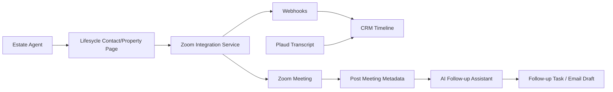

# M3_IMPLEMENTATION_PROMPT.md

# M3 — Zoom Video Meetings in Lifesycle CRM Implementation Prompt

## Bağlam

M3, M2’de oluşturulan Zoom Integration Service’i Lifesycle CRM domain’ine bağlar. Amaç estate agent’ın CRM’den çıkmadan valuation/follow-up meeting oluşturması, müşteriye davet göndermesi, meeting metadata’sının contact/property timeline’a düşmesi ve post-meeting follow-up sürecinin otomasyonla desteklenmesidir.

## Hedef Ürün

**Lifesycle Zoom Meeting Flow:** Contact veya Property ekranından Zoom meeting oluştur, toplantıya katıl, activity timeline’da meeting lifecycle’ı izle ve meeting sonrası follow-up task/summary üret.

## Kapsam

### In Scope

- Contact/property/valuation context ile meeting create
- CRM timeline event oluşturma
- Meeting invite payload
- Embedded join veya redirect option
- Webhook event ingestion
- Post-meeting metadata card
- M4 Plaud/summary ile birleşebilir activity model

### Out of Scope

- Full calendar replacement
- Full Zoom Phone rollout
- Fully automated proposal update without user review
- Production CRM schema migration without main team review

## Lifesycle CRM Context Assumptions

```text
Agency has many Branches
Branch has many Agents
Agent owns Contacts, Properties, Appointments
Contact may relate to Property as owner/vendor/buyer
Valuation Appointment may produce Proposal
TimelineEvent attaches to Contact/Property/Valuation
```

Bilinmeyenler:

- Gerçek Lifesycle internal API endpointleri
- Existing timeline/event schema
- Auth/session implementation
- Notification/email infrastructure
- Current calendar integration status

## Integration Option Comparison

| Yaklaşım | MVP hızı | UX | Production readiness | Risk | Skor |
|---|---:|---:|---:|---:|---:|
| Manual Zoom link paste | Çok yüksek | Düşük | Orta | Düşük | 6/10 |
| REST API create + redirect join | Yüksek | Orta | Yüksek | Orta | 8/10 |
| REST API + Meeting SDK embed | Orta | Yüksek | Orta/Yüksek | Orta/Yüksek | 8.5/10 |
| Video SDK custom room | Düşük | Yüksek | Orta | Yüksek | 5/10 |

**Önerilen MVP:** REST API create + CRM timeline + redirect join.  
**Etkileyici demo:** Meeting SDK embed opsiyonu ekle.  
**Production path:** OAuth, calendar/email, webhook reliability, permissions.

## Full Vision



## Data Model

```text
ZoomIntegrationAccount
- id
- agency_id
- user_id nullable
- zoom_account_id
- auth_type: s2s | user_oauth
- encrypted_token_ref
- scopes
- status

CrmMeeting
- id
- subject_type: contact | property | valuation
- subject_id
- zoom_meeting_id
- topic
- start_time
- duration
- join_url
- start_url_ref encrypted/internal
- created_by
- status

TimelineEvent
- id
- subject_type
- subject_id
- provider: zoom
- event_type
- title
- summary
- occurred_at
- metadata_json

MeetingParticipant
- id
- crm_meeting_id
- contact_id nullable
- email
- role
- attendance_status
```

## API Design

| Method | Endpoint | Açıklama |
|---|---|---|
| POST | `/api/crm/{subjectType}/{subjectId}/zoom-meetings` | CRM context ile meeting oluştur |
| GET | `/api/crm/{subjectType}/{subjectId}/timeline` | Timeline getir |
| POST | `/api/zoom/sdk/signature` | Embed join için signature |
| POST | `/api/zoom/webhooks` | Zoom event receiver |
| POST | `/api/meetings/{id}/follow-up-draft` | AI follow-up draft üret |
| PATCH | `/api/meetings/{id}/link-subject` | Meeting’i farklı contact/property’ye bağla |

## UX Flow

### Agent journey

1. Agent Lifesycle’da bir property valuation sayfasına girer.
2. “Schedule Zoom Meeting” butonuna basar.
3. Topic otomatik önerilir: `Valuation call — {property address}`.
4. Contact email ve property context prefilled gelir.
5. Meeting oluşturulur, timeline’a `meeting_created` düşer.
6. Agent meeting’e redirect veya embedded join ile katılır.
7. Meeting start/end webhookları timeline’ı günceller.
8. Recording/transcript varsa “pending review” olarak görünür.
9. Agent follow-up email/task draft’ını onaylar.

## OAuth Scope & Permission Matrisi

| İşlem | Scope tipi | Not |
|---|---|---|
| Meeting create | meeting:write / equivalent | User OAuth production için daha doğru olabilir |
| Meeting read | meeting:read | Timeline sync |
| Recording read | recording:read | Consent ve plan kontrolü |
| Webhook receive | App-level event subscription | Signature verification |
| SDK join | Meeting SDK credentials | Backend signature endpoint |

## Post-Meeting Data

- Meeting status
- Start/end time
- Duration
- Participants
- Recording availability
- Transcript availability
- AI summary status
- Follow-up task status
- Related property/contact confidence

## POC Uygulama Spesifikasyonu

### Minimum acceptable demo

- Mock contact/property
- Create Zoom meeting via API
- Show meeting card in CRM timeline
- Join via redirect URL
- Webhook event replay

### Preferred demo

- Embedded Meeting SDK join
- Timeline event stream
- AI follow-up draft mock/real
- Handover docs

### Tech stack

- Backend: Node/NestJS or Laravel service
- Frontend: React CRM mock page
- DB: Postgres/SQLite for POC
- Queue: simple worker or BullMQ
- AI: shared AI adapter for draft generation

## M2 ile Paylaşım

M3 M2’den şunları direkt almalı:

- OAuth/S2S token client
- Meeting create service
- SDK signature generator
- Webhook verifier
- Zoom event type mapping
- Phone capability notes

M3’e özel olanlar:

- CRM subject linking
- Timeline adapter
- Contact/property UX
- Follow-up task/email logic

## M4 ile Bağlantı

- Plaud recording `TimelineEvent(provider=plaud)` olarak aynı timeline’da gösterilir.
- Zoom meeting ve Plaud transcript aynı valuation appointment’a bağlanabilir.
- AI summary, Zoom metadata + Plaud transcript’i birlikte kullanabilir.

## GitHub Referansları

| Repo | URL | Kullanım |
|---|---|---|
| zoom/meetingsdk-web-sample | https://github.com/zoom/meetingsdk-web-sample | Embed join implementation |
| zoom/webhook-sample | https://github.com/zoom/webhook-sample | Webhook verification |
| zoom/zoom-server-to-server-oauth-starter | https://github.com/zoom/zoom-server-to-server-oauth-starter | Token flow |
| calcom/cal.com | https://github.com/calcom/cal.com | Scheduling UX/reference |
| nhn/tui.calendar | https://github.com/nhn/tui.calendar | Calendar UI component reference |
| openai/openai-agents-python | https://github.com/openai/openai-agents-python | Follow-up assistant pattern |

## Handover Package İçeriği

- Architecture README
- CRM model assumptions
- Zoom app setup guide
- Env vars
- API endpoint docs
- Webhook event mapping
- UI screenshots/GIF
- Known issues
- Production migration checklist

## Demo Day Reflection Template

```markdown
## What we proved
- CRM context -> Zoom meeting create works.
- Timeline can capture meeting lifecycle.
- Embed vs redirect trade-off is visible.

## What remains unknown
- Real Lifesycle schema
- Production OAuth model
- Recording/transcript availability

## Recommendation
Continue to production spike if internal CRM API and Zoom app credentials are available.
```

## Final Recommendation

M3 için en doğru yol: önce REST API + timeline MVP, ardından Meeting SDK embed’i opsiyonel “wow factor” olarak eklemek. Bu yaklaşım M2’deki ortak Zoom service’i reuse eder, M4 Plaud transcript akışına doğal zemin hazırlar ve production handover riskini azaltır.

## Kırmızı Çizgiler

- CRM timeline’a yazılan AI output review’suz proposal’a uygulanmamalı.
- Meeting SDK embed, redirect MVP’yi geciktirmemeli.
- OAuth scope’ları minimum olmalı.
- Recording/transcript consent açıkça gösterilmeli.
