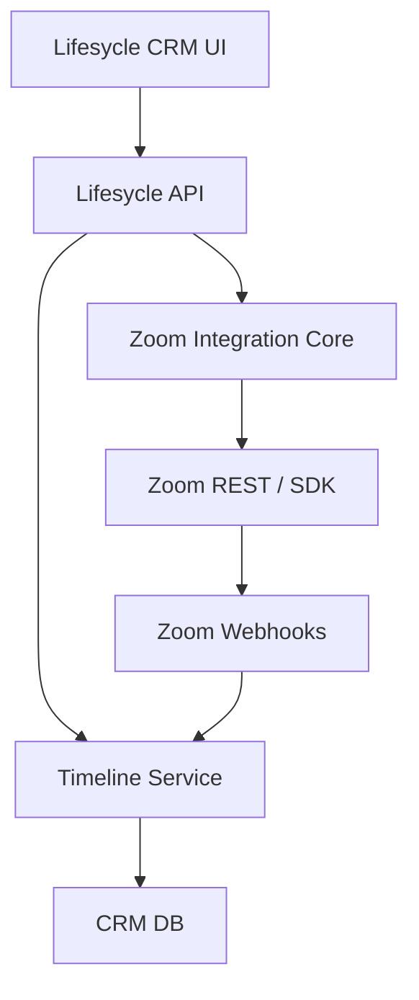

# Zoom Video Meetings in Lifesycle CRM — Implementation Prompt

> **Grok versiyonu** — `_grok` soneki ile diğer AI'lerden ayırt edilir.

## Bağlam

Bu mission, Lifesycle kullanıcılarının CRM içinden Zoom meeting oluşturup, katılıp ve meeting bilgisini contact/lead/property timeline'a bağlayıp bağlayamayacağını araştırır ve POC üretir. M2'nin `zoom-integration-core` çıktısı bu mission'ın teknik altyapısıdır.

Ortak araştırma referansı: `SHARED_RESEARCH_REPORT_grok.md`. Lifesycle domain modeli public kaynaklarda sınırlı olduğu için aşağıdaki entity'ler mission brief'lerinden çıkarılmış varsayımlardır.

## Hedef Ürün

**Lifesycle Zoom Meeting Flow**: Contact profile üzerinde "Schedule Zoom Meeting" / "Start Zoom Meeting" aksiyonu, meeting oluşturma, join URL gösterme, CRM timeline event'i, follow-up task ve opsiyonel embedded join demo.

## Kapsam

### In Scope

- CRM-style contact profile POC.
- Zoom REST API create/schedule meeting.
- Timeline event creation.
- OAuth/scope matrix.
- Embed vs redirect karar tablosu.
- Handover package.

### Out of Scope

- Full production Lifesycle merge.
- Tüm Zoom Phone senaryoları.
- AI transcript ingestion; M4 ile bağlanır ama bu mission'da uygulanmaz.

## Lifesycle CRM Context Assumptions

Varsayılan domain:

- `Company`: estate agency / tenant.
- `User`: agent veya admin.
- `Contact/Lead`: homeowner, buyer, seller, landlord.
- `Property`: valuation veya listing kaydı.
- `Viewing/Appointment`: scheduled interaction.
- `TimelineEvent`: call, email, note, Zoom meeting, Plaud transcript, task.

## Integration Option Comparison

| Yaklaşım | MVP hızı | Production readiness | UX etkisi | Risk | Öneri |
|---|---:|---:|---:|---:|---|
| Meeting link redirect | Çok yüksek | Orta | Orta | Düşük | İlk MVP için ideal. |
| REST API create + timeline | Yüksek | Yüksek | Yüksek | Orta | Ana öneri. |
| Meeting SDK embed | Orta | Orta | Çok yüksek | Orta/Yüksek | Demo ve select use case. |
| Video SDK custom room | Düşük | Orta | Çok yüksek | Yüksek | Daha sonra branded consultation. |

## Önerilen MVP

Zoom meeting'i Lifesycle'dan oluştur, `join_url/start_url` ve metadata'yı contact/property timeline'a yaz, follow-up task oluştur. Embed opsiyonel demo tab olarak kalsın.

## Full Vision

- Contact/property profile'dan Zoom meeting başlatma.
- Meeting timeline event.
- Post-meeting metadata sync.
- Recording/transcript available ise M4/M3 ortak transcript workflow.
- Follow-up task / WhatsApp/email automation.
- Plaud transcript ve Zoom meeting aynı timeline'da birleşir.

## Mimari



## Tech Stack

- Backend: mevcut Lifesycle backend stack bilinmiyorsa Laravel-compatible API spec tasarla; POC Node/Laravel olabilir.
- Frontend: CRM-style React/Vue/Blade component.
- Zoom: REST API + optional Meeting SDK Web.
- Storage: relational tables + JSON metadata for provider payloads.

## Data Model

```text
contacts(id, company_id, name, email, phone)
properties(id, company_id, address, status)
appointments(id, company_id, contact_id, property_id, type, starts_at)
zoom_meetings(id, company_id, user_id, contact_id, property_id, appointment_id, zoom_meeting_id, topic, join_url, start_url_encrypted, start_time, status, raw_payload_json)
timeline_events(id, company_id, actor_id, subject_type, subject_id, event_type, title, body, metadata_json, occurred_at)
follow_up_tasks(id, company_id, assignee_id, contact_id, property_id, title, due_at, status)
```

## API Spesifikasyonu

- `POST /api/crm/contacts/{contact}/zoom-meetings`: create/schedule.
- `GET /api/crm/contacts/{contact}/timeline`: list events.
- `POST /api/crm/zoom-meetings/{meeting}/join`: return join payload / SDK signature if enabled.
- `POST /api/crm/zoom/webhooks`: meeting lifecycle event receiver.
- `POST /api/crm/zoom-meetings/{meeting}/follow-up`: create task.

## UI/UX Spesifikasyonu

- Contact profile header: primary action `Schedule Zoom`.
- Modal: topic, date/time, related property, agenda, invitee email.
- Result card: join URL, copy/share, optional embedded join.
- Timeline item: Zoom icon, topic, status, linked property, follow-up action.
- Empty/error states: Zoom not connected, missing license, API failure, meeting deleted.

## OAuth Scope & Permission Matrisi

| Capability | Auth model | Scope category |
|---|---|---|
| Create meeting for connected user | User OAuth or S2S account-level | meeting write |
| Read meeting metadata | User OAuth or S2S | meeting read |
| Webhook events | Marketplace app | event subscriptions |
| Recording/transcript | Account/user settings + scopes | recording/transcript read |
| SDK join | Meeting SDK credentials | SDK signature |

## Post-Meeting Data

- Store meeting ended event when webhook available.
- Recording/transcript should be feature-flagged because availability depends on Zoom account settings, license and user consent.
- Use `TimelineEvent.metadata_json` for provider payload; do not denormalize every field initially.

## GitHub'dan Kullanılacak Referanslar

| Repo | URL | Kullanım |
|---|---|---|
| zoom/meetingsdk-react-sample | https://github.com/zoom/meetingsdk-react-sample | Optional embedded meeting component. |
| zoom/meetingsdk-web-sample | https://github.com/zoom/meetingsdk-web-sample | Signature/join reference. |
| zoom/videosdk-ui-toolkit-react-sample | https://github.com/zoom/videosdk-ui-toolkit-react-sample | Future custom consultation room. |
| hubspot-api-nodejs | https://github.com/HubSpot/hubspot-api-nodejs | CRM API design inspiration for timeline-style integration. |
| calcom/cal.com | https://github.com/calcom/cal.com | Scheduling UX, meeting links, availability concepts. |

## Uygulama Adımları

- [ ] CRM POC seed: contact, property, appointment, agent.
- [ ] Zoom connected/not-connected states.
- [ ] Create meeting endpoint using M2 core service.
- [ ] Timeline event creation transaction.
- [ ] Contact profile UI and schedule modal.
- [ ] Optional embed tab with Meeting SDK.
- [ ] Webhook event log/mocked update.
- [ ] Handover docs and demo-day reflection.

## Test Planı

- API: meeting create failure leaves no partial timeline event.
- Permissions: user can only see company records.
- UX: schedule, copy join URL, timeline appears.
- Webhook: duplicate event idempotent.
- Security: `start_url` encrypted or never exposed to non-host.

## Demo Senaryosu

1. Agent opens contact profile.
2. Selects related property and schedules Zoom meeting.
3. Lifesycle displays meeting card and adds timeline item.
4. Agent copies join link or joins embedded demo.
5. Meeting ended event updates timeline.
6. Agent creates follow-up task.

## Handover Checklist

- [ ] README with setup and Zoom app configuration.
- [ ] Env var example.
- [ ] API docs.
- [ ] Entity relationship diagram.
- [ ] OAuth/scope matrix.
- [ ] Screenshots.
- [ ] Known limitations.
- [ ] Demo Day Reflection: what could be planned/tested/scoped better.

## Diğer Mission'lara Bağlantı Noktaları

- M2 provides Zoom core service and partner escalation answers.
- M4 reuses `TimelineEvent` for Plaud transcript and property proposal intelligence.
- M5 can generate CRM integration boilerplate and handover docs.

## Kırmızı Çizgiler

- Full embed'i otomatik doğru çözüm varsayma.
- Recording/transcript availability için account/license/consent belirsizliğini belirt.
- Lifesycle production domain modelini doğrulamadan migration finalleştirme.

## Final Recommendation

Devam önerisi: **Continue**. MVP "Zoom meeting create + CRM timeline log" olmalı; Meeting SDK embed demo etkisi için ayrı feature flag olarak eklenmeli.
