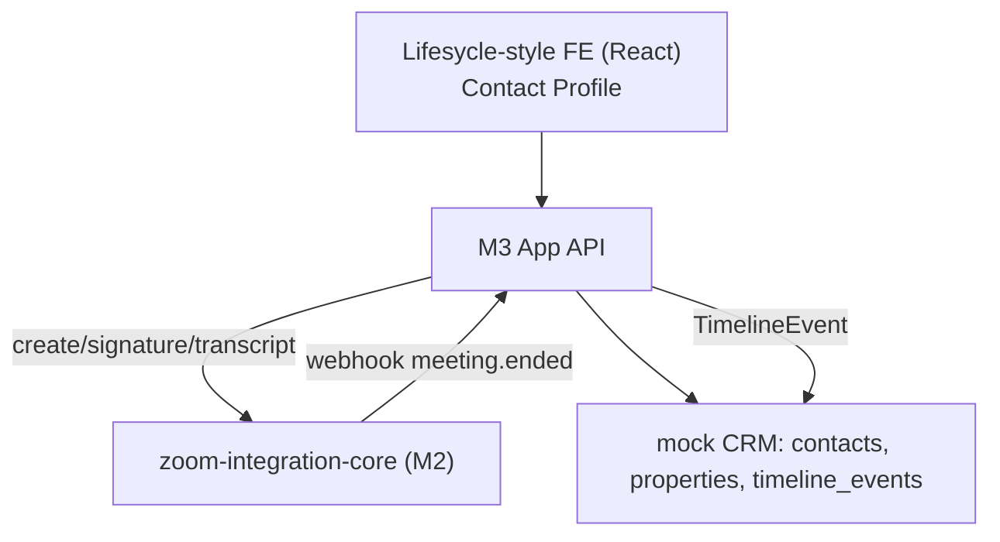

# M3 — Zoom Video Meetings in Lifesycle CRM — Implementation Prompt

> **Referans:** `SHARED_RESEARCH_REPORT_opus.md` §1 (Lifesycle), §2 (Zoom), §9 (Timeline model). `M2_IMPLEMENTATION_PROMPT_opus.md` (zoom-integration-core).
> **Tarih:** 2026-06-20
> **Hedef:** Lifesycle agent'larının Zoom meeting'i CRM içinden başlatıp timeline'a bağlayabildiği çalışan POC.

## Bağlam

Lifesycle, estate agent'lar için AI-native CRM/OS. Tek contact profili (Buyer/Vendor/Landlord/Land). Use case: agent contact/lead profili açar → meeting başlatır/planlar → bilgi CRM kaydına (timeline) bağlanır. M2'deki `zoom-integration-core` burada tüketilir. Production-ready zorunlu değil; net teknik öneri + demo hedefleniyor.

## Hedef Ürün

CRM-style contact profile içinde:
1. "Start/Schedule Zoom Meeting" → REST ile meeting create → join (Meeting SDK embed veya link).
2. Meeting bilgisi otomatik **Communication Timeline**'a event olarak düşer.
3. Meeting bitince transcript/recording timeline'a iliştirilir (M4 ile birleşik timeline'a hazır).

## Kapsam

### In Scope
- Mock Lifesycle domain (Contact, Property, TimelineEvent).
- Contact profile UI + "Start Meeting" / "Schedule Meeting".
- zoom-integration-core tüketimi (create + signature + transcript).
- Embedded meeting (tercih edilen) **veya** join link + timeline log (MVP).
- Post-meeting: transcript event'i.

### Out of Scope
- Gerçek Lifesycle DB (mock şema).
- Plaud entegrasyonu (M4) — sadece timeline modeli uyumlu bırakılır.
- Full follow-up automation (stub).

## Integration Option Comparison

| Yaklaşım | TTV | Production | UX | Skor |
|----------|-----|------------|-----|------|
| **A) Link redirect** (REST create + join_url) | Çok hızlı | Yüksek | Orta (Zoom'a çıkış) | MVP için ✅ |
| **B) Meeting SDK embed** (Component View) | Orta | Yüksek | Yüksek (CRM içinde) | Preferred ✅ |
| **C) Video SDK** (white-label) | Yavaş | Yüksek | En yüksek ama gereksiz | ❌ (lisans+effort) |

**Öneri:** MVP = A (link + timeline), Preferred demo = B (embed). C gereksiz.

## Önerilen MVP
Contact profile → "Start Meeting" → backend REST create → `join_url` döner → agent join → **TimelineEvent(type=zoom_meeting)** otomatik oluşturulur. En basit değerli versiyon; embed olmadan da tam değer verir.

## Full Vision
Embed (Component View) + meeting bitince transcript otomatik timeline'a + AI özet + follow-up task önerisi (M1 AI layer ile).

## Mimari



## Tech Stack
- FE: React + Vite + Tailwind (CRM-style).
- API: Node/Express + TypeScript.
- DB: PostgreSQL (mock CRM).
- Zoom: M2 `zoom-integration-core` (HTTP).

## Data Model
```
Contact(id, name, email, phone, roles[buyer|vendor|landlord|land], ...)
Property(id, address, contactId, status)
TimelineEvent(id, contactId, propertyId?, type[zoom_meeting|plaud_transcript|note|call], source, occurredAt, payload, aiSummary?)
MeetingLink(id, timelineEventId, zoomMeetingId, joinUrl, transcriptText?)
```
> `TimelineEvent` SHARED §9 ortak modeliyle birebir — M4 Plaud event'leri aynı tabloya düşer.

## API Design
- `GET /contacts/:id` — profil + timeline.
- `POST /contacts/:id/meetings` — `{ topic, startTime? }` → core create → TimelineEvent oluştur → joinUrl döner.
- `POST /meetings/:id/embed-signature` — embed için signature (core proxy).
- `POST /webhooks/zoom` — meeting.ended/recording → transcript çek → timeline event güncelle.
- `GET /contacts/:id/timeline` — birleşik timeline.

## UX Flow (Agent Journey)
1. Agent contact profilini açar → timeline + "Start/Schedule Meeting" butonu.
2. "Start Meeting" → modal (topic) → create → embed (B) veya "Join in Zoom" (A).
3. Meeting timeline'da anında "Zoom Meeting started" event'i.
4. Meeting biter → "Transcript available" event'i (tıklayınca metin).
5. (Full) "Create follow-up task" önerisi.

## OAuth Scope & Permission Matrisi
- Backend (core): S2S OAuth `meeting:write:meeting:admin`, `cloud_recording:read:meeting_transcript:admin` (transcript için), `meeting:read`.
- Embed join: SDK JWT (signature), role=1 host / 0 participant.

## Post-Meeting Data
- Recording varsa: recordings API → TRANSCRIPT dosyası.
- Recording yoksa: AI Companion transcript (instance UUID + ayar açık).
- Timeline event'e `transcriptText` + `aiSummary` (ops. M1 AI layer).

## POC Spesifikasyonu
- **Minimum acceptable:** Mock contact + "Start Meeting" butonu + backend create + timeline log.
- **Preferred:** Gerçek Zoom REST + Component View embed + gerçek transcript + timeline.

## GitHub Referansları
1. **zoom/meetingsdk-react-sample** — embed.
2. **zoom/meetingsdk-auth-endpoint-sample** — signature (core içinde).
3. **zoom/webhook-sample** — meeting.ended → transcript.
4. **specivo/specivo** — timeline/activity + search ilhamı.
5. **zoom/skills** (recording-pipeline) — transcript retrieval örneği.

## Handover Package İçeriği
- README outline: setup, env (core URL, DB), mimari, varsayımlar.
- `.env.example`.
- Known issues: Lifesycle gerçek şema bilinmiyor; embed CSS izolasyonu; transcript ayar bağımlılığı.
- Demo link/script.

## Demo Day Reflection Template (Doldurulmuş örnek)
- **Ne iyi gitti:** Embed + otomatik timeline; M2 core'un yeniden kullanımı.
- **Ne daha iyi olabilirdi:** Gerçek Lifesycle API'siyle test edilemedi (mock). Transcript yalnızca host ayarına bağlı; consent UI eklenmeli.
- **Sonraki adım:** Main dev team ile gerçek Contact/Timeline şeması; M4 Plaud event'leriyle birleşik timeline.

## M2 ile Paylaşım
- Ortak: token, signature, REST create, webhook, transcript (hepsi core'da).
- Lifesycle-specific: Contact profile UX, TimelineEvent eşleme, follow-up.

## M4 ile Bağlantı
- Aynı `TimelineEvent` tablosu: `zoom_meeting` ve `plaud_transcript` yan yana. Valuation appointment → Zoom meeting + Plaud kaydı tek timeline.

## Final Recommendation
**Continue.** MVP (A) hızlı değer; Preferred (B) embed "wow". Production öncesi: gerçek Lifesycle şeması + consent/compliance. Video SDK'ya gerek yok.

## Kırmızı Çizgiler
- Embed'i CRM CSS'inden izole et.
- Transcript erişimi consent + hesap ayarına bağlı — varsayma, kontrol et.
- Mock domain açıkça "varsayım" olarak işaretlensin.
