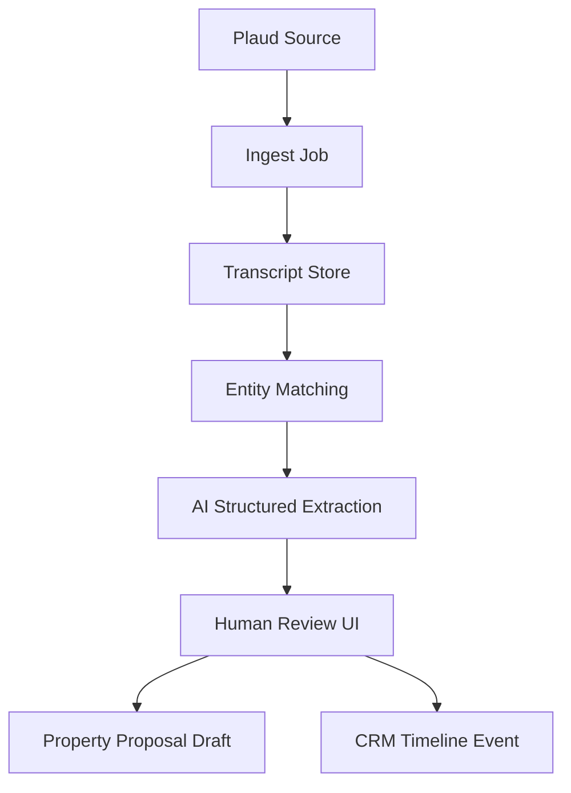

# Plaud Transcript Retrieval — Implementation Prompt

## Bağlam

M4, Plaud cihazlarıyla kaydedilen valuation konuşmalarının transcript/summary verisini Lifesycle'a getirmeyi, doğru Company/User/Property ile eşleştirmeyi ve property proposal workflow'unda kullanılabilir structured data üretmeyi hedefler.

Ortak araştırma referansı: `SHARED_RESEARCH_REPORT.md`. 2026 itibarıyla Plaud developer platformu, Embedded/Device SDK, Transcription API, MCP ve CLI kaynakları bulunmuştur; ancak production CRM account modelinin Plaud ile netleştirilmesi gerekir.

## Hedef Ürün

**Property Intelligence Pipeline**: Plaud transcript ingest -> entity matching -> AI structured extraction -> human review -> property proposal draft fields -> CRM timeline event.

## Kapsam

### In Scope

- Plaud API/platform analizi.
- Mock/MCP/CLI based transcript POC.
- Entity matching confidence model.
- AI structured extraction prompt/schema.
- Human review UI spec.
- Fallback plan.

### Out of Scope

- Tam production Plaud partner approval.
- Automatic write without review.
- Raw audio storage unless explicitly consented and required.

## Plaud Platform Analizi

- Plaud Embedded: capture/sync/transcribe akışı.
- Plaud Transcription API: async submit/status/result modeli.
- Plaud MCP/CLI: personal account verisine kayıt/transcript/note erişimi.
- Plaud SDK public repo: device/auth ve transcription API örnekleri.

Production soruları:

- Existing Plaud App customer data için OAuth veya enterprise API var mı?
- Company/User bazlı tenant isolation nasıl sağlanacak?
- Webhook var mı yoksa polling mi gerekiyor?
- Metadata: recording time, device, owner, title, location, template type, speaker labels.

## Retrieval Architecture Options

| Yaklaşım | MVP hızı | Production readiness | Risk | Öneri |
|---|---:|---:|---:|---|
| Manual export / mock import | Çok yüksek | Düşük | Düşük | Demo başlangıcı. |
| Plaud MCP/CLI personal account | Yüksek | Orta | Orta | POC için en gerçekçi hızlı yol. |
| Transcription API audio submit/poll | Orta | Yüksek | Orta | Eğer raw audio elde ediliyorsa production path. |
| Plaud Embedded Device SDK | Düşük | Yüksek | Yüksek | Native/mobile veya partner product path. |
| Webhook ingest | Bilinmiyor | Yüksek | Belirsiz | Kaynaklarda net değil; Plaud'a escalate. |

## Account Model Kararı

| Model | Artı | Eksi | Öneri |
|---|---|---|---|
| Per User OAuth/account | Veri sahipliği doğru, audit kolay | Setup friction | Production için tercih. |
| Per Company shared Plaud account | Operasyon basit | User attribution zayıf | Küçük ajanslar için opsiyon. |
| Central Iceberg account | Demo hızlı | Multi-tenant privacy riski | Sadece POC/mock. |

## Entity Matching Stratejisi

Confidence score 0-100:

- User match: Plaud owner / connected account / device id (0-30).
- Time correlation: valuation appointment +/- 4 saat (0-25).
- Property/contact text match: address, homeowner name, postcode, phone/email (0-25).
- Location/geofence if available (0-10).
- Manual hints: selected property in import UI (0-10).

Thresholds:

- `>= 85`: auto-suggest with high confidence, still require approval.
- `60-84`: review required, show top 3 candidates.
- `< 60`: unassigned transcript queue.

## Property Proposal Integration

Extract fields:

- property_condition
- motivation_to_sell_or_let
- target_price_expectation
- timeline_to_market
- improvements_needed
- competing_agent_mentions
- homeowner_concerns
- valuation_context
- recommended_follow_up
- missing_information

## Data Pipeline Mimarisi



## Tech Stack

- Backend: Laravel/Node service with queue jobs.
- AI: structured JSON output with strict schema; no free-form auto-apply.
- Matching: deterministic scoring first, optional fuzzy string matching.
- Storage: transcript text encrypted or access-controlled; extracted fields versioned.

## Data Model

```text
plaud_accounts(id, company_id, user_id, provider_user_id, auth_type, status)
plaud_recordings(id, account_id, provider_recording_id, title, recorded_at, duration, metadata_json, status)
transcripts(id, recording_id, text, summary, speaker_json, source, imported_at)
transcript_matches(id, transcript_id, company_id, user_id, property_id, contact_id, confidence, reasons_json, status)
proposal_extractions(id, transcript_id, property_id, ai_run_id, fields_json, confidence, review_status)
proposal_field_drafts(id, proposal_id, extraction_id, field_key, old_value, suggested_value, applied_at)
```

## API Spesifikasyonu

- `POST /api/plaud/import/mock`: upload/sample transcript.
- `POST /api/plaud/sync`: trigger MCP/API sync.
- `GET /api/plaud/unmatched`: unassigned queue.
- `POST /api/plaud/transcripts/{id}/match`: choose/confirm property.
- `POST /api/plaud/transcripts/{id}/extract`: run AI extraction.
- `POST /api/properties/{id}/proposal-drafts/apply`: apply approved fields.

## UI/UX Spesifikasyonu

- Transcript inbox: date, owner, title, match confidence, status.
- Match review: top candidate properties with reason chips.
- Extraction review: suggested proposal fields with diff and source snippets.
- Timeline event: Plaud summary linked to property/contact.

## GitHub'dan Kullanılacak Referanslar

| Repo | URL | Kullanım |
|---|---|---|
| Plaud-AI/plaud-sdk-public | https://github.com/Plaud-AI/plaud-sdk-public | Official SDK/API examples. |
| Plaud-AI/plaud-template-app | https://github.com/Plaud-AI/plaud-template-app | Quickstart app pattern. |
| openai/openai-agents-python | https://github.com/openai/openai-agents-python | Structured extraction agent. |
| dedupeio/dedupe | https://github.com/dedupeio/dedupe | Entity resolution concepts. |
| seatgeek/thefuzz | https://github.com/seatgeek/thefuzz | Fuzzy text matching for address/contact hints. |

## Uygulama Adımları

- [ ] Plaud source path seç: mock + optional MCP/CLI.
- [ ] Transcript inbox seed data oluştur.
- [ ] Matching score function yaz.
- [ ] Review UI'da top candidate properties göster.
- [ ] Structured extraction schema ve prompt oluştur.
- [ ] Proposal draft diff UI ekle.
- [ ] Timeline event creation ekle.
- [ ] Privacy/compliance notes ve escalation list yaz.

## Test Planı

- Unit: confidence score combinations.
- Unit: fuzzy address/contact match.
- API: duplicate recording idempotency.
- AI: invalid JSON retry, low confidence handling.
- Privacy: unauthorized company cannot read transcript.

## Demo Senaryosu

1. Agent transcript inbox açar.
2. New Plaud recording gelir.
3. System top 3 property match gösterir.
4. Agent correct property'yi onaylar.
5. AI proposal fields çıkarır.
6. Agent diff'i review edip selected fields apply eder.
7. Timeline'da Plaud summary görünür.

## Handover Checklist

- [ ] Plaud API/MCP findings.
- [ ] Account model decision matrix.
- [ ] Matching algorithm doc.
- [ ] Prompt and output schema.
- [ ] Sample transcripts.
- [ ] Privacy/GDPR checklist.
- [ ] Fallback plan.

## Diğer Mission'lara Bağlantı Noktaları

- M3 Zoom meeting timeline ile Plaud transcript timeline aynı event modelini kullanır.
- M1 AI review governance pattern'i burada human review olarak tekrar kullanılır.
- M5 agent stack, prompt/version/test generation için destek sağlar.

## Kırmızı Çizgiler

- Plaud API var diye existing customer app data access garantisi verme; bunu Plaud ile netleştir.
- Düşük confidence match'i otomatik property'ye bağlama.
- Consent ve retention policy olmadan raw audio/transcript production'a taşıma.

## Final Recommendation

İlk POC: **Mock/MCP transcript inbox + deterministic matching + AI extraction + human review**. Plaud production account modelini paralelde Plaud support/partner channel ile netleştir.
