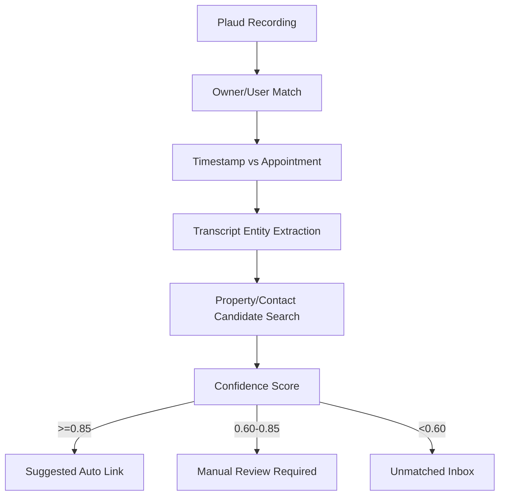
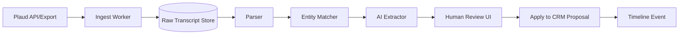

# M4_IMPLEMENTATION_PROMPT.md

# M4 — Plaud Transcript Retrieval Implementation Prompt

## Bağlam

M4, estate agent’ların Plaud cihazı/uygulamasıyla aldığı valuation konuşmalarını Lifesycle property workflow’una bağlar. Hedef transcript/summary ingestion, contact/property matching, AI structured extraction ve human review sonrası proposal alanlarını doldurma akışıdır.

## Hedef Ürün

**Plaud-to-Property Intelligence Pipeline:** Plaud recordings/transcripts çekilir, ilgili user/contact/property/valuation ile eşleştirilir, AI ile yapılandırılmış veri çıkarılır ve CRM’de review/apply ekranına düşer.

## Kapsam

### In Scope

- Plaud API/MCP/CLI access spike
- Manual export/Zapier fallback
- Transcript ingest model
- Entity matching confidence score
- AI extraction schema
- Human review UI spec
- Mock data ile çalışan POC

### Out of Scope

- Consent olmadan kayıt işleme
- AI output’un otomatik proposal update yapması
- Plaud resmi API erişimi doğrulanmadan production guarantee
- Audio transcription engine inşa etmek, fallback dışında

## Plaud Platform Analizi

### Ana bulgular

- Plaud developer/MCP/CLI yaklaşımı recordings search, transcript ve AI notes retrieval için kullanılabilir görünür.
- Zapier entegrasyonu, no-code bridge veya POC fallback olarak kullanılabilir.
- Export flows, API yoksa manual ingestion için kullanılabilir.

### Doğrulanması gerekenler

1. Auth modeli: OAuth mu API key mi?
2. Per-user data access mümkün mü?
3. Transcript field formatı nedir?
4. Recording metadata’da timestamp, device, owner, title var mı?
5. Rate limit ve pagination nasıl?
6. Webhook/event var mı?
7. AI-generated summary template bilgisi geliyor mu?

## Retrieval Architecture Options

| Yaklaşım | MVP hızı | Production | Risk | Öneri |
|---|---:|---:|---:|---|
| API/MCP pull | Orta | Yüksek | API access belirsiz | Ana hedef |
| Scheduled polling | Yüksek | Orta/Yüksek | Delay/rate limit | API varsa uygulanır |
| Webhook | Düşük/Orta | Yüksek | Var mı belirsiz | Varsa ideal |
| Zapier | Çok yüksek | Orta | Vendor/no-code limit | Fallback |
| Manual export upload | Çok yüksek | Düşük | Manual iş | Demo kurtarma |
| Generic transcription | Orta | Yüksek | Plaud dışı scope | Long-term fallback |

## Account Model Kararı

| Model | Artı | Eksi | Öneri |
|---|---|---|---|
| Central company account | Yönetimi kolay | User ownership belirsiz, privacy riski | Sadece demo/fallback |
| Per-user OAuth | Least privilege, audit iyi | Setup karmaşık | Production önerisi |
| Branch-level service account | Operasyon kolay | Granular consent zayıf | Büyük müşteriler için opsiyon |

**Öneri:** Production’da per-user OAuth veya Plaud’un desteklediği en yakın least-privilege model. Demo’da central/sandbox account kullanılabilir ama risk açıkça etiketlenmeli.

## Entity Matching Stratejisi



### Matching signals

| Signal | Weight | Örnek |
|---|---:|---|
| Same user/agent | 0.20 | Plaud owner = CRM agent |
| Appointment time proximity | 0.25 | ±2 saat valuation |
| Address/postcode mention | 0.25 | Transcript’te property address |
| Contact name/phone/email | 0.15 | Vendor adı |
| Recording title/template | 0.10 | “valuation” keyword |
| Manual prior link | 0.05 | Agent confirmed history |

### Confidence model

```text
confidence = weighted_sum(deterministic_signals) + fuzzy_score + ai_entity_score
```

Kurallar:

- `>= 0.85`: Suggested link, yine de review visible.
- `0.60 - 0.85`: Manual confirmation required.
- `< 0.60`: Unmatched inbox.

## Property Proposal Integration

Transcript/summary’den çıkarılabilecek alanlar:

- Property condition
- Number of bedrooms/bathrooms
- Seller motivation
- Desired timeline
- Asking price expectation
- Comparable properties mentioned
- Repairs/improvements
- Objections/risks
- Follow-up tasks
- Missing documents

## Data Pipeline Mimarisi



## Data Model

```text
PlaudConnection(id, user_id, auth_type, status, last_sync_at)
PlaudRecording(id, connection_id, plaud_recording_id, title, recorded_at, duration, raw_metadata)
Transcript(id, recording_id, text, summary, language, source_format)
ExtractionJob(id, transcript_id, status, model, prompt_version)
ExtractedField(id, job_id, field_key, value, confidence, evidence_quote)
MatchCandidate(id, recording_id, subject_type, subject_id, score, status)
ReviewDecision(id, candidate_id, reviewer_id, decision, applied_at)
```

## AI Enhancement Layer

### Prompt design skeleton

```text
You are extracting structured property valuation data from a transcript.
Return JSON only.
Do not infer unknown values.
For every field include confidence and evidence quote.
Schema: property_condition, seller_motivation, expected_price, timeline, objections, follow_up_tasks, missing_info.
```

### Guardrails

- JSON schema validation
- Evidence quote required
- “unknown” allowed
- High-impact fields require human approval
- PII masking in logs

## POC Spesifikasyonu

### Mock-first demo

1. Plaud sample transcript upload edilir.
2. Transcript parse edilir.
3. Mock CRM properties arasından candidate list çıkar.
4. AI structured extraction yapar.
5. Review UI’da fields görünür.
6. User seçili alanları “Apply to Proposal” ile uygular.
7. Timeline’da `transcript_ingested` ve `proposal_updated_pending_review` eventleri görünür.

### API-real demo

- Plaud API/MCP/CLI ile recordings list çek.
- Yeni recording transcript’i al.
- Aynı pipeline’a gönder.

## M3 Bağlantısı

- M3 Zoom meeting appointment oluşturduysa, Plaud recording timestamp + agent + appointment yakınlığıyla otomatik bağlanabilir.
- CRM timeline’da Zoom meeting ve Plaud transcript ardışık event olarak görünür.
- AI follow-up, Zoom meeting metadata + Plaud transcript’i birlikte kullanır.

## Privacy & Compliance

- Recording için explicit consent state tutulmalı.
- Transcript text encrypted at rest olmalı.
- Retention policy tenant/agency bazlı olmalı.
- DSAR/delete request için transcript silme akışı olmalı.
- AI provider’a gönderilen text için data processing policy incelenmeli.
- Review UI’da “source transcript” ve “AI extracted” ayrımı net görünmeli.

## GitHub Referansları

| Repo | URL | Kullanım |
|---|---|---|
| Plaud-Official/plaud-api-template-ts | https://github.com/Plaud-Official/plaud-api-template-ts | Plaud API starter |
| openplaud/openplaud | https://github.com/openplaud/openplaud | Plaud data ecosystem exploration |
| arbuzmell/plaud-api | https://github.com/arbuzmell/plaud-api | Unofficial Plaud access patterns; caution |
| moj-analytical-services/splink | https://github.com/moj-analytical-services/splink | Entity resolution |
| dedupeio/dedupe | https://github.com/dedupeio/dedupe | Fuzzy matching/entity dedupe |
| openai/openai-agents-python | https://github.com/openai/openai-agents-python | Extraction/review agent |

## Fallback Plan

### Plaud API yoksa

1. Manual transcript export upload
2. Zapier -> webhook bridge
3. Email attachment ingestion
4. Generic audio transcription pipeline
5. Future API adapter interface hazır bırakılır

Adapter interface:

```text
PlaudProviderAdapter
- listRecordings(user, cursor)
- getTranscript(recordingId)
- getSummary(recordingId)
- getMetadata(recordingId)
```

## Test Planı

- Unit: matching score, parser, schema validation
- Integration: mock Plaud adapter, CRM mock adapter
- AI eval: known transcript -> expected fields
- Privacy: consent missing -> no processing
- UI: manual match approval
- Regression: duplicate recording idempotency

## Demo Senaryosu

1. Agent “Plaud Inbox” ekranına girer.
2. Yeni transcript görünür.
3. Sistem 3 property candidate önerir.
4. En yüksek confidence nedenleriyle gösterilir.
5. AI extracted fields review ekranında listelenir.
6. Agent 4 alanı onaylar, 1 alanı reddeder.
7. Proposal draft güncellenir.
8. Timeline’a transcript + review eventleri düşer.

## Final Recommendation

M4 için mock-first POC şarttır; çünkü Plaud API erişimi production netliğinde doğrulanmadan süre riski oluşur. En güçlü demo, API varsa canlı pull; yoksa export/Zapier fallback ile aynı pipeline’ı çalıştırmaktır. Değer, Plaud’dan ziyade **matching + review + proposal automation** katmanındadır.

## Kırmızı Çizgiler

- Consent yoksa transcript işleme yok.
- Confidence düşükse auto-apply yok.
- Plaud API erişimi doğrulanmadan “fully integrated” denmemeli.
- Unofficial API’ler production dependency yapılmamalı.
