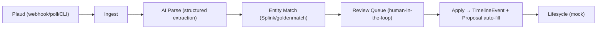

# M4 — Plaud Transcript Retrieval — Implementation Prompt

> **Referans:** `SHARED_RESEARCH_REPORT_opus.md` §3 (Plaud), §4.4 (extraction/matching), §1 (Lifesycle domain), §9 (Timeline).
> **Tarih:** 2026-06-20
> **Hedef:** Plaud özetlerini property workflow'una bağlamak; entity matching + retrieval + POC.

## Bağlam

Müşteriler valuation randevularında Plaud cihazıyla konuşmaları kaydediyor. Hedef: özet/transcript'i otomatik Lifesycle property proposal sürecine taşımak. **Kritik gerçek (SHARED §3.2):** Plaud'un "mevcut hesaptan veri çekme" resmi developer API'si 2026-06 itibarıyla **henüz açık değil.** Bu yüzden mimari iki yollu ve fallback zorunlu.

## Hedef Ürün — "Property Intelligence Pipeline"

`Ingest → Parse → Match → Review → Apply`: Plaud transcript/summary alınır → AI ile yapılandırılır → doğru Company/User/Property ile eşleştirilir → human review → property proposal alanlarına auto-fill.

## Account Model Kararı

| Model | Artı | Eksi | Öneri |
|-------|------|------|-------|
| Central Plaud account | Tek entegrasyon, basit | Eşleştirme zor (kim/hangi property?), gizlilik | POC için olası |
| Per Company/User OAuth | Net sahiplik, GDPR uyumu | Resmi API henüz yok | **Production hedefi (API gelince)** |
| Plaud Embedded SDK | Resmi, cihaz bağlama | Mobil app + ciddi effort | Uzun vade |

**Öneri:** POC'de **central account + topluluk connector / mock**; production'da **per-user (resmi application API gelince)** veya **Embedded SDK**.

## Retrieval Architecture Options

| Yaklaşım | Açıklama | Durum |
|----------|----------|-------|
| **Webhook** (`transcription.completed`) | Push, gerçek zamanlı | ✅ Developer Platform'da var (Beta, account manager kaydı) |
| **Polling** (`GET .../transcriptions/{id}`) | 3 sn poll | ✅ Transcription API'de var |
| **Manual export / CLI** (`plaud transcript <id>`) | Topluluk/CLI | ✅ Hızlı POC, resmi destek sınırlı |

## Entity Matching Stratejisi

`Transcript → Company → User → Property`:
- **Sinyaller:** recording timestamp ↔ valuation appointment time; user (cihaz sahibi) ↔ agent; geolocation/adres (transcript içinde geçen adres) ↔ Property.address; isim/email fuzzy.
- **Algoritma:** Splink (probabilistik, ölçek) veya goldenmatch (JS/zero-config). Confidence score üret.
- **Confidence modeli:** `score = w1*timestampMatch + w2*addressSim + w3*nameSim + w4*userMatch`.
- **Eşik:** yüksek → auto-link; orta → review queue; düşük → manuel.
- **Manual confirmation UI:** belirsizlerde agent onayı (human-in-the-loop).

## Property Proposal Integration (Auto-fill)
Summary'den çıkarılacak alanlar (structured extraction): bedrooms, condition, asking expectation, renovation notes, vendor motivation, timeline, key features, concerns. Hepsi `confidence` + `source span` ile; auto-fill **öneri** olarak gelir, agent onaylar.

## Data Pipeline Mimarisi



## AI Enhancement Layer (Prompt Design)
- Structured outputs (OpenAI `parse`+Zod / Anthropic `output_config.format`).
- Schema: `PropertyInsights { bedrooms?, condition?, askingExpectation?, renovations[], vendorMotivation?, timeline?, features[], concerns[], confidencePerField }`.
- Generation sonrası Zod validate + healing retry. Düşük confidence alanlar review'a.

## Tech Stack
- Backend: Node/Express + TypeScript (veya Python — Splink Python).
- Matching: goldenmatch (JS, hızlı POC) veya Splink (Python, ölçek).
- AI: OpenAI/Anthropic structured outputs.
- DB: PostgreSQL.

## Data Model
```
PlaudRecording(id, plaudFileId, userId, recordedAt, durationSec, transcriptText, summaryText, fetchedVia[webhook|poll|cli|mock])
PropertyInsight(id, recordingId, field, value, confidence, status[suggested|approved|rejected])
MatchCandidate(id, recordingId, propertyId, contactId, score, decision[auto|review|manual])
TimelineEvent(... type=plaud_transcript ...)  # SHARED §9 ortak model
```

## API Spesifikasyonu
- `POST /plaud/webhook` — `transcription.completed` → fetch transcript (imza doğrula).
- `POST /plaud/ingest` — manuel/CLI/mock ingest.
- `POST /recordings/:id/extract` — AI structured extraction.
- `POST /recordings/:id/match` — entity matching → candidates.
- `GET /review-queue` / `POST /review/:id/decide` — human-in-the-loop.
- `POST /recordings/:id/apply` — TimelineEvent + proposal auto-fill önerileri.

## POC Spesifikasyonu (Mock data ile bile çalışır)
- **Mock dataset:** 5 sahte valuation transcript + 5 property + appointment. (Resmi API olmadan tüm pipeline çalışır.)
- Akış: ingest (mock) → extract → match (timestamp+adres) → review UI → apply → timeline + proposal auto-fill.
- **Gerçek veri opsiyonu:** plaud-connector/CLI ile kendi Plaud hesabından bir kayıt çekip aynı pipeline'a sok.

## M3 Bağlantısı
Valuation appointment → (M3) Zoom meeting veya yüz yüze → Plaud recording → bu pipeline → aynı `TimelineEvent` tablosunda `plaud_transcript`. Birleşik Communication & Intelligence Timeline.

## Privacy & Compliance
- **Consent:** kayıt öncesi onay (müşteri); transcript saklama politikası.
- **GDPR:** data retention, silme hakkı, amaç sınırlaması.
- **Audit:** her auto-fill ve match kararı loglanır.
- Plaud bölgesel host (US/EU) ve ISO27001/GDPR/SOC2/HIPAA uyumu (SHARED §3.1) not edilir.

## GitHub Referansları
1. **rggnkmp/plaud-connector** — 33 MCP tool, transcript çekme (POC fallback).
2. **charathram/plaud-mcp** — MCP server, hızlı entegrasyon.
3. **Plaud-AI/plaud-template-app** — resmi Transcription API akışı.
4. **benseverndev-oss/goldenmatch** — entity matching (JS/zero-config).
5. **moj-analytical-services/splink** — probabilistik record linkage (ölçek).

## Fallback Plan (Plaud API yoksa/kısıtlıysa)
1. **Mock-first POC** (her durumda çalışır) — pipeline'ı kanıtlar.
2. **Topluluk connector/CLI** — kendi hesaptan demo verisi (resmi destek yok, ToS dikkat).
3. **Plaud Embedded SDK** — uzun vadeli resmi yol (mobil app gerekir).
4. **Generic voice→CRM** — Plaud yerine Zoom transcript / yüklenen ses + Plaud Transcription API ile aynı pipeline (vendor-agnostic).

## Uygulama Adımları
- [ ] Mock dataset + şema + seed
- [ ] Ingest (webhook + manuel)
- [ ] AI structured extraction + Zod validate
- [ ] Entity matching + confidence
- [ ] Review queue UI
- [ ] Apply → timeline + proposal auto-fill
- [ ] (Ops.) plaud-connector ile gerçek veri denemesi
- [ ] README + compliance notları

## Final Recommendation
**Continue, ama beklentiyi yönet.** Pipeline ve eşleştirme bugün mock/topluluk veriyle tam kanıtlanabilir. Production "pull from Plaud account" **resmi API'ye bağımlı** (henüz yok) → Iceberg, Plaud ile partner/early-access görüşmesi başlatmalı. Embedded SDK uzun vadeli en sağlam yol.

## Kırmızı Çizgiler
- "Plaud hesabından otomatik çekiyoruz" deme — resmi API henüz yok; durumu açıkça belirt.
- Topluluk connector'ı production çözüm gibi sunma (ToS/kırılganlık).
- Auto-fill her zaman human onayı ister; AI çıktısı confidence + validate'siz uygulanmaz.
- Consent olmadan transcript işleme yok.
