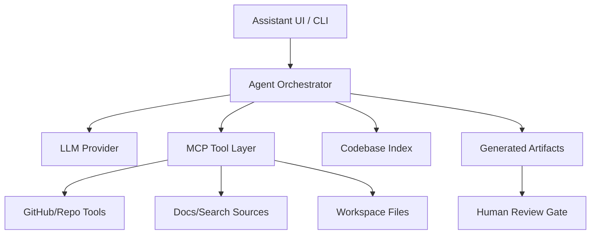

# Agent Stack — AI Powered Developer Workflow Assistant — Implementation Prompt

## Brief Güncelleme Notu

`Agent Stack AI Powered Developer Workflow Assistant.md` dosyasının içeriği şu anda M3 Zoom CRM brief'i ile birebir aynı görünüyor. Bu prompt, dosya adı ve Iceberg X bağlamından çıkarılmış varsayımsal ama uygulanabilir plan olarak hazırlanmıştır. Doğru mission metni gelince kapsam, deliverable ve demo hedefleri revize edilmelidir.

## Bağlam

M5'in amacı Iceberg Digital dev team ve Iceberg X intern'lerinin araştırma, POC scaffold, test, review, dokümantasyon ve handover süreçlerini hızlandıran AI destekli agent stack tasarlamak ve POC üretmektir.

Ortak araştırma referansı: `SHARED_RESEARCH_REPORT.md`. OpenAI Agents SDK, MCP, LangGraph, CrewAI, Aider, Continue ve Cursor/agent workflow bulgularını kullan.

## Hedef Ürün

**Iceberg Dev Workflow Assistant**: mission brief okuyan, repo context'i indeksleyen, uygun template seçen, POC skeleton oluşturan, test planı ve handover docs üreten, human review gate ile çalışan agent orchestrator.

## Problem Definition

Yavaşlayan workflow'lar:

- Mission brief'ten teknik scope çıkarma.
- Boilerplate API/frontend/demo iskeleti kurma.
- Kaynak araştırmasını claim/source formatına dönüştürme.
- Test planı ve handover checklist yazma.
- Reviewer feedback'i issue/task listesine çevirme.

## Capability Map

- Code generation: route/component/service/test scaffold.
- Code review: bug/risk/test gap analysis.
- Test writing: unit/API/smoke test taslağı.
- Docs: README, env vars, architecture diagrams, known issues.
- Debugging: logs + failing tests -> fix plan.
- Mission-specific templates: Zoom POC, Plaud pipeline, Iceberg X module.
- Handover doc generation.

## Architecture Options

| Yaklaşım | MVP hızı | Production readiness | Handover | Öneri |
|---|---:|---:|---:|---|
| IDE embedded rules only | Çok yüksek | Orta | Düşük | Quick win. |
| Standalone agent service | Yüksek | Yüksek | Yüksek | Ana POC. |
| CI/GitHub agent | Orta | Yüksek | Yüksek | Phase 2. |
| Multi-agent orchestration | Orta/Düşük | Orta/Yüksek | Orta | Karmaşıklık artınca. |

## Mimari



## Tool Chain Design

- LLM provider: OpenAI for Agents SDK/tracing/structured outputs; alternative provider abstraction allowed.
- MCP servers: filesystem, GitHub, docs/search, Plaud MCP, future Zoom docs wrapper.
- RAG: repo file index + embeddings optional; MVP can use targeted file retrieval.
- Templates: mission scaffolds for M1-M4.
- Governance: tool allowlist, secret redaction, human approval before writes/PR.

## Agent Orchestration Pattern

MVP single orchestrator:

1. Parse mission brief.
2. Classify mission type.
3. Load matching template.
4. Generate architecture/API/data model.
5. Scaffold files in dry-run artifact folder.
6. Generate tests and handover docs.
7. Ask human to approve apply/PR.

Phase 2 multi-agent:

- Research agent.
- Architect agent.
- Implementation agent.
- Test/review agent.
- Handover agent.

## Tech Stack

- Python service with OpenAI Agents SDK for fastest orchestrator POC.
- Node/TS optional if repo tooling is JS-heavy.
- SQLite/Postgres for runs/artifacts.
- Markdown templates for outputs.
- MCP-compatible tool boundary.

## Data Model

```text
agent_runs(id, mission_id, user_id, status, objective, created_at)
agent_steps(id, run_id, name, status, input_json, output_json)
agent_artifacts(id, run_id, path, artifact_type, content_hash, review_status)
repo_context_snapshots(id, run_id, files_json, summary)
tool_invocations(id, run_id, tool_name, args_redacted_json, result_summary, approved)
```

## API Spesifikasyonu

- `POST /api/agent/runs`: start run with mission brief.
- `GET /api/agent/runs/{id}`: status and artifacts.
- `POST /api/agent/runs/{id}/approve-step`: human approval.
- `POST /api/agent/runs/{id}/generate-scaffold`: create dry-run artifacts.
- `POST /api/agent/runs/{id}/export-handover`: README/checklist/docs.

## UI/UX Spesifikasyonu

- Run setup: mission brief, target stack, output type.
- Plan view: steps, dependencies, risk flags.
- Artifact browser: generated files/docs with diff.
- Approval gate: apply/export/PR.
- Metrics: time saved, tests generated, review issues found.

## GitHub'dan Kullanılacak Referanslar

| Repo | URL | Kullanım |
|---|---|---|
| openai/openai-agents-python | https://github.com/openai/openai-agents-python | Agent SDK patterns, tools, tracing. |
| langchain-ai/langgraph | https://github.com/langchain-ai/langgraph | Stateful workflow/human-in-loop phase 2. |
| crewAIInc/crewAI | https://github.com/crewAIInc/crewAI | Multi-agent role decomposition ideas. |
| Aider-AI/aider | https://github.com/Aider-AI/aider | CLI coding assistant UX and repo edit loop. |
| continuedev/continue | https://github.com/continuedev/continue | IDE assistant/reference architecture. |

## Uygulama Adımları

- [ ] Correct brief missing note'u README'ye koy.
- [ ] Mission brief parser oluştur.
- [ ] M1-M4 template registry yaz.
- [ ] Single-agent orchestrator POC kur.
- [ ] Dry-run artifact generator ekle.
- [ ] Handover doc generator ekle.
- [ ] Tool invocation audit log ekle.
- [ ] Demo için "Zoom POC skeleton from brief" senaryosu oluştur.

## Test Planı

- Unit: mission classification, template selection.
- Unit: secret redaction.
- API: run lifecycle.
- Golden tests: same brief -> expected artifact outline.
- Safety: no file write without human approval.

## Demo Senaryosu

1. User M3 mission brief'i yükler.
2. Assistant mission type'i Zoom CRM olarak sınıflandırır.
3. Architecture, API spec ve file scaffold önerir.
4. Dry-run artifacts gösterilir.
5. Assistant test planı ve README üretir.
6. Human approve eder veya artifact export eder.

## Handover Checklist

- [ ] Brief uncertainty note.
- [ ] Architecture diagram.
- [ ] Tool allowlist.
- [ ] Prompt/template registry.
- [ ] Example generated artifacts.
- [ ] Security/governance policy.
- [ ] Phase 2 roadmap.

## Diğer Mission'lara Bağlantı Noktaları

- M1: AI mission generator ve AI review assistant ile ortak prompt governance.
- M2: Zoom core scaffold template.
- M3: CRM integration template.
- M4: Plaud pipeline template and extraction prompt tests.

## Kırmızı Çizgiler

- Brief hatasını saklama; her çıktı "assumption-based" olarak etiketlensin.
- Agent'ın production code'u human review olmadan merge/apply etmesine izin verme.
- Secrets, customer transcripts veya private repo context'i model output'una sızdırma.

## Final Recommendation

M5'in ilk POC'si **mission brief -> reviewed scaffold + handover package generator** olmalı. Bu, tüm mission'ların teslim kalitesini yükseltir ve doğru brief geldiğinde kolayca yeniden hedeflenebilir.
