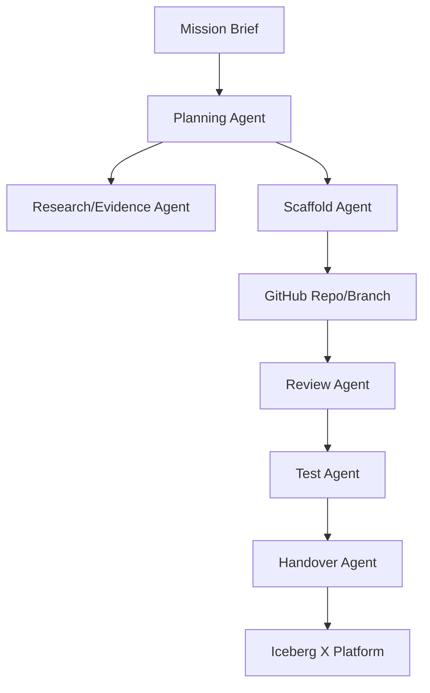

# M5_IMPLEMENTATION_PROMPT.md

# M5 — Agent Stack / AI Dev Workflow Assistant Implementation Prompt

> **Brief notu:** Mission 5 dosya içeriği hatalı/eksik kabul edilmiştir. Bu plan, dosya adı “Agent Stack — AI Dev Workflow Assistant” ve Iceberg X bağlamına göre hazırlanmıştır. Doğru brief geldiğinde problem tanımı, acceptance criteria ve demo scope revize edilmelidir.

## Bağlam

Iceberg X mission’larında ortak problem: araştırma, POC scaffold, code review, test, dokümantasyon ve handover kalitesi kişiden kişiye değişiyor. M5, developer workflow içinde AI destekli bir “mission-to-POC assistant” oluşturarak M1-M4 hızını ve standardını artırmalıdır.

## Hedef Ürün

**Iceberg Agent Stack:** Mission brief’i alan, kaynak araştırma checklist’i çıkaran, repo scaffold üreten, test/handover dokümanı hazırlayan ve GitHub PR review checklist’i oluşturan AI developer workflow assistant.

## Kapsam

### In Scope

- Mission brief parser
- Codebase/RAG index design
- MCP tool registry
- GitHub issue/PR assistant
- POC scaffold generator
- Handover doc generator
- Security/governance rules
- Demo: M2 veya M4 için çalışan POC skeleton üretimi

### Out of Scope

- Fully autonomous production deploy
- Human review’suz code merge
- Secret erişimi olan uncontrolled agent
- Tüm IDE’leri kapsayan enterprise rollout

## Problem Definition

| Workflow | Bugünkü problem | Agent katkısı |
|---|---|---|
| Research | Kaynak kalitesi değişken | Evidence checklist + source templates |
| POC setup | Boilerplate zaman alıyor | Scaffold generator |
| Testing | Test plan unutuluyor | Auto test checklist + sample tests |
| Review | Mentor feedback dağınık | PR review rubric |
| Handover | README/env/known issues eksik | Handover generator |

## Agent Stack Vizyonu



## Capability Map

- Mission decomposition
- Acceptance criteria generation
- API/env var checklist
- Repo skeleton generation
- Cursor rules / agent instructions generation
- Test plan generation
- PR review checklist
- Handover README
- Risk register updates
- Zoom/Plaud docs retrieval through MCP/RAG

## Architecture Options

| Yaklaşım | Time-to-value | Production readiness | Handover | Öneri |
|---|---:|---:|---:|---|
| IDE-embedded Cursor workflow | Çok yüksek | Orta | Orta | POC için iyi |
| Standalone web app in Iceberg X | Orta | Yüksek | Yüksek | Production path |
| CI-integrated PR assistant | Orta | Yüksek | Yüksek | Sprint 2/3 |
| CLI tool | Yüksek | Orta/Yüksek | Orta | Developer-friendly |

**Öneri:** POC = CLI + Cursor rules + GitHub PR checklist. Production = M1 platformuna bağlı standalone service + CI integration.

## Tool Chain Design

### LLM provider

- Primary: OpenAI Agents SDK / Responses API adapter
- Optional: Anthropic/other provider abstraction
- Local model: only privacy-sensitive code review experiments

### MCP servers

- GitHub MCP: issues, PRs, repo file read
- Filesystem MCP: local POC scaffold
- Docs MCP/RAG: Zoom/Plaud/Iceberg docs index
- Browser/search tool: current research validation
- Database MCP: only read-only sandbox for POC

### RAG over Iceberg repos

- Index README, architecture docs, API routes, migrations, tests.
- Store chunks with repo, path, commit SHA.
- Always cite file path + commit in agent output.

## Agent Orchestration Pattern

### Single agent MVP

- One Planner Agent with tools: file read/write, template generator, GitHub issue creator.
- Easier demo, lower complexity.

### Multi-agent production

- Planner Agent
- Research Agent
- Scaffold Agent
- Test Agent
- Review Agent
- Handover Agent

Use handoff only at clear boundaries. Avoid agent loops without max steps.

## POC Spesifikasyonu

### Demo: “M2 brief’inden Zoom POC skeleton üret”

Input:

```text
Build Zoom Integration Service with S2S OAuth, Meeting SDK signature endpoint, webhook receiver and React demo UI.
```

Output:

- `/backend/src/zoom/auth.ts`
- `/backend/src/zoom/meetings.ts`
- `/backend/src/zoom/webhooks.ts`
- `/backend/src/zoom/sdkSignature.ts`
- `/frontend/src/pages/ZoomDemo.tsx`
- `.env.example`
- `README.md`
- `TEST_PLAN.md`
- `HANDOVER.md`

## Diğer Mission’lara Etki

| Mission | M5 katkısı |
|---|---|
| M1 | AI planning/review engine olarak platforma bağlanır |
| M2 | Zoom service scaffold ve docs checklist üretir |
| M3 | CRM adapter ve timeline skeleton üretir |
| M4 | Transcript extraction schema ve test fixtures üretir |

## Security & Governance

- Agent secrets okuyamaz; sadece secret name/env var template görür.
- Write operations sandbox/branch ile sınırlı.
- PR açabilir ama merge edemez.
- Tool permissions least privilege.
- Prompt/model config versionlanır.
- Generated code “AI-generated” metadata ile etiketlenir.
- License check yapılmadan dependency eklenmez.

## GitHub Referansları

| Repo | URL | Kullanım |
|---|---|---|
| openai/openai-agents-python | https://github.com/openai/openai-agents-python | Agent orchestration |
| langchain-ai/langgraph | https://github.com/langchain-ai/langgraph | Stateful multi-agent workflows |
| modelcontextprotocol/servers | https://github.com/modelcontextprotocol/servers | MCP server examples |
| continuedev/continue | https://github.com/continuedev/continue | IDE coding assistant benchmark |
| Aider-AI/aider | https://github.com/Aider-AI/aider | Repo-aware coding workflow |
| crewAIInc/crewAI | https://github.com/crewAIInc/crewAI | Role-based agent prototyping |

## Uygulama Fazları

### Sprint 1 — CLI POC

- [ ] Mission parser
- [ ] Template-based scaffold generator
- [ ] README/HANDOVER generator
- [ ] Local dry-run mode

### Sprint 2 — Tool integrations

- [ ] GitHub issue/branch/PR integration
- [ ] Docs RAG index
- [ ] Test generator
- [ ] Security policy checks

### Sprint 3 — Iceberg X integration

- [ ] M1 platform UI
- [ ] Agent run history
- [ ] Review queue
- [ ] Metrics dashboard

## Test Planı

- Unit: prompt parser, template renderer, policy checker
- Golden files: same brief -> expected scaffold structure
- Security: secret exfiltration prompt rejected
- Integration: GitHub dry-run PR creation
- Human eval: mentor rates generated handover quality

## Demo Senaryosu

1. Kullanıcı M2 brief’ini Agent Stack’e verir.
2. Agent requirements ve risks çıkarır.
3. “Generate POC skeleton” çalışır.
4. Repo dosya ağacı oluşur.
5. README, env vars ve test plan otomatik gelir.
6. Agent PR checklist üretir.
7. M1 platformunda run history ve artifacts görünür.

## Final Recommendation

M5, tek başına “AI coding demo” olarak değil, Iceberg X programının üretim kalitesini artıran governance-aware developer assistant olarak sunulmalıdır. İlk demo CLI/agent scaffold üzerinden yapılmalı; production path M1 platformu ve GitHub/CI entegrasyonudur.

## Brief Güncelleme Notu

Doğru M5 mission metni geldiğinde revize edilecekler:

- Resmi acceptance criteria
- Hedef kullanıcı profili
- Demo output formatı
- İzin verilen tool/API listesi
- Security/compliance sınırları
- Başarı metrikleri

## Kırmızı Çizgiler

- Agent production branch’e direkt merge yapamaz.
- Secret okuyamaz veya loglayamaz.
- Kaynaksız teknik iddia üretemez.
- İnsan review olmadan generated code production’a alınamaz.
