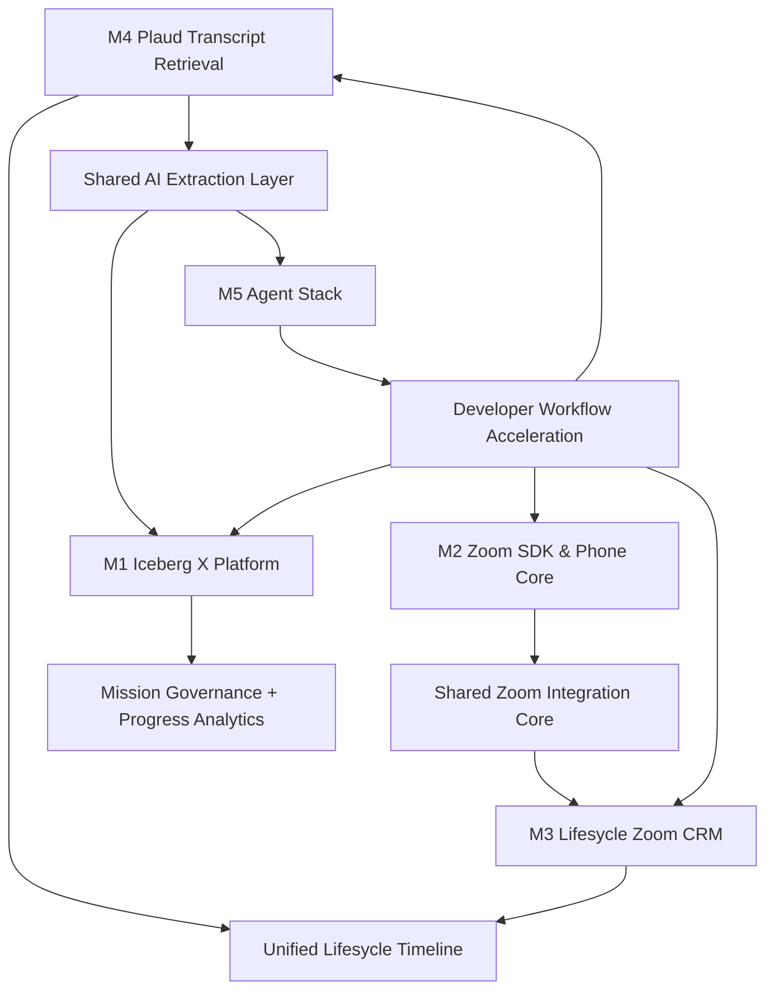

# Iceberg X Shared Research Report

Hazırlanma tarihi: 2026-06-20  
Erişim tarihi: 2026-06-20  
Kapsam: M1-M5 ortak teknoloji araştırması, kaynaklı karar matrisi, ortak mimari prensipleri ve risk kayıtları.

## Araştırma Kalite Kontrolü

- [x] 25+ web araması / canlı kaynak kontrolü yapıldı.
- [x] Zoom Meeting SDK, Video SDK, OAuth, Zoom Phone Smart Embed ve webhook yetenekleri resmi Zoom dokümanlarıyla doğrulandı.
- [x] Plaud API durumu 2026 itibarıyla resmi Plaud developer dokümanları ve GitHub SDK reposuyla doğrulandı.
- [x] 20+ GitHub reposu tarandı; raporda ve mission prompt'larında 10+ repo kullanıldı.
- [x] Agent framework karşılaştırması OpenAI Agents SDK, LangGraph/LangSmith, MCP, CrewAI, AutoGen/Agent Framework, Aider ve Continue kaynaklarıyla güncellendi.
- [x] M5 brief dosyasının hatalı olduğu ayrıca not edildi.

## Araştırma Günlüğü

Kullanılan arama kümeleri: Lifesycle CRM / Iceberg Digital public footprint, Zoom Meeting SDK Web, Zoom Video SDK, Zoom OAuth, Zoom Phone API/Smart Embed, Zoom SDK GitHub samples, Plaud API/developer/docs/MCP/CLI, Plaud SDK GitHub, CRM Zoom integration precedent, CRM communication timeline patterns, LangGraph production agents, OpenAI Agents SDK, MCP, Cursor Agent/CLI docs, AutoGen, CrewAI, Aider, Continue, open source project management, innovation/R&D tracking, badge/achievement systems, internship/open-source mentorship.

Not: Lifesycle ve Iceberg Digital'in bazı domain bilgileri kamuya açık web'de sınırlı görünüyor. Lifesycle domain modeli için repo içindeki mission dokümanları ve `MISSIONS_OVERVIEW.md` esas alınmıştır; public kaynak bulunmayan iddialar "varsayım" olarak etiketlenmiştir.

## Temel Kaynaklı Bulgular

### Zoom Ekosistemi

İDDİA: Zoom Meeting SDK for Web, Zoom Meeting ve Webinar deneyimini web sayfasına gömmek için tasarlanmıştır; React/Vue/Angular dahil JS framework'leri destekler.  
KAYNAK: https://developers.zoom.us/docs/meeting-sdk/web/  
GÜVENİLİRLİK: resmi docs  
NOT: Component view desktop browser odaklıdır; mobil için client view önerilir.

İDDİA: Meeting SDK bot / AI notetaker senaryoları için doğru ürün değildir; gerçek zamanlı medya veya AI notetaker için Zoom RTMS değerlendirilmelidir.  
KAYNAK: https://developers.zoom.us/docs/meeting-sdk/web/  
GÜVENİLİRLİK: resmi docs  
NOT: M3/M4 transcript otomasyonu Zoom toplantılarından gelecekse ayrıca RTMS / recording / transcript API araştırması gerekir.

İDDİA: Zoom Video SDK, Zoom Meeting'e katılmak değil, custom video/audio/chat/screen-share deneyimi inşa etmek içindir.  
KAYNAK: https://developers.zoom.us/docs/video-sdk/  
GÜVENİLİRLİK: resmi docs  
NOT: Lifesycle içinde klasik Zoom meeting yerine branded "consultation room" istenirse güçlü adaydır.

İDDİA: Zoom OAuth hem account-level Server-to-Server OAuth hem de user authorization flow sunar; access token'lar tipik olarak 1 saatliktir.  
KAYNAK: https://developers.zoom.us/docs/integrations/oauth/  
GÜVENİLİRLİK: resmi docs  
NOT: Lifesycle multi-tenant senaryoda per-user OAuth, internal/admin-owned Zoom hesabı için Server-to-Server OAuth ayrımı kritik.

İDDİA: Zoom Phone Smart Embed web uygulamasına softphone gömebilir; click-to-call, SMS, answer/hangup, hold/resume, recording controls, voicemail/call history ve event/contact/call logging API'lerini destekler.  
KAYNAK: https://developers.zoom.us/docs/phone/smart-embed/  
GÜVENİLİRLİK: resmi docs  
NOT: Audio path için Zoom Desktop client gerekir; "desktop bağımsız tam phone" iddiası yapılmamalıdır.

### Plaud Ekosistemi

İDDİA: 2026 itibarıyla Plaud'un public developer platformu vardır; Plaud Embedded, Device SDK, Transcription API, MCP ve CLI yönleri sunar.  
KAYNAK: https://dev.plaud.ai/ ve https://docs.plaud.ai/overview  
GÜVENİLİRLİK: resmi docs  
NOT: Bu, Plaud App içindeki mevcut customer verisini çekme ile Plaud cihazlarını kendi app'imize bağlama arasında iki ayrı yol yaratır.

İDDİA: Plaud Embedded akışı "capture -> sync -> transcribe" şeklindedir; kullanıcı Plaud device ile kayıt alır, device mobile app'e bağlanır, Plaud speaker-labeled transcript döndürür.  
KAYNAK: https://dev.plaud.ai/  
GÜVENİLİRLİK: resmi docs  
NOT: Lifesycle'ın native mobile app'i yoksa ilk POC için MCP/CLI veya mock import daha hızlıdır.

İDDİA: Plaud MCP & CLI personal Plaud data üzerinden recording arama, transcript alma ve AI-generated notes erişimi sağlar.  
KAYNAK: https://docs.plaud.ai/overview ve https://docs.plaud.ai/llms.txt  
GÜVENİLİRLİK: resmi docs  
NOT: Production multi-company CRM integration için OAuth/enterprise model ve veri sahipliği ayrıca Plaud ile netleştirilmeli.

İDDİA: Plaud Transcription API async çalışır; audio submit edilir, `transcription_id` ile status/result poll edilir.  
KAYNAK: https://docs.plaud.ai/llms.txt ve https://github.com/Plaud-AI/plaud-sdk-public  
GÜVENİLİRLİK: resmi docs + resmi GitHub repo  
NOT: M4 için polling yaklaşımı POC seviyesinde yeterli; webhook desteği kaynaklarda netleşmedi.

### AI / Agent Stack

İDDİA: OpenAI Agents SDK; agents, tools, handoffs, guardrails, sessions, MCP server tool calling, sandbox agents ve tracing primitive'leri sunan production-oriented bir SDK'dır.  
KAYNAK: https://openai.github.io/openai-agents-python/  
GÜVENİLİRLİK: resmi OpenAI SDK docs  
NOT: Python-first olduğundan backend POC için hızlıdır; mevcut stack Laravel ağırlıklıysa servis sınırıyla konumlandırılmalı.

İDDİA: MCP, AI uygulamalarını external systems/data/tools/workflows'a bağlamak için açık bir standarttır.  
KAYNAK: https://modelcontextprotocol.io/docs/getting-started/intro  
GÜVENİLİRLİK: resmi MCP docs  
NOT: M5 ve Plaud MCP bağlantısı için ortak tool interface önerilir.

İDDİA: LangGraph long-running, stateful agent workflows için durable execution, human-in-the-loop, memory ve deployment/observability ekosistemi sağlar.  
KAYNAK: https://github.com/langchain-ai/langgraph ve https://docs.langchain.com/langsmith/deployment  
GÜVENİLİRLİK: resmi GitHub + docs  
NOT: Daha karmaşık agent orchestration için iyi; basit POC için OpenAI Agents SDK veya direct provider çağrısı daha hızlı olabilir.

İDDİA: AutoGen repo'su maintenance mode'a geçmiş; yeni kullanıcılar için Microsoft Agent Framework öneriliyor.  
KAYNAK: https://github.com/microsoft/autogen  
GÜVENİLİRLİK: resmi GitHub repo  
NOT: M5'te AutoGen yeni temel seçim olmamalı; legacy/research referansı olarak kalmalı.

### R&D / Internal Platform

İDDİA: OpenProject; project/portfolio, agile boards, Gantt, release planning, time/cost tracking, bug tracking, wiki/forum/news, meeting agenda/minutes ve GitHub/GitLab entegrasyonları sunan enterprise-ready açık kaynak proje yönetim platformudur.  
KAYNAK: https://github.com/opf/openproject  
GÜVENİLİRLİK: resmi GitHub repo  
NOT: Iceberg X için fork değil, domain model ve workflow ilhamı olarak kullanılmalı.

İDDİA: Plane; Jira/Linear/Monday/ClickUp alternatifi olarak task, sprint, docs ve triage yönetimi hedefleyen modern açık kaynak project management ürünüdür.  
KAYNAK: https://github.com/makeplane/plane  
GÜVENİLİRLİK: GitHub repo  
NOT: Mission tracking UX için iyi benchmark.

## Teknoloji Karar Matrisi

| Alan | Yaklaşım A | Yaklaşım B | Yaklaşım C | Öneri |
|---|---|---|---|---|
| Zoom meeting | Basit meeting link + timeline log | REST API create/schedule | Meeting SDK embed | M3 MVP: REST API + timeline. M2 demo: Meeting SDK embed. |
| Custom video | Meeting SDK | Video SDK UI Toolkit | Tam custom Video SDK | Lifesycle MVP için beklet; branded room için Video SDK. |
| Zoom Phone | Call logs/webhooks | Smart Embed | Custom phone workflow | POC: Smart Embed + webhook listener; desktop audio path riskini açık yaz. |
| Plaud ingest | Manual export/mock | Plaud MCP/CLI | Embedded Device SDK + Transcription API | M4 POC: mock + MCP/CLI. Production path: Embedded/API partner model. |
| AI extraction | Prompt-only | RAG + structured output | Fine-tuning | Property proposal için structured output + human review; fine-tuning erken değil. |
| Agent stack | IDE assistant rules | Standalone backend agent | CI/GitHub agent | M5 POC: standalone orchestrator + MCP + repo templates; sonra IDE/CI entegrasyonu. |
| R&D platform | Dashboard POC | Submission tracker | AI mission/review assistant | M1: Iceberg X Intelligence Layer; dashboard + AI review en etkili demo. |

## Önerilen Ortak Altyapı

- Shared auth pattern: Zoom, Plaud ve AI provider credential'ları tenant/user seviyesinde ayrılmalı; tokens encrypted at rest saklanmalı; audit log zorunlu.
- Shared timeline/activity model: `TimelineEvent` ortak nesnesi Zoom meeting, Zoom Phone call, Plaud transcript, manual note, AI summary ve follow-up task'i taşımalı.
- Shared AI service layer: `ai_extractions`, `ai_runs`, `ai_run_artifacts`, `prompt_versions`, `human_review_status` tabloları M1/M4/M5 için ortak kullanılmalı.
- Shared integration service pattern: Her external provider için `IntegrationAccount`, `IntegrationCredential`, `WebhookEvent`, `ProviderJob` ve retry/idempotency standardı.
- Shared review UX: AI output asla doğrudan CRM alanlarına yazılmamalı; confidence + diff + approve/apply akışı olmalı.

## Mission Bağımlılık Grafiği

## Ortak Risk Register

| Risk | Etki | Olasılık | Mitigasyon |
|---|---:|---:|---|
| Zoom Partner özel izinleri / marketplace review | Yüksek | Orta | Partner support escalation list hazırlansın; POC local/dev app ile sınırlandırılsın. |
| Meeting SDK component view browser/mobil limitleri | Orta | Orta | M3 MVP'de embed'i zorunlu yapma; link + API create + timeline'ı ana yol yap. |
| Zoom Phone Smart Embed desktop audio path gerektirir | Yüksek | Yüksek | "Tam desktop bağımsız call" hedefini ertele; Smart Embed'i hızlı CRM phone UX olarak konumlandır. |
| Plaud App account data production access belirsizliği | Yüksek | Orta | MCP/CLI ile POC, Embedded/API partner path için Plaud contact/escalation. |
| Transcript privacy / GDPR / consent | Yüksek | Yüksek | Consent capture, retention policy, redact/anonymize, human approval, per-tenant isolation. |
| AI hallucination / yanlış property match | Yüksek | Orta | Confidence scoring, manual confirmation, audit trail, no auto-apply under threshold. |
| M5 brief hatalı | Orta | Yüksek | Prompt'ta varsayımsal kapsam açıkça işaretlendi; doğru brief gelince revize edilecek. |
| Handover eksikliği | Yüksek | Orta | Her mission README, env vars, diagrams, known issues, demo script ve test plan içermeli. |

## Ortak GitHub Referans Havuzu

| Repo | URL | 2026-06-20 gözlem | Kullanım |
|---|---|---|---|
| zoom/meetingsdk-web-sample | https://github.com/zoom/meetingsdk-web-sample | 644 stars, latest v6.0.2 May 20 2026 | M2 embed POC ana referansı. |
| zoom/meetingsdk-react-sample | https://github.com/zoom/meetingsdk-react-sample | 180 stars, latest v5.0.0 Dec 10 2025 | React Lifesycle-style component örneği. |
| zoom/videosdk-web-sample | https://github.com/zoom/videosdk-web-sample | 137 stars, latest v2.4.5 Jun 1 2026 | Video SDK karar karşılaştırması. |
| zoom/videosdk-ui-toolkit-react-sample | https://github.com/zoom/videosdk-ui-toolkit-react-sample | 19 stars, latest Sep 3 2025 | Custom consultation room hızlı POC. |
| Plaud-AI/plaud-sdk-public | https://github.com/Plaud-AI/plaud-sdk-public | 9 stars, Apache-2.0, official SDK | M4 production path ve mobile SDK akışı. |
| langchain-ai/langgraph | https://github.com/langchain-ai/langgraph | 35.3k stars, latest Jun 18 2026 | M5 stateful agent workflows. |
| crewAIInc/crewAI | https://github.com/crewAIInc/crewAI | 54k stars, MIT, latest Jun 11 2026 | Multi-agent POC ilhamı. |
| microsoft/autogen | https://github.com/microsoft/autogen | Maintenance mode | Yeni temel değil; migration/lessons learned. |
| Aider-AI/aider | https://github.com/Aider-AI/aider | 46.5k stars, Apache-2.0 | CLI coding assistant UX benchmark. |
| continuedev/continue | https://github.com/continuedev/continue | Open-source coding agent | IDE assistant benchmark. |
| opf/openproject | https://github.com/opf/openproject | 15.4k stars, GPL-3.0 | M1 workflow benchmark. |
| makeplane/plane | https://github.com/makeplane/plane | Open-source PM platform | M1 modern project UX benchmark. |
| taigaio/taiga | https://github.com/kaleidos-ventures/taiga | Open-source agile PM | M1 backlog/sprint concepts. |
| kanboard/kanboard | https://github.com/kanboard/kanboard | Kanban PM | Minimal mission board reference. |

## Final Ortak Öneri

Beş mission tek tek POC olarak kalmamalı. En güçlü birleşik hikaye: **Lifesycle Communication & Intelligence Layer** + **Iceberg X Intelligence Layer** + **Agent Stack Accelerator**. M2 Zoom core servisinin M3'e altyapı sağlaması, M4'ün aynı timeline'a transcript intelligence eklemesi, M1'in program yönetimini görünür kılması ve M5'in tüm geliştirme/handover kalitesini standardize etmesi önerilir.
