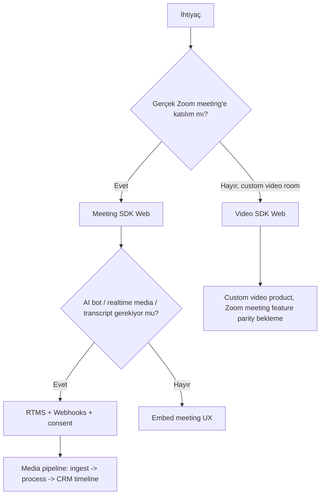
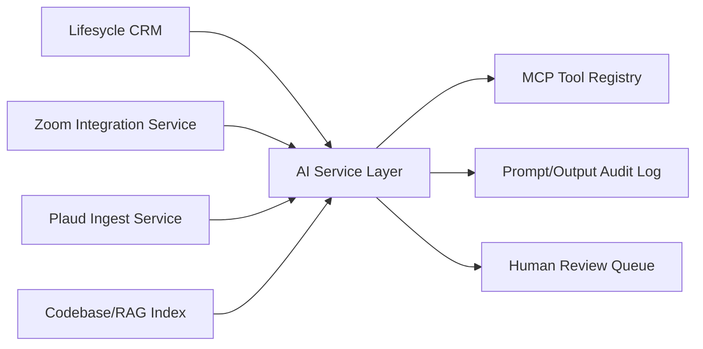
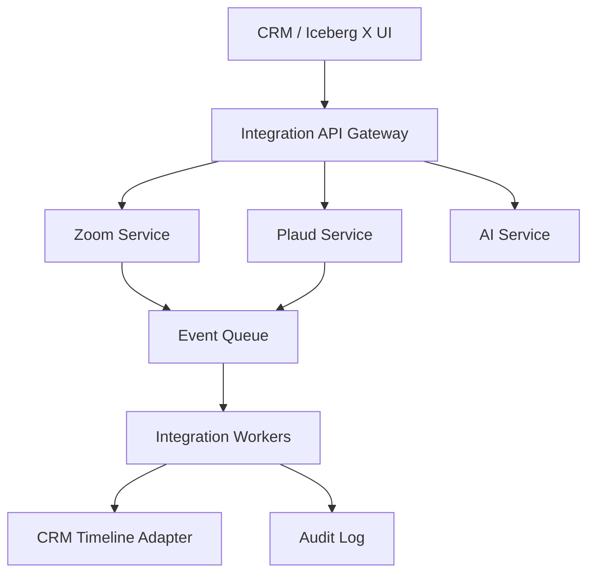
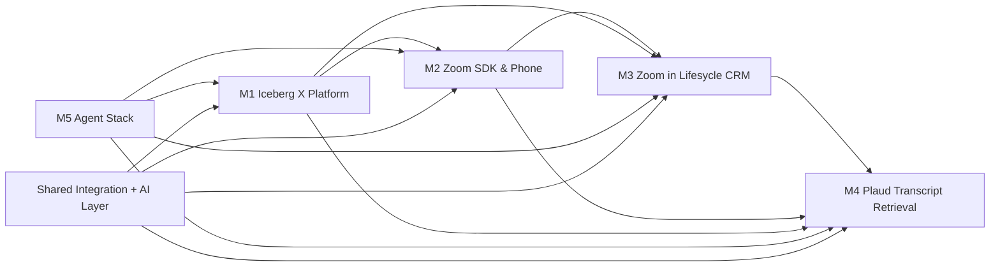

# SHARED_RESEARCH_REPORT.md

# Iceberg X — Ortak Araştırma Raporu

**Referans tarihi:** 2026-06-20  
**Kapsam:** M1 Iceberg X Platform Improvement, M2 Zoom SDK & Phone Integration, M3 Zoom Video Meetings in Lifesycle CRM, M4 Plaud Transcript Retrieval, M5 Agent Stack — AI Dev Workflow Assistant  
**Amaç:** 5 paralel R&D mission için ortak teknoloji kararlarını, riskleri, entegrasyon sınırlarını ve handover-ready mimari prensipleri netleştirmek.

---

## 0. Executive Research Takeaways

1. **Zoom tarafında tek entegrasyon yolu yok.** CRM içi meeting oluşturma ve timeline için Zoom REST API + Server-to-Server/OAuth temel katmandır; tarayıcı içinde toplantı deneyimi için Meeting SDK; tamamen custom video deneyimi için Video SDK; canlı medya/AI transcript kullanımları için RTMS düşünülmelidir.
2. **Meeting SDK insan katılımcı deneyimi içindir.** AI bot/notetaker veya gerçek zamanlı medya işleme gibi senaryolarda Zoom’un RTMS yaklaşımı ayrıca değerlendirilmelidir.
3. **Zoom Phone entegrasyonu yapılabilir ama lisans, hesap seviyesi ve client bağımlılıkları demo kapsamını belirler.** Phone API, webhooks ve Smart Embed birlikte değerlendirilmeli; click-to-call/interaction logging MVP için daha güvenli ilk hedef olur.
4. **Plaud için resmi geliştirici yüzeyi yeni ve sınırlı doğrulama gerektiriyor.** Plaud Developer / MCP / CLI / Zapier / export dokümanları transcript retrieval senaryosunu destekliyor; fakat production-grade API kapsamı için gerçek hesap, API access ve rate-limit doğrulaması şart.
5. **M3 + M4 birlikte “Lifesycle Communication & Intelligence Layer” vizyonunu oluşturur.** Zoom toplantıları ve Plaud kayıtları CRM timeline’a tek activity model üzerinden bağlanmalıdır.
6. **M5 ayrı bir ürün değil, tüm mission’ları hızlandıran developer workflow layer olmalı.** MCP + codebase RAG + GitHub/CI entegrasyonlarıyla POC üretimi, review ve handover standardize edilebilir.

---

## 1. Kanıt Standardı ve Kaynak Notları

Bu dosyada kaynaklar aşağıdaki formatta tutulur:

```text
İDDİA: [özet iddia]
KAYNAK: [URL + erişim tarihi]
GÜVENİLİRLİK: [resmi docs / GitHub / community / vendor]
NOT: [limitasyon]
```

> Not: GitHub star sayısı ve son commit tarihi hızla değiştiği için implementation öncesi repo sayfalarında tekrar doğrulanmalıdır. Burada repo seçimi “kullanılabilir referans / starter / mimari ilham” odaklıdır.

---

## 2. Lifesycle / Iceberg Digital Ekosistemi

### 2.1 Bulgular

İDDİA: Iceberg Digital, Lifesycle’ı estate agency için AI-driven CRM/operating system olarak konumlandırıyor; hedef, agent operasyonlarını tek merkezden yönetmek ve otomasyonla verimlilik artırmak.  
KAYNAK: https://www.iceberg-digital.co.uk/ — erişim: 2026-06-20  
GÜVENİLİRLİK: Resmi şirket sitesi  
NOT: Public teknik stack detayları sınırlı; internal stack ayrıca ekipten doğrulanmalı.

İDDİA: Lifesycle estate agent’lar için valuation, nurture, marketing ve sales workflow’larını kapsayan CRM/proptech ürün ailesi olarak anlatılıyor.  
KAYNAK: https://www.iceberg-digital.co.uk/lifesycle/ — erişim: 2026-06-20  
GÜVENİLİRLİK: Resmi ürün sayfası / vendor  
NOT: Domain entity’leri public sitede yüksek seviyede; gerçek schema için internal access gerekir.

### 2.2 Lifesycle için Çıkarımlar

- **Domain model varsayımları:** `Agency`, `Branch`, `Agent/User`, `Contact`, `Property`, `Valuation`, `Appointment`, `TimelineEvent`, `CommunicationLog`, `Proposal`.
- **CRM timeline ana entegrasyon noktası olmalı:** Zoom meeting, Zoom phone call, Plaud recording, AI summary, follow-up task aynı activity stream’de görünmeli.
- **MVP için domain bağımlılığı azaltılmalı:** İlk POC ayrı integration service + mocked CRM objects ile çalışmalı; sonra Lifesycle internal API’ye bağlanmalı.

---

## 3. Zoom Developer Ekosistemi

### 3.1 Ürün Ailesi

| Ürün / API | Ne için? | M2 etkisi | M3 etkisi | Risk |
|---|---|---:|---:|---|
| REST API | Meeting create/read/update, users, recordings, reports | Çok yüksek | Çok yüksek | Scope/app review |
| Server-to-Server OAuth | Backend servis hesabı ile API erişimi | Çok yüksek | Yüksek | Account-level erişim, admin consent |
| User OAuth | Kullanıcı adına meeting oluşturma | Orta | Çok yüksek | Per-user consent/refresh token yönetimi |
| Meeting SDK Web | Zoom meeting’i web uygulamasına embed etme | Çok yüksek | Yüksek | Browser, policy, signature, UX limitleri |
| Video SDK Web | Tam custom video deneyimi | Orta | Orta | Zoom meeting değildir; feature parity yok |
| RTMS | Realtime meeting media/transcript streaming | Yüksek | Orta/Yüksek | App config, event pipeline, compliance |
| Zoom Phone API | Call logs, user phone data, bazı call control flows | Çok yüksek | Orta | Lisans ve account/phone setup |
| Zoom Phone Smart Embed | Web app içinde phone client deneyimi | Yüksek | Orta | Lisans/client support |
| Webhooks | meeting.started, ended, recording.completed, phone events | Çok yüksek | Çok yüksek | Signature verification, retry/idempotency |

### 3.2 Kritik Kaynak Bulguları

İDDİA: Zoom Meeting SDK for Web, Zoom Meeting/Webinar deneyimini web uygulamalarına gömmek için kullanılır.  
KAYNAK: https://developers.zoom.us/docs/meeting-sdk/web/ — erişim: 2026-06-20  
GÜVENİLİRLİK: Resmi Zoom docs  
NOT: Embed deneyimi gerçek Zoom meeting’e bağlanır; custom video ürünü değildir.

İDDİA: Zoom, Meeting SDK’nın human-interactive meeting deneyimleri için olduğunu; AI notetaker/bot veya realtime medya işleme için RTMS gibi alternatiflerin kullanılması gerektiğini belirtir.  
KAYNAK: https://developers.zoom.us/docs/meeting-sdk/web/ — erişim: 2026-06-20; https://developers.zoom.us/docs/rtms/ — erişim: 2026-06-20  
GÜVENİLİRLİK: Resmi Zoom docs  
NOT: Bu sınır M2/M3 transcript/AI kapsamını doğrudan değiştirir.

İDDİA: Server-to-Server OAuth, account-level backend entegrasyonlarda access token üretmek için Zoom’un desteklediği app tiplerinden biridir.  
KAYNAK: https://developers.zoom.us/docs/internal-apps/s2s-oauth/ — erişim: 2026-06-20  
GÜVENİLİRLİK: Resmi Zoom docs  
NOT: Kullanıcı adına granular permission gereken flows için User OAuth ayrıca gerekir.

İDDİA: Zoom Phone API ve webhook/event dokümanları phone entegrasyonu için mevcuttur; Smart Embed web uygulamalarına Zoom Phone deneyimini yerleştirmeyi hedefler.  
KAYNAK: https://developers.zoom.us/docs/api/phone/ — erişim: 2026-06-20; https://developers.zoom.us/docs/zoom-phone/smart-embed/ — erişim: 2026-06-20  
GÜVENİLİRLİK: Resmi Zoom docs  
NOT: Gerçek demo için Zoom Phone lisansı ve tenant config gereklidir.

İDDİA: Webhook event’leri signature doğrulaması ve idempotent processing ile ele alınmalıdır.  
KAYNAK: https://developers.zoom.us/docs/api/rest/webhook-reference/ — erişim: 2026-06-20  
GÜVENİLİRLİK: Resmi Zoom docs  
NOT: Demo’da bile duplicate/retry ihtimali hesaba katılmalıdır.

### 3.3 Meeting SDK vs Video SDK vs RTMS Karar Ağacı



### 3.4 Zoom için Ortak Mimari Kararı

**Öneri:** `Zoom Integration Service` bağımsız servis olmalı.

- `auth`: OAuth / S2S token yönetimi
- `meeting`: create/update/delete/read meeting
- `sdk`: Meeting SDK signature endpoint
- `webhook`: event receiver + verification + idempotency
- `phone`: phone events/call log/click-to-call adapter
- `crm-adapter`: Lifesycle timeline payload üretimi
- `audit`: API call logs, consent, security events

---

## 4. Plaud.ai API & Transcript Entegrasyonu

### 4.1 Bulgular

İDDİA: Plaud geliştirici yüzeyi, agent’ların Plaud verilerine bağlanması; recordings search, transcripts ve AI-generated notes retrieval gibi kabiliyetleri hedefler.  
KAYNAK: https://docs.plaud.ai/ — erişim: 2026-06-20  
GÜVENİLİRLİK: Resmi Plaud docs  
NOT: Production kapsam, auth modeli ve quota gerçek developer erişimiyle doğrulanmalı.

İDDİA: Plaud Zapier ve export akışları, API kısıtlıysa fallback ingestion yolu olarak kullanılabilir.  
KAYNAK: https://support.plaud.ai/hc/en-us/articles/plaud-zapier — erişim: 2026-06-20; https://support.plaud.ai/hc/en-us/articles/export-recordings-transcripts — erişim: 2026-06-20  
GÜVENİLİRLİK: Resmi destek dokümanı  
NOT: Manual/export tabanlı akış production otomasyon için zayıf; POC için değerlidir.

### 4.2 Retrieval Architecture Options

| Yaklaşım | Değer | Zorluk | Production uygunluğu | Öneri |
|---|---:|---:|---:|---|
| Resmi API/MCP/CLI ile pull | Yüksek | Orta | Yüksek, access doğrulanırsa | Ana hedef |
| Zapier bridge | Orta | Düşük | Orta | POC/fallback |
| Manual export upload | Düşük/Orta | Düşük | Düşük | API yoksa demo kurtarır |
| Generic transcription pipeline | Yüksek | Yüksek | Yüksek | Plaud dışı uzun vadeli alternatif |

### 4.3 Entity Matching İlkeleri

- **Primary anchors:** Plaud recording owner, recording timestamp, CRM appointment timestamp, assigned agent, contact/property context.
- **Secondary anchors:** Address mention, seller/vendor name, phone/email mention, postcode, valuation notes.
- **Confidence score:** deterministic + fuzzy + AI extraction weighted score.
- **Manual confirmation:** Confidence < 0.85 ise agent onayı olmadan proposal’a yazma.

---

## 5. AI / LLM / Agent Stack

### 5.1 Framework Karşılaştırması

| Framework | Güçlü Yan | Uygun Mission | Risk |
|---|---|---|---|
| OpenAI Agents SDK | Tool calling, guardrails, handoffs | M1, M4, M5 | Vendor lock-in ve provider strategy |
| LangGraph | Durable graph/stateful workflows | M4, M5 | Öğrenme eğrisi |
| MCP | Tool/context standardizasyonu | M5, M1 | Server security ve permission tasarımı |
| CrewAI | Role-based agent prototyping | M5 POC | Production governance gerekir |
| Aider/Continue | Code-aware developer workflows | M5 | Internal repo access/security |
| Cursor CLI/Agent | IDE/terminal workflow hızlandırma | M5 | Kurumsal politika/telemetry |

### 5.2 Önerilen AI Service Layer



**Core prensipler:**

- Prompt ve model config versionlanmalı.
- PII redaction opsiyonel değil, default olmalı.
- AI output doğrudan CRM’i değiştirmemeli; review/apply pattern kullanılmalı.
- Tool permissions mission bazlı scoped olmalı.

---

## 6. R&D Platform / Internal Tooling Benchmark

### 6.1 Ürün Fırsatı

M1 için “Iceberg X Intelligence Layer” önerilir:

- Mission brief generator
- Research evidence vault
- POC progress tracker
- Mentor review workflow
- Demo readiness score
- Handover package generator
- Slack/GitHub activity integration
- Intern leaderboard/gamification (dikkatli, quality-first)

### 6.2 Açık Kaynak / Benchmark Notları

İDDİA: OpenideaL gibi açık kaynak innovation management platformları idea submission, review ve workflow yönetimi için referans alınabilir.  
KAYNAK: https://github.com/linnovate/openideal — erişim: 2026-06-20  
GÜVENİLİRLİK: GitHub / open source  
NOT: Doğrudan stack uyumu değil, product pattern referansı.

İDDİA: LaraCollab gibi Laravel + React proje yönetim örnekleri Iceberg mevcut stack Laravel/React ise POC hızlandırıcı olabilir.  
KAYNAK: https://github.com/ilhammeidi/LaraCollab — erişim: 2026-06-20  
GÜVENİLİRLİK: GitHub / open source  
NOT: Production kalitesi ayrıca incelenmeli.

---

## 7. GitHub Referans Havuzu

| Alan | Repo | URL | Kullanım |
|---|---|---|---|
| Zoom Meeting SDK | zoom/meetingsdk-web-sample | https://github.com/zoom/meetingsdk-web-sample | Web embed ve signature flow örneği |
| Zoom Video SDK | zoom/videosdk-web-sample | https://github.com/zoom/videosdk-web-sample | Custom video POC karşılaştırması |
| Zoom RTMS | zoom/rtms-meeting-assistant-starter-kit | https://github.com/zoom/rtms-meeting-assistant-starter-kit | Realtime transcript/media pipeline referansı |
| Zoom Webhooks | zoom/webhook-sample | https://github.com/zoom/webhook-sample | Webhook doğrulama ve event receiver |
| Zoom OAuth | zoom-s2s-oauth-starter | https://github.com/zoom/zoom-server-to-server-oauth-starter | Backend token üretim pattern’i |
| CRM/Zoom demo | zoomapps/advanded-sample-react | https://github.com/zoom/zoomapps-advanded-sample-react | CRM benzeri Zoom app UX ilhamı |
| Plaud official | plaudai/plaud-api-template-ts | https://github.com/Plaud-Official/plaud-api-template-ts | Plaud API starter |
| Plaud community | openplaud/openplaud | https://github.com/openplaud/openplaud | Plaud dosya/veri ekosistemi keşfi |
| Plaud community | arbuzmell/plaud-api | https://github.com/arbuzmell/plaud-api | Unofficial API denemeleri; dikkatli kullanılmalı |
| Entity matching | moj-analytical-services/splink | https://github.com/moj-analytical-services/splink | Entity resolution/fuzzy matching |
| AI agents | openai/openai-agents-python | https://github.com/openai/openai-agents-python | Agent orchestration starter |
| Agent graph | langchain-ai/langgraph | https://github.com/langchain-ai/langgraph | Stateful workflow graph |
| Coding assistant | continuedev/continue | https://github.com/continuedev/continue | Developer assistant benchmark |
| Coding assistant | Aider-AI/aider | https://github.com/Aider-AI/aider | Repo-aware coding agent benchmark |
| Innovation mgmt | linnovate/openideal | https://github.com/linnovate/openideal | Internal R&D idea workflow pattern |
| Laravel PM | ilhammeidi/LaraCollab | https://github.com/ilhammeidi/LaraCollab | Laravel/React internal tool pattern |

---

## 8. Ortak Teknoloji Karar Matrisi

| Karar Alanı | Seçenek A | Seçenek B | Seçenek C | Öneri |
|---|---|---|---|---|
| Zoom meeting create | S2S OAuth | User OAuth | Manual link | M2 demo S2S; M3 production User OAuth + admin config |
| Zoom meeting UI | Link redirect | Meeting SDK embed | Video SDK custom | MVP redirect/API; impressive demo Meeting SDK; Video SDK sadece özel use case |
| Realtime transcript | Recording API | RTMS | Bot/notetaker SDK misuse | RTMS veya post-meeting transcript; bot misuse yok |
| Zoom Phone | Call log only | Smart Embed | Deep call automation | MVP call logging + click-to-call; Smart Embed license doğrulanırsa |
| Plaud ingestion | API/MCP pull | Zapier | Manual export | API/MCP ana yol; Zapier/manual fallback |
| AI architecture | Single service | Per mission scripts | Agent platform | Shared AI service + mission-specific adapters |
| CRM update pattern | Direct write | Review queue | Human-only note | AI-generated data için review/apply |

---

## 9. Önerilen Ortak Altyapı

### 9.1 Shared Auth Pattern

- OAuth credentials per provider `IntegrationAccount` tablosunda tutulur.
- Secrets KMS/secret manager’da tutulur; DB’de encrypted reference.
- Token refresh ayrı job ile yönetilir.
- Scope değişiklikleri migration gibi versionlanır.

### 9.2 Shared Timeline / Activity Model

```text
TimelineEvent
- id
- subject_type: Contact | Property | Valuation | Appointment
- subject_id
- provider: zoom | zoom_phone | plaud | ai | manual
- event_type: meeting_created | meeting_started | recording_ready | transcript_ingested | call_logged | proposal_updated
- occurred_at
- actor_user_id
- title
- summary
- metadata_json
- confidence_score
- review_status
```

### 9.3 Shared Integration Service Pattern



---

## 10. Mission’lar Arası Bağımlılık Grafiği



---

## 11. Ortak Risk Register

| Risk | Etki | Olasılık | Mitigasyon | Owner |
|---|---:|---:|---|---|
| Zoom Partner / Marketplace approval gecikmesi | Yüksek | Orta | POC’de internal app; production için early app review checklist | M2 |
| Meeting SDK policy ihlali | Yüksek | Orta | AI/media için RTMS kullan; bot yapma | M2/M3 |
| Zoom Phone lisansı yok | Orta/Yüksek | Orta | Phone demo’yu mock + webhook replay; Smart Embed için license check | M2 |
| Plaud API erişimi sınırlı | Yüksek | Orta/Yüksek | Zapier/manual export fallback; generic transcription alternatif | M4 |
| CRM internal schema bilinmiyor | Yüksek | Orta | Adapter interface + mock CRM schema | M3/M4 |
| AI hallucination ile yanlış proposal alanı | Yüksek | Orta | Confidence score + human review + audit | M4/M5 |
| GDPR/consent eksikliği | Çok yüksek | Orta | Explicit consent, retention policy, DSAR-ready logs | M3/M4 |
| POC scope şişmesi | Orta | Yüksek | Minimum / impressive / production path ayrımı | Hepsi |

---

## 12. Ortak Kalite Kontrol Checklist

- [x] Zoom ürün ailesi karar ağacı çıkarıldı
- [x] Plaud API/retrieval için ana yol + fallback belirlendi
- [x] AI/Agent frameworkleri mission’lara bağlandı
- [x] CRM timeline ortak model önerildi
- [x] Mission bağımlılık grafiği üretildi
- [x] Risk register yazıldı
- [ ] Production öncesi gerçek tenant/API credential doğrulaması yapılacak
- [ ] GitHub star/commit metrikleri implementation başlamadan tekrar kontrol edilecek
