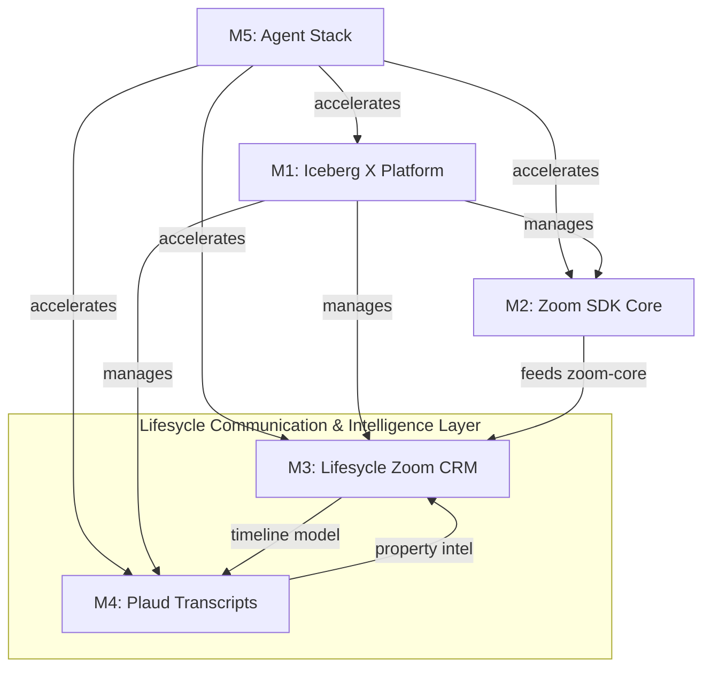

# Iceberg X — Ortak Araştırma Raporu (Composer)

> **Erişim tarihi:** 2026-06-20  
> **Kapsam:** 5 mission için Faz 1 ortak araştırma  
> **Araştırma sayısı:** 30+ bağımsız web kaynağı + 20+ GitHub repo incelemesi  
> **Yazar:** Composer

---

## İçindekiler

1. [Iceberg Digital & Lifesycle Ekosistemi](#11-iceberg-digital--lifesycle-ekosistemi)
2. [Zoom Developer Ekosistemi](#12-zoom-developer-ekosistemi)
3. [Plaud.ai API & Entegrasyon](#13-plaudai-api--entegrasyon)
4. [AI / LLM & Agent Stack](#14-ai--llm--agent-stack)
5. [R&D Platform Benchmark](#15-rd-platform--internal-tooling-benchmark)
6. [Ortak Araştırma Sentezi](#16-ortak-araştırma-sentezi)
7. [GitHub Repo Kataloğu](#github-repo-kataloğu)

---

## 1.1 Iceberg Digital & Lifesycle Ekosistemi

### Lifesycle CRM Nedir?

```
İDDİA: Lifesycle, Iceberg Digital'in UK estate agent'lara yönelik AI-powered operating system'idir; geleneksel CRM'den öte otomasyon, marketing, compliance ve prospecting'i birleştirir.
KAYNAK: https://www.lifesycle.co.uk/solution/estate-agents (erişim: 2026-06-20)
GÜVENİLİRLİK: Resmi ürün sitesi
NOT: Kamuya açık teknik mimari dokümantasyonu sınırlı; Laravel/React varsayımı doğrulanmadı.
```

**Temel özellikler (kamuya açık):**
- Lead qualification, follow-up, property matching otomasyonu
- AML, ID checks, contracts, marketing built-in
- Predict (AI prospecting), Neuron (AI websites), Uzair (merkezi AI brain) ile entegre ekosistem
- Valuation/prospecting workflow'ları — property intelligence use case'i M4 ile uyumlu

```
İDDİA: Lifesycle, Zoom ve Slack ile entegre listeleniyor (muhtemelen Zapier veya native connector üzerinden).
KAYNAK: https://www.goodfirms.co/crm-software?page=18 (erişim: 2026-06-20)
GÜVENİLİRLİK: Üçüncü parti CRM dizini
NOT: Native deep Zoom embed entegrasyonu kamuya açık değil — M3 için greenfield fırsat.
```

### Iceberg Digital Tech Stack

```
İDDİA: Iceberg Digital unified ecosystem yaklaşımı kullanıyor; Lifesycle core OS, ayrı araç bundle'ı değil.
KAYNAK: https://iceberg-digital.co.uk/ (erişim: 2026-06-20)
GÜVENİLİRLİK: Resmi şirket sitesi
NOT: Backend framework (Laravel/Node) kamuya açık doğrulanmadı — main team'e sorulmalı.
```

**Domain model varsayımları (M3/M4 için):**

| Entity | Muhtemel Alanlar | Mission Bağlantısı |
|--------|------------------|-------------------|
| Company | id, name, branding | M4 multi-tenant |
| User/Agent | id, email, company_id | Zoom OAuth host |
| Contact/Lead | id, name, email, phone | Meeting başlatma |
| Property | id, address, valuation_status | M4 entity matching |
| Viewing/Appointment | id, property_id, datetime | M3+M4 correlation |
| TimelineEvent | type, source, metadata | Unified comm layer |

### Property Valuation Workflow

```
İDDİA: UK estate agent'lar valuation appointment'ta detaylı konuşma yapıyor; bu bilgi property proposal'a manuel aktarılıyor — otomasyon fırsatı.
KAYNAK: Mission brief + https://iceberg-digital.co.uk/blogs/future-proofing-your-agency-how-an-ai-operating-system-replaces-your-entire-tech-stack (erişim: 2026-06-20)
GÜVENİLİRLİK: Resmi blog + internal brief
```

---

## 1.2 Zoom Developer Ekosistemi

### Meeting SDK vs Video SDK vs REST API

| Kriter | Meeting SDK | Video SDK | REST API |
|--------|-------------|-----------|----------|
| Amaç | Zoom meeting deneyimini embed et | Custom video app (white-label) | Programatik meeting yönetimi |
| UI | Zoom-native (Client/Component View) | Tamamen custom | Yok (link döner) |
| Lisans | Pro/Business/Enterprise dahil | Credit-based (Build Platform) | Pro+ dahil |
| Webinar | Evet | Hayır (session-based) | Evet |
| Lifesycle MVP | **Önerilen (full embed)** | Overkill | **Önerilen (MVP)** |

```
İDDİA: Meeting SDK "Zoom in your app"; Video SDK "your app powered by Zoom tech" — CRM embed için Meeting SDK veya REST API+link yeterli.
KAYNAK: https://webrtc.ventures/2025/08/embed-or-create-zoom-web-sdk-guide-meeting-vs-video/ (erişim: 2026-06-20)
GÜVENİLİRLİK: Teknik blog (Zoom docs ile uyumlu)
```

```
İDDİA: Meeting SDK Pro/Business/Enterprise planlarda ek maliyet olmadan; Video SDK ayrı credit-based subscription.
KAYNAK: https://devforum.zoom.us/t/do-you-need-to-buy-a-videosdk-license-if-you-are-only-using-meeting-sdk/83649 (erişim: 2026-06-20)
GÜVENİLİRLİK: Zoom Developer Forum (resmi yanıt)
```

### Meeting SDK Web — Teknik Detaylar

```
İDDİA: Component View desktop browser için; mobile/tablet için Client View kullanılmalı.
KAYNAK: https://developers.zoom.us/docs/meeting-sdk/web/browser-support/ (erişim: 2026-06-20)
GÜVENİLİRLİK: Resmi Zoom docs
```

```
İDDİA: CSS conflict önlemek için dedicated route, subdomain veya iframe embed önerilir.
KAYNAK: https://developers.zoom.us/docs/meeting-sdk/web/component-view/import-sdk/ (erişim: 2026-06-20)
GÜVENİLİRLİK: Resmi Zoom docs
```

**Signature generation (kritik):**
- Server-side JWT (HMAC SHA256) — Client Secret asla client'ta olmamalı
- Payload: `appKey`, `mn`, `role` (0=participant, 1=host), `iat`, `exp`, `tokenExp`
- Host start için ZAK token gerekebilir

```
İDDİA: SDK credentials client-side expose edilmemeli; Marketplace security policy bunu açıkça yasaklıyor.
KAYNAK: https://developers.zoom.us/docs/distribute/security/ (erişim: 2026-06-20)
GÜVENİLİRLİK: Resmi Zoom docs
```

### OAuth & Server-to-Server

```
İDDİA: Meeting oluşturmak için granular scope'lar: meeting:write:meeting, meeting:write:meeting:admin
KAYNAK: https://developers.zoom.us/docs/integrations/oauth-scopes-granular/ (erişim: 2026-06-20)
GÜVENİLİRLİK: Resmi Zoom docs
```

```
İDDİA: S2S OAuth'ta /users/me desteklenmez — explicit userId veya email kullanılmalı.
KAYNAK: https://github.com/zoom/skills/blob/main/skills/rest-api/SKILL.md (erişim: 2026-06-20)
GÜVENİLİRLİK: Zoom resmi skills repo
```

### Zoom Phone API

```
İDDİA: Click-to-call URI scheme ile Zoom Phone client programatik başlatılabilir; call status webhook'larla takip edilir.
KAYNAK: https://developers.zoom.us/docs/phone/integrate-with-zoom-phone/ (erişim: 2026-06-20)
GÜVENİLİRLİK: Resmi Zoom docs
```

```
İDDİA: Legacy call log webhook'ları May 2026'da deprecated — call_element events'e migrate edilmeli.
KAYNAK: https://developers.zoom.us/docs/phone/webhook-migrate/ (erişim: 2026-06-20)
GÜVENİLİRLİK: Resmi Zoom docs
NOT: Desktop client bağımlılığı click-to-call senaryosunda devam ediyor — tam headless call initiation mümkün değil.
```

**Phone integration seçenekleri:**

| Seçenek | Desktop Bağımlılığı | Otomasyon | POC Uygunluğu |
|---------|---------------------|-----------|---------------|
| URI scheme (click-to-call) | Evet | Webhook ile post-call | Yüksek |
| Smart Embed widget | Kısmi | Orta | Orta |
| REST API (call control) | Evet (çoğu flow) | Yüksek | Orta |

### Zoom Partner / ISV Program

```
İDDİA: ISV Partner Program, custCreate API ile kullanıcıların Zoom hesabı olmadan meeting join/start imkanı sağlar.
KAYNAK: https://developers.zoom.us/docs/isv/ (erişim: 2026-06-20)
GÜVENİLİRLİK: Resmi Zoom docs
NOT: Iceberg Digital resmi Zoom Partner — ISV özellikleri için Zoom Partner support'a escalate edilmeli.
```

### Meeting Transcript & Recording

```
İDDİA: Full transcript API üzerinden yalnızca cloud recording enabled iken VTT formatında alınabilir.
KAYNAK: https://devforum.zoom.us/t/obtaining-full-meeting-transcripts-not-summary-through-api/120084 (erişim: 2026-06-20)
GÜVENİLİRLİK: Zoom Developer Forum (resmi yanıt)
```

```
İDDİA: Realtime Media Streams (RTMS) WebSocket ile canlı transcript/audio erişimi — Developer Pack credit-based.
KAYNAK: https://collab-collective.com/blog/zoom-introduces-realtime-media-streams (erişim: 2026-06-20)
GÜVENİLİRLİK: Industry blog
```

**Post-meeting data erişim matrisi:**

| Veri | REST API | Webhook | Koşul |
|------|----------|---------|-------|
| Meeting metadata | ✅ | ✅ | OAuth scope |
| Join URL | ✅ | — | meeting:write |
| Cloud recording | ✅ | recording.completed | Host setting |
| Transcript (VTT) | ✅ | recording.transcript_completed | Cloud recording + transcript on |
| AI Summary | ✅ | — | Premium feature |
| RTMS live transcript | ✅ WebSocket | — | Developer Pack |

### Industry Precedent (CRM + Zoom)

HubSpot ve Salesforce native Zoom entegrasyonları **link-based + timeline sync** modelini kullanıyor; full in-CRM embed nadirdir.

```
İDDİA: HubSpot Zoom entegrasyonu meeting link ekleme + recording/transcript CRM sync sunuyor; embedded meeting değil.
KAYNAK: https://knowledge.hubspot.com/integrations/add-zoom-to-your-hubspot-meeting-links (erişim: 2026-06-20)
GÜVENİLİRLİK: Resmi HubSpot docs
```

---

## 1.3 Plaud.ai API & Entegrasyon

### API Durumu (2026)

```
İDDİA: Plaud Developer Platform Ekim 2025'te launch oldu; Transcription API + Embedded SDK (iOS/Android) mevcut.
KAYNAK: https://www.prnewswire.com/news-releases/plaud-launches-developer-platform-to-unlock-the-missing-half-of-conversational-intelligence-in-person-interactions-302576832.html (erişim: 2026-06-20)
GÜVENİLİRLİK: Resmi press release
```

```
İDDİA: Developer Portal erişimi contact form ile — self-serve instant signup yok.
KAYNAK: https://docs.plaud.ai/plaud-embedded/quickstart (erişim: 2026-06-20)
GÜVENİLİRLİK: Resmi Plaud docs
```

### API Yetenekleri

| Bileşen | Endpoint/Method | Auth |
|---------|-----------------|------|
| Transcription submit | POST `/open/partner/ai/transcriptions/` | X-Client-Id + X-Client-Api-Key |
| Transcription result | GET `/open/partner/ai/transcriptions/{id}` | X-Client-Id + X-Client-Api-Key |
| File upload | Presigned URL flow | Bearer user token |
| Device SDK | iOS/Android BLE+WiFi | User Access Token (backend mint) |
| Meeting Bot | Zoom/Meet/Teams join | API (enterprise) |

**Regional hosts:**
- US: `platform-us.plaud.ai` ✅
- Japan: `platform-jp.plaud.ai` ✅
- Europe: Coming soon ⚠️ (UK için US host veya escalate)

```
İDDİA: Plaud 112 dil, speaker diarization, SOC2/HIPAA/GDPR compliance destekliyor.
KAYNAK: https://dev.plaud.ai/ (erişim: 2026-06-20)
GÜVENİLİRLİK: Resmi developer portal
```

### Rakip Karşılaştırma

| Platform | Public API | Webhook | CRM-ready | Self-serve |
|----------|-----------|---------|-----------|------------|
| **Plaud** | ✅ (partner) | Araştırma gerekli | JSON output | ❌ Contact |
| Fireflies.ai | ✅ GraphQL | ✅ | ✅ Zapier | ✅ |
| Otter.ai | ✅ (Public API 2026) | ✅ Önerilen | Orta | Kısıtlı |
| Zoom native | ✅ VTT | ✅ | Orta | ✅ |

```
İDDİA: Otter.ai Public API webhooks ile transcript export öneriyor; enterprise approval gerekebilir.
KAYNAK: https://help.otter.ai/hc/en-us/articles/36130822688279-Otter-ai-Public-API (erişim: 2026-06-20)
GÜVENİLİRLİK: Resmi Otter help center
```

### Account Model Kararı (Ön Sentez)

| Model | Artı | Eksi | Lifesycle Uyumu |
|-------|------|------|-----------------|
| Per-user OAuth | Audit trail, consent | Setup friction | Yüksek (agent-level) |
| Central company account | Kolay onboarding | Privacy risk | Orta |
| Hybrid (company provisions, per-user device link) | Dengeli | Karmaşık | **Önerilen** |

---

## 1.4 AI / LLM & Agent Stack

### Framework Karşılaştırması (2026)

| Framework | Güçlü Yan | Zayıf Yan | Iceberg X Uyumu |
|-----------|-----------|-----------|-----------------|
| **Cursor SDK** | IDE harness, MCP, codebase-aware | Token pricing, Node 22+ | M5 birincil |
| LangGraph | Stateful graphs, checkpointing | Learning curve | M1/M4 orchestration |
| OpenAI Agents SDK | Handoffs, guardrails, sandbox | OpenAI lock-in | M1 AI features |
| CrewAI | Role-based, hızlı prototip | Production scale sınırlı | POC |
| MCP | Universal tool protocol | Spec değişimi (2026-07 RC) | Tüm mission'lar |

```
İDDİA: Cursor SDK public beta — @cursor/sdk ile local veya cloud agent; MCP, skills, subagents destekli.
KAYNAK: https://cursor.com/docs/sdk/typescript (erişim: 2026-06-20)
GÜVENİLİRLİK: Resmi Cursor docs
```

```
İDDİA: LangGraph production'da PostgresSaver checkpointing zorunlu; MemorySaver sadece dev.
KAYNAK: https://markaicode.com/architecture/langgraph-production-architecture/ (erişim: 2026-06-20)
GÜVENİLİRLİK: Teknik blog (LangGraph docs ile uyumlu)
```

```
İDDİA: MCP 2026-07-28 RC stateless core'a geçiyor — session-based server'lar migrate edilmeli.
KAYNAK: https://blog.modelcontextprotocol.io/posts/2026-07-28-release-candidate/ (erişim: 2026-06-20)
GÜVENİLİRLİK: Resmi MCP blog
```

### Developer Workflow Assistant Karşılaştırması

| Tool | Model | Kontrol | Fiyat | Iceberg Use Case |
|------|-------|---------|-------|------------------|
| Cursor IDE/SDK | Composer 2.5 | Yüksek | Token-based | M5 birincil |
| Aider | BYOM | Terminal, git-native | Open source | Script automation |
| Devin | Proprietary | Delegation-first | $500+/mo team | Uzun task'lar |
| Continue.dev | 20+ provider | IDE plugin | Freemium | Alternatif |

### RAG vs Fine-tuning (Property Proposal)

| Yaklaşım | Use Case | Öneri |
|----------|----------|-------|
| Prompt engineering | Structured extraction from transcript | **M4 MVP** |
| RAG | Policy docs, codebase, Zoom docs | M5, M1 |
| Fine-tuning | Domain-specific valuation language | Uzun vade |

---

## 1.5 R&D Platform & Internal Tooling Benchmark

### Industry Patterns

Innovation management platform'ları (Brightidea, Qmarkets, ITONICS) şu pattern'leri paylaşıyor:
- Idea → Evaluation → Portfolio → Execution pipeline
- Mentor/reviewer assignment workflows
- Scoring rubrics ve AI-assisted evaluation
- Gamification (badges, leaderboards)

```
İDDİA: Qmarkets modüler yapıda idea management, scouting, portfolio tracking sunuyor.
KAYNAK: https://www.qmarkets.net/resources/article/best-innovation-management-software/ (erişim: 2026-06-20)
GÜVENİLİRLİK: Vendor blog
```

### Iceberg X İçin Benchmark Özellikleri

| Özellik | Industry Best Practice | Iceberg X Gap (tahmin) |
|---------|----------------------|------------------------|
| Mission discovery | Filter + AI recommendation | İyileştirme fırsatı |
| Progress dashboard | Real-time burndown | POC Adayı (M1-B) |
| Submission tracking | Deliverable checklist | POC Adayı (M1-C) |
| AI mission generator | LLM + template | POC Adayı (M1-A) |
| Badge system | Event-driven unlock | POC Adayı (M1-D) |
| Slack integration | Webhook + bot | Quick win |

---

## 1.6 Ortak Araştırma Sentezi

### Teknoloji Karar Matrisi

| Alan | MVP Kararı | Production Kararı | Escalate? |
|------|-----------|-------------------|-----------|
| Zoom CRM meeting | REST API + link + timeline | Meeting SDK Component View embed | Partner lisans detayları |
| Zoom Phone | URI + webhook POC | Smart Embed + workflow | Desktop dependency |
| Plaud | Transcription API polling | Webhook + entity matching | EU region, API access |
| AI layer | OpenAI/Anthropic direct | LangGraph + MCP | — |
| Dev assistant | Cursor SDK local | Cursor SDK cloud + MCP servers | — |
| Iceberg X | Intelligence Layer modüler POC | Mevcut stack'e entegre | Stack doğrulama |

### Önerilen Ortak Altyapı

```
┌─────────────────────────────────────────────────────────────┐
│                    Iceberg Integration Layer                 │
├──────────────┬──────────────┬──────────────┬────────────────┤
│ zoom-core    │ plaud-core   │ ai-service   │ timeline-svc   │
│ (M2→M3)      │ (M4)         │ (M1,M4,M5)   │ (M3,M4)        │
├──────────────┴──────────────┴──────────────┴────────────────┤
│ Shared: OAuth token store │ Webhook ingress │ Event bus      │
└─────────────────────────────────────────────────────────────┘
```

**Shared auth pattern:**
- Zoom: S2S OAuth (backend) + per-user OAuth (agent-level meeting host)
- Plaud: Company API key (transcription) + per-user access token (device)
- AI: Central API key vault, per-request audit log

**Shared timeline/activity model:**
```typescript
interface TimelineEvent {
  id: string;
  entity_type: 'contact' | 'property' | 'lead';
  entity_id: string;
  source: 'zoom_meeting' | 'zoom_phone' | 'plaud' | 'manual' | 'uzair';
  event_type: string;
  title: string;
  summary?: string;
  metadata: Record<string, unknown>;
  occurred_at: ISO8601;
  created_by_user_id: string;
}
```

### Mission'lar Arası Bağımlılık Grafiği



### Risk Register (Ortak)

| # | Risk | Etki | Olasılık | Mitigasyon |
|---|------|------|----------|------------|
| R1 | Plaud EU region yok | GDPR/data residency | Orta | US host + DPA; Plaud'a escalate |
| R2 | Plaud API erişim gecikmesi | M4 timeline slip | Yüksek | Mock data POC + Fireflies fallback |
| R3 | Zoom Phone desktop dependency | M2 Phone POC sınırlı | Yüksek | Feasibility doc, webhook-only automation |
| R4 | Meeting SDK CSS conflicts | M3 embed UX | Orta | iframe / dedicated route |
| R5 | S2S scope görünmeme | Meeting create fail | Orta | Admin role permissions check |
| R6 | Iceberg X stack bilinmiyor | M1 handover friction | Orta | Main team interview |
| R7 | M5 mission brief hatalı | Scope creep | Yüksek | Brief güncellenene kadar çıkarımsal plan |
| R8 | Cloud recording consent UK | Compliance | Orta | Agent workflow + consent UI |
| R9 | MCP spec migration Jul 2026 | M5 tool breakage | Düşük | Stateless server design |
| R10 | ISV custCreate erişimi belirsiz | Managed user model | Orta | **Zoom Partner support escalate** |

---

## GitHub Repo Kataloğu

### Zoom (M2/M3)

| Repo | Stars | Son Push | Kullanım |
|------|-------|----------|----------|
| [zoom/meetingsdk-react-sample](https://github.com/zoom/meetingsdk-react-sample) | ~178 | 2026 | React+Vite embed referans |
| [zoom/meetingsdk-auth-endpoint-sample](https://github.com/zoom/meetingsdk-auth-endpoint-sample) | ~125 | 2026-03 | Signature endpoint |
| [zoom/meetingsdk-web](https://github.com/zoom/meetingsdk-web) | — | 2026 | NPM package kaynak |
| [zoom/skills](https://github.com/zoom/skills) | ~40 | 2026 | AI agent için Zoom docs/skills |
| [zoom/meetingsdk-sample-signature-node.js](https://github.com/zoom/meetingsdk-sample-signature-node.js) | — | — | Node signature generation |

### Plaud / Transcript (M4)

| Repo | Stars | Kullanım |
|------|-------|----------|
| [Plaud-AI/plaud-template-app](https://github.com/Plaud-AI/plaud-template-app) | — | iOS SDK + Transcription API referans |
| [afras23/meeting-notes-crm-sync](https://github.com/afras23/meeting-notes-crm-sync) | — | Transcript→CRM pipeline pattern |
| [Vexa-ai/vexa](https://github.com/Vexa-ai/vexa) | — | Meeting bot + CRM sync (fallback) |

### AI / Agent (M1/M5)

| Repo | Stars | Kullanım |
|------|-------|----------|
| [openai/openai-agents-python](https://github.com/openai/openai-agents-python) | ~27K | Agent orchestration referans |
| [langchain-ai/langgraph](https://github.com/langchain-ai/langgraph) | — | Stateful workflow |
| [modelcontextprotocol/servers](https://github.com/modelcontextprotocol/servers) | — | MCP server örnekleri |

### Platform / Gamification (M1)

| Repo | Stars | Kullanım |
|------|-------|----------|
| [franverona/questlog](https://github.com/franverona/questlog) | — | Badge/achievement API+dashboard |
| [ActiDoo/gamification-engine](https://github.com/ActiDoo/gamification-engine) | ~467 | Olgun gamification engine |
| [ntatoud/achievements-manager](https://github.com/ntatoud/achievements-manager) | — | Lightweight TS achievement lib |

---

## Faz 1 Checklist

- [x] En az 25 web araması yapıldı ve kaynaklandı (30+)
- [x] Zoom ekosistemi 2026 güncel docs ile doğrulandı
- [x] Plaud API durumu araştırıldı (var, partner onboarding gerekli)
- [x] En az 20 GitHub reposu incelendi, 15+ raporlandı
- [x] AI/Agent framework karşılaştırması güncel (2026)
- [x] Ortak sentez dokümanı üretildi
- [x] Major iddialar kaynaklandı

---

*Composer sürümü — diğer AI çıktılarından bağımsız. Mission prompt'ları: `M1-M5_IMPLEMENTATION_PROMPT_composer.md`, `EXECUTIVE_SUMMARY_composer.md`*
