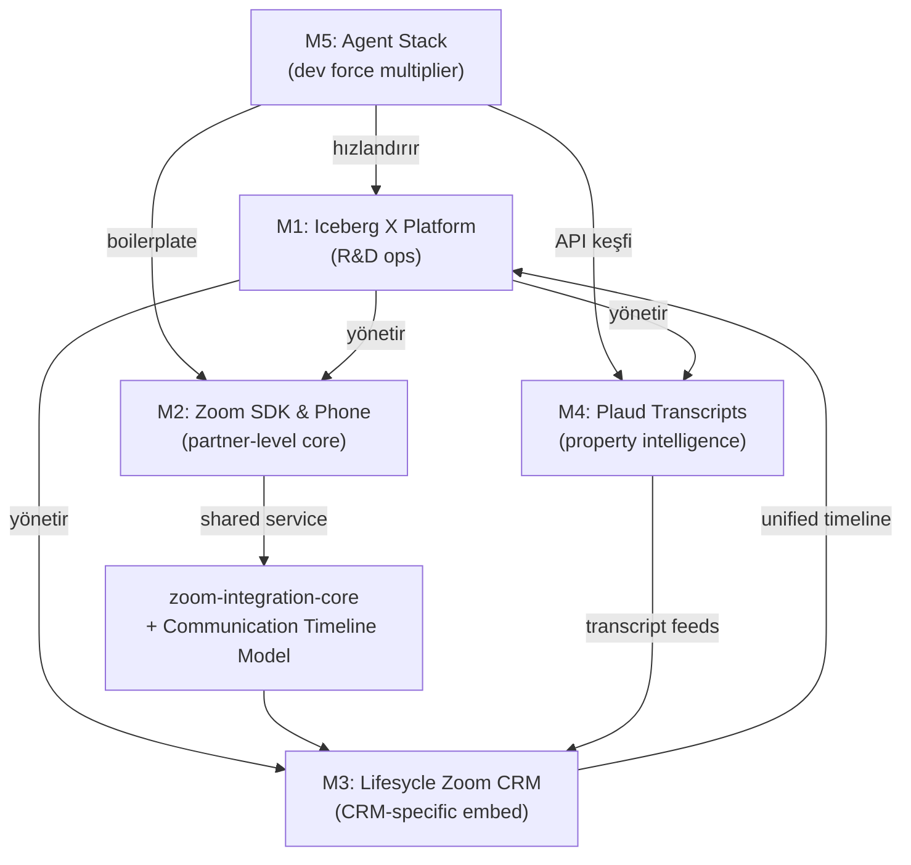

# Iceberg X — Ortak Araştırma Raporu (SHARED RESEARCH REPORT)

> **Hazırlanma tarihi:** 2026-06-20
> **Kapsam:** 5 mission için ortak Faz 1 araştırması (Zoom, Plaud, AI/Agent, Lifesycle, R&D platform)
> **Referans:** `MISSIONS_OVERVIEW.md`, `RESEARCH_AND_PLANNING_PROMPT.md`
> **Not:** Tüm teknik iddialar aşağıdaki kaynak URL'leri ile desteklenmiştir; erişim tarihi 2026-06-20.

---

## 0. Yönetici Özeti (Ortak Bulgular)

Beş mission'ın tamamı tek bir stratejik vizyon altında birleşiyor: **Lifesycle Communication & Intelligence Layer**. Araştırma şu kritik sonuçları ortaya koydu:

1. **Zoom tarafı güçlü ve net.** Meeting SDK (web embed), Video SDK (white-label) ve REST API olgun ve dokümante. Server-to-Server OAuth ile meeting create/transcript retrieval mümkün. **Ancak Zoom Phone'da sunucu taraflı outbound call API'si YOK** — sadece URI scheme / Smart Embed (click-to-call) var ve Zoom client bağımlılığı sürüyor. Bu, M2'nin en önemli kırmızı çizgisi.
2. **Plaud'da çift gerçeklik var.** Yeni bir **Plaud Developer Platform** (Plaud Embedded SDK + Transcription API) çıkmış; ancak bu, **kendi cihazlarınızı kendi uygulamanıza bağlamak** içindir. **Mevcut bir Plaud hesabından veri çekmek için resmi developer API'si 2026-06 itibarıyla HENÜZ açık değil** (bekleme listesi var). Topluluk çözümleri (plaud-mcp, plaud-connector) consumer API üzerinden çalışıyor ve resmi destekli değil. M4'ün fallback planı bu yüzden zorunlu.
3. **AI/Agent ekosistemi handover'a hazır.** Cursor CLI (`agent -p` headless) + Cursor SDK (`@cursor/sdk`), MCP (Linux Foundation standardı), structured outputs (OpenAI/Anthropic) — hepsi production pattern'lerine ulaşmış. M5 için sağlam temel mevcut.
4. **Lifesycle = AI-native estate agent OS.** Iceberg Digital ekosistemi 4 parçadan oluşuyor: **Lifesycle** (CRM core), **Predict** (prospecting), **Neuron** (AI web), **Uzair** (merkezi AI beyin). Bu, M1/M3/M4'ün domain modelini şekillendiriyor: tek contact profili (Buyer/Vendor/Landlord/Land), valuation opportunity detection.
5. **R&D platform benchmark'ı net trend gösteriyor:** 2026'da iç platformlar **AI-native + MCP server + self-hosted** olarak kurgulanıyor (OpenPraxis, Zagrosi, OpenPR, Specivo). M1 için yön bu.

---

## 1. Iceberg Digital & Lifesycle Ekosistemi

### 1.1 Bulgular

**İDDİA:** Lifesycle, estate agent'lar için geleneksel CRM'i tamamen değiştiren bir AI işletim sistemidir; lead qualification, follow-up, property matching, buyer/vendor journey, compliance (AML, ID check) ve task management'ı otomatikleştirir.
**KAYNAK:** https://www.lifesycle.co.uk/solution/estate-agents (2026-06-20)
**GÜVENİLİRLİK:** Resmi ürün sitesi.

**İDDİA:** Iceberg AI Operating System dört bileşenden oluşur: **Lifesycle** (CRM/otomasyon/marketing/compliance çekirdeği), **Predict** (AI prospecting & yeni listing fırsat tespiti), **Neuron** (her ziyaretçiye kişiselleştirilen AI-optimize web siteleri + LLM keşfedilebilirliği), **Uzair** (içerik, istatistik, insight, iletişim için merkezi AI beyin).
**KAYNAK:** https://iceberg-digital.co.uk/ (2026-06-20)
**GÜVENİLİRLİK:** Resmi şirket sitesi.

**İDDİA:** Lifesycle her contact için **tek profil** tutar ve kişinin Buyer / Vendor / Landlord / Land (veya kombinasyonu) olduğunu işaretler. Portal'dan buyer olarak gelen bir kişi otomatik kalifiye edilip "potansiyel vendor" olarak da etiketlenebilir.
**KAYNAK:** https://iceberg-digital.co.uk/blogs/what-is-the-proactive-function-in-lifesycle-that-points-your-team-in-the-right-direction (2026-06-20)
**GÜVENİLİRLİK:** Resmi blog.

**İDDİA:** Valuation fırsatları; geçmiş appraisal'lar, web sitesi/içerik etkileşimi, satılık mülkü olan buyer davranışları, market hareketi ve rakip listinglerin analiziyle otomatik yüzeye çıkarılır. Portal enquiry'leri doğrudan Lifesycle'a çekilir; otomatik email/SMS ile ek bilgi toplanır.
**KAYNAK:** https://iceberg-digital.co.uk/blogs/how-to-set-your-company-up-to-work-smart-with-leads-in-lifesycle-for-maximum-productivity (2026-06-20)
**GÜVENİLİRLİK:** Resmi blog.

### 1.2 Mission'lara Etkisi

- **M3/M4 domain modeli:** Contact (multi-role), Property, Valuation/Appointment, Timeline. Plaud transcript ve Zoom meeting aynı Contact/Property timeline'ına bağlanmalı.
- **M1:** Iceberg X, bu ürün kültürünün (AI core value) iç R&D yansımasıdır — AI-assisted özellikler beklenen standarttır.
- **Bilinmeyen (Araştırma gerekli):** Lifesycle'ın public API'si veya webhook'ları kamuya açık dokümante DEĞİL. Gerçek entity şeması, auth modeli ve timeline event yapısı **main dev team'den** alınmalı. POC'lerde domain modeli varsayımsal kurgulanmalı.

---

## 2. Zoom Developer Ekosistemi (M2 + M3 Ortak)

### 2.1 Meeting SDK vs Video SDK vs REST API

| Boyut | Meeting SDK | Video SDK | REST API |
|-------|-------------|-----------|----------|
| Amaç | Zoom'un tanıdık meeting deneyimini app'e gömme | Tamamen custom, white-label video ürünü | Backend'den meeting yönetimi (create/update/delete) |
| UI | Zoom native UI (tam re-skin edilemez) | Tamamen senin UI'ın, Zoom görünmez | UI yok (saf API) |
| Model | Host'lu, scheduled meeting; önceden create gerekir | Session/room-based, ad-hoc, host yok, önceden create gerekmez | — |
| Lisans | Zoom Workplace plan / ISV anlaşması | Build Platform credits ($100/$450 aylık taban) | Hesap planına bağlı |
| Web görünümleri | Client View (Zoom client'a benzer) + Component View (modüler) | UI Toolkit (low-code React) veya tam custom | — |
| Tipik kullanım | Telehealth, CRM içi meeting embed | Tüketici RTC, live commerce, eğitim | Otomasyon, scheduling, bot |

**İDDİA:** "Son kullanıcı Zoom kullandığını bilmeli" ise Meeting SDK; "Zoom görünmez altyapı olsun" ise Video SDK seçilir.
**KAYNAK:** https://trtc.io/blog/details/zoom-video-sdk-pricing-2026 (2026-06-20) ; https://devforum.zoom.us/t/video-sdk-or-meeting-sdk/118180 (2026-06-20)
**GÜVENİLİRLİK:** Üçüncü taraf analiz + resmi Zoom forum yanıtı.
**NOT:** Lifesycle (M3) use case'i için **Meeting SDK önerilir** — agent'lar Zoom meeting'i CRM içinde tanıdık biçimde görmeli, host modeli ve scheduling gerekiyor.

### 2.2 Meeting SDK for Web — Embed & Customization Limitleri

**İDDİA:** Web Component View **sınırlı** customization sunar; tam UI overhaul desteklenmez. CSS ile stillemek mümkün ama SDK'da stabil/unique ID-class olmadığı için kırılgandır ve her major güncellemede yeniden test gerekir. `viewSizes` (default/ribbon/popper) ile boyut/konum ayarlanabilir.
**KAYNAK:** https://devforum.zoom.us/t/customization-of-ui-for-web-client-sdk/50634 (2026-06-20) ; https://developers.zoom.us/docs/meeting-sdk/web/component-view/resizing/ (2026-06-20)
**GÜVENİLİRLİK:** Resmi docs + forum.

**İDDİA:** CSS çakışmalarını önlemek için Zoom, SDK'yı **ayrı route / subdomain / iframe** içinde izole etmeyi şiddetle önerir (Tailwind/Bootstrap/MUI gibi reset'ler SDK'yı bozabilir). En güçlü izolasyon: dedicated route veya subdomain.
**KAYNAK:** https://developers.zoom.us/docs/meeting-sdk/web/component-view/import-sdk/ (2026-06-20)
**GÜVENİLİRLİK:** Resmi docs.

### 2.3 Auth: Server-to-Server OAuth & Signature

**İDDİA:** Meeting create için `POST /v2/users/me/meetings`; gerekli granular scope `meeting:write:meeting` (kendi user) veya `meeting:write:meeting:admin` (hesaptaki herhangi bir user). Klasik scope karşılığı `meeting:write` / `meeting:write:admin`. S2S OAuth token ömrü 1 saat; user OAuth refresh token 15 yıl.
**KAYNAK:** https://developers.zoom.us/docs/integrations/oauth-scopes-granular/ ; https://github.com/zoom/skills/blob/main/skills/rest-api/concepts/authentication-flows.md (2026-06-20)
**GÜVENİLİRLİK:** Resmi docs + Zoom resmi skills repo.

**İDDİA:** Meeting SDK'ya join için backend bir **SDK JWT (signature)** üretmelidir: header+payload, Client Secret ile HMAC-SHA256 imzalanır. Hazır referans: `zoom/meetingsdk-auth-endpoint-sample` (Node/Express). Başka kullanıcı adına başlatmak için **ZAK** token gerekir.
**KAYNAK:** https://godevelopers.zoom.us/docs/meeting-sdk/auth/ ; https://github.com/zoom/meetingsdk-auth-endpoint-sample/ (2026-06-20)
**GÜVENİLİRLİK:** Resmi docs + resmi sample repo.

### 2.4 Post-Meeting: Recording & Transcript

**İDDİA:** Cloud recording varsa: `GET /meetings/{meetingId}/recordings` → `recording_files` içinde `file_type = TRANSCRIPT` olan dosyanın `download_url`'i OAuth Bearer ile indirilir. Webhook: `recording.completed` / `recording.transcript_completed`.
**KAYNAK:** https://developers.zoom.us/docs/api/meetings/ ; https://www.nylas.com/blog/how-to-transcribe-a-zoom-meeting/ (2026-06-20)
**GÜVENİLİRLİK:** Resmi docs + üçüncü taraf rehber.

**İDDİA:** Cloud recording YOKSA ama AI Companion transcript varsa: `GET /meetings/{meetingUUID}/transcript` kullanılır. **Kritik:** scheduled UUID değil, **past meeting instance UUID** gerekir (`GET /past_meetings/{meetingId}/instances` veya `meeting.ended` webhook'tan alınır). Ayrıca hesapta "Allow meeting hosts to retain and access meeting transcripts" ayarı açık olmalı. UUID `/` içeriyorsa double URL-encode.
**KAYNAK:** https://devforum.zoom.us/t/unable-to-access-ai-companion-transcripts-from-api-using-meetings-encoded-uuid-transcript/136510 (2026-06-20)
**GÜVENİLİRLİK:** Resmi forum (Zoom staff onaylı).

### 2.5 Zoom Phone — KRİTİK LİMİTASYON

**İDDİA:** Zoom Phone, Twilio gibi programlanabilir bir ses platformu **DEĞİLDİR**. Sunucu taraflı outbound call başlatan bir REST endpoint **yoktur** (`/phone/callout` mevcut değil). Tek yollar: (1) **URI scheme** (`zoomphonecall://`, `tel:`, `callto:`) — Zoom client'ı açar; (2) **Smart Embed** (web iframe, `zp-make-call` postMessage ile click-to-call). Her iki yol da **Zoom client/desktop veya Smart Embed iframe bağımlılığı** taşır.
**KAYNAK:** https://devforum.zoom.us/t/how-to-make-an-outbound-call-via-zoom-api/132115 ; https://devforum.zoom.us/t/place-outbound-phone-calls-via-api-without-zoom-desktop-client/93294 ; https://developers.zoom.us/docs/phone/outbound-call/ (2026-06-20)
**GÜVENİLİRLİK:** Resmi forum (Zoom staff) + resmi docs.

**İDDİA:** Call durumu için webhook'lar / Smart Embed event'leri mevcut: `phone.caller_call_log_completed`, ve Smart Embed `zp-call-ringing-event`, `zp-call-connected-event`, `zp-call-ended-event`, `zp-call-recording-completed-event`. Yani "call bitince workflow tetikleme" event tarafında **mümkün**.
**KAYNAK:** https://developers.zoom.us/docs/phone/smart-embed-guide/ (2026-06-20)
**GÜVENİLİRLİK:** Resmi docs.

**SONUÇ (Phone):** "Missed call → WhatsApp follow-up" gibi **event-driven** senaryolar mümkün; "tamamen client'sız programatik arama" mümkün değil → **Zoom Partner support'a escalate** edilecek konu.

### 2.6 GitHub Referansları (Zoom)

1. **zoom/meetingsdk-auth-endpoint-sample** — https://github.com/zoom/meetingsdk-auth-endpoint-sample — Node/Express, SDK JWT signature üretir. → M2/M3 backend'in temeli, doğrudan fork'lanabilir.
2. **zoom/meetingsdk-react-sample** — https://github.com/zoom/meetingsdk-react-sample — Vite React, Client + Component View. → M3 frontend embed iskeleti.
3. **zoom/meetingsdk-web-sample** — https://github.com/zoom/meetingsdk-web-sample — CDN/Local/Components üç yaklaşım. → Embed pattern karşılaştırması.
4. **zoom/meetingsdk-web** — https://github.com/zoom/meetingsdk-web — `@zoom/meetingsdk` npm paketi, WebAssembly. → Üretim bağımlılığı.
5. **zoom/webhook-sample** — https://github.com/zoom/webhook-sample — Webhook handling (recording.completed, meeting.ended). → M3/M4 post-meeting pipeline.
6. **zoom/skills** — https://github.com/zoom/skills — Zoom resmi "skills" repo'su (REST, OAuth, recording pipeline örnekleri). → Referans/dokümantasyon.

---

## 3. Plaud.ai API & Transcript Ingestion (M4)

### 3.1 Plaud Developer Platform — Yeni ama Dikkatli Okunmalı

**İDDİA:** Plaud'un bir **Developer Platform**'u vardır: **Plaud Embedded** (cihaz SDK + Transcription API) ve **Plaud MCP & CLI** (kişisel veriye agent erişimi). Embedded; kendi mobil uygulamana Plaud cihazlarını bağlamak ve Plaud'un ASR modelini kullanmak içindir — "Plaud senin uygulamanın altyapısı olur".
**KAYNAK:** https://docs.plaud.ai/overview ; https://docs.plaud.ai/plaud-embedded/overview (2026-06-20)
**GÜVENİLİRLİK:** Resmi developer docs.

**İDDİA:** Transcription API region-bazlı host kullanır: US `platform-us.plaud.ai/developer/api` (aktif), Japan aktif, EU/Singapore "coming soon". Akış: audio upload (presigned S3) → `POST /open/partner/ai/transcriptions/` → 3 sn'de bir `GET /open/partner/ai/transcriptions/{id}` poll (`task_status == COMPLETED`). Auth: `X-Client-Id` + `X-Client-Api-Key` (transcription), Bearer user token (upload).
**KAYNAK:** https://github.com/Plaud-AI/plaud-template-app ; https://docs.plaud.ai/plaud-embedded/quickstart (2026-06-20)
**GÜVENİLİRLİK:** Resmi SDK template repo + docs.

**İDDİA:** Webhook'lar mevcut: `transcription.completed` ve `transcription.failed`. Payload `transcription_id`, `file_id`, `language`, `duration`, `word_count` içerir; sonra `GET .../transcriptions/{transcription_id}` ile tam transcript çekilir. İmza doğrulama: `plaud-signature` + `plaud-timestamp` header (HMAC-SHA256). **Beta'da webhook UI yok — endpoint/secret için account manager ile kayıt gerekiyor;** device event'leri (sync/connect/recording) Beta'da gönderilmiyor, sadece transcription event'leri aktif.
**KAYNAK:** https://plaud.mintlify.app/documentation/embedded_sdk/webhooks (2026-06-20)
**GÜVENİLİRLİK:** Resmi docs.

### 3.2 KRİTİK: Mevcut Plaud Hesabından Veri Çekme Henüz Açık Değil

**İDDİA:** "Mevcut Plaud hesabımdan developer platform üzerinden veri çekebilir miyim?" sorusuna Plaud'un resmi yanıtı: **"Şu an için hayır."** Developer Platform, Plaud mobil/web uygulaması dışında **custom çözümler kurmak** içindir; mevcut hesap verisini çekmek isteyenler için "application API" geldiğinde bildirim almak üzere survey doldurulması isteniyor.
**KAYNAK:** https://uk.plaud.ai/pages/developer-platform (2026-06-20)
**GÜVENİLİRLİK:** Resmi ürün sitesi SSS.
**NOT:** Bu, M4'ün en kritik bulgusudur. Iceberg'in valuation senaryosu "agent kendi Plaud'una kaydeder → özet Lifesycle'a akar" diyorsa, **resmi yol şu an kısıtlı**. İki seçenek: (a) Plaud Embedded ile kullanıcı cihazlarını Iceberg uygulamasına bağlamak (ciddi entegrasyon, mobil app gerektirir), (b) topluluk/consumer API çözümleri (resmi destekli değil, kırılgan, ToS riski).

### 3.3 Topluluk Çözümleri (Fallback / Hızlı POC)

**İDDİA:** Topluluk araçları consumer API (`api.plaud.ai`) üzerinden login → list → transcript/summary çekiyor: `plaud-mcp` (MCP server, Claude vb.), `plaud-connector` (33 MCP tool, CLI + dev client), Plaud resmi `@plaud-ai/mcp` npm paketi. Plaud CLI komutları: `plaud login/files/transcript <id>/summary <id>/audio <id>`.
**KAYNAK:** https://github.com/charathram/plaud-mcp ; https://github.com/rggnkmp/plaud-connector ; https://support.plaud.ai/hc/en-us/articles/57751026815257-Plaud-CLI (2026-06-20)
**GÜVENİLİRLİK:** Topluluk (MIT) + resmi CLI support sayfası.
**NOT:** POC'de hızlı sonuç için kullanılabilir; production'da resmi developer platform veya official application API beklenmelidir.

### 3.4 GitHub Referansları (Plaud)

1. **Plaud-AI/plaud-template-app** — https://github.com/Plaud-AI/plaud-template-app — Resmi starter app (upload → submit → poll). → M4 Embedded yolu iskeleti.
2. **charathram/plaud-mcp** — https://github.com/charathram/plaud-mcp — MCP server (list, transcript, summary, export). → Hızlı POC / AI entegrasyon.
3. **rggnkmp/plaud-connector** — https://github.com/rggnkmp/plaud-connector — 33 MCP tool, CLI + dev client (`platform.plaud.ai` OAuth). → En kapsamlı topluluk referansı.
4. **goldenmatch (entity resolution)** — https://github.com/benseverndev-oss/goldenmatch — transcript→property eşleştirme için (bkz. §4.4).
5. **Plaud webhooks docs** — https://plaud.mintlify.app/documentation/embedded_sdk/webhooks — webhook imza doğrulama referansı.

---

## 4. AI / LLM & Agent Stack (M1 + M4 + M5 Ortak)

### 4.1 Cursor Agent CLI & SDK (M5 çekirdeği)

**İDDİA:** Cursor headless otomasyon iki yolla sunar: **Cursor CLI** (`agent -p "..."` print/non-interactive, `--force`/`--yolo` ile dosya yazma, `--output-format json|stream-json`, `CURSOR_API_KEY`) ve **Cursor SDK** (`npm install @cursor/sdk`, TypeScript; `Agent.create()` ile `local` veya `cloud` runtime; cloud çalışmalar Cursor Agents Window'da görünür). CLI; `.cursor/rules`, `mcp.json` ve worktree (`-w`) destekler.
**KAYNAK:** https://cursor.com/docs/cli/headless ; https://cursor.com/docs/cli/using ; https://cursor.com/blog/typescript-sdk (2026-06-20)
**GÜVENİLİRLİK:** Resmi Cursor docs + blog.

### 4.2 AI Coding Agent Karşılaştırması (2026)

| Araç | Kategori | Fiyat | Güçlü Yön |
|------|----------|-------|-----------|
| Claude Code | Terminal/CLI | ~$20+/ay | Reasoning, büyük codebase refactor, agentic loop |
| Cursor | IDE (kendi fork) | $20/ay | En iyi IDE UX, file-aware edit, CLI+SDK |
| Codex CLI | Terminal/cloud | $20+/ay | OpenAI-native, async cloud task |
| GitHub Copilot | IDE plugin | $10/ay | GitHub-native PR/review akışı |
| Devin | Cloud/autonomous | $500+/ay (uçtan uca) | "Ticket-in, PR-out" tam otonom |
| Aider / Cline / OpenCode | Terminal/OSS | Ücretsiz + API | BYOM, git-native, maliyet/gizlilik |

**İDDİA:** 2026'da deneyimli geliştiriciler ortalama 2.3 araç kullanıyor; tipik stack = IDE agent (Cursor) + terminal agent (Claude Code). Tek "en iyi" yok; workflow'a göre seçilir.
**KAYNAK:** https://jobsbyculture.com/blog/ai-coding-agents-compared-2026 ; https://www.zbuild.io/resources/news/best-ai-for-coding-2026-complete-ranking (2026-06-20)
**GÜVENİLİRLİK:** Üçüncü taraf karşılaştırma (çoklu kaynak).

### 4.3 MCP (Model Context Protocol)

**İDDİA:** MCP, LLM uygulamaları (client) ile dış araç/veri kaynakları (server) arasında standart bir arayüzdür ("AI için USB"). 2024 sonu Anthropic, 2026 Mart Linux Foundation'a geçti (vendor-neutral). Resmi SDK'lar: TypeScript, Python, Java, Kotlin, C#, Rust, Go. Production pattern: **MCP gateway** (auth, RBAC, rate limit, observability). Cursor/VS Code/JetBrains MCP destekler; resmi registry mevcut.
**KAYNAK:** https://www.paolochignoli.it/blog/mcp-model-context-protocol-production-guide ; https://github.com/modelcontextprotocol/servers (87k+ star) (2026-06-20)
**GÜVENİLİRLİK:** Üçüncü taraf production rehberi + resmi repo.

### 4.4 Structured Extraction & Entity Resolution

**İDDİA:** LLM'den güvenilir yapılandırılmış veri için 2026 standardı **constrained decoding / Structured Outputs**: OpenAI `client.beta.chat.completions.parse` + Pydantic/Zod + `strict:true`; Anthropic `output_config.format` (JSON schema, GA early 2026); tool/function calling + `tool_choice` zorlaması. Üretim kuralı: generation sonrası **Pydantic/Zod validate** + hata mesajını geri besleyen "healing retry".
**KAYNAK:** https://niteagent.com/blog/2026-06-04-structured-outputs-across-providers/ ; https://techsy.io/en/blog/llm-structured-outputs-guide (2026-06-20)
**GÜVENİLİRLİK:** Üçüncü taraf production rehberleri (çoklu).

**İDDİA:** Entity resolution / fuzzy matching için olgun açık kaynak: **Splink** (probabilistik, Fellegi-Sunter, DuckDB/Spark — ölçeklenebilir varsayılan), **Zingg** (ML, Spark), **dedupe** (Python, human-trained), **goldenmatch** (polyglot Python+TS, zero-config, LLM boost, MCP), **RecordLinkage** (basit ama 2023'ten beri bakımsız).
**KAYNAK:** https://tilores.io/content/best-open-source-entity-resolution-and-record-linkage-libraries-splink-zingg-dedupe-and-when-to-move-beyond-them ; https://github.com/benseverndev-oss/goldenmatch (2026-06-20)
**GÜVENİLİRLİK:** Üçüncü taraf benchmark + repo.

### 4.5 GitHub Referansları (AI/Agent)

1. **modelcontextprotocol/servers** — https://github.com/modelcontextprotocol/servers — 87k+ star, referans MCP server'lar. → M5 tool entegrasyonu.
2. **@cursor/sdk** — https://cursor.com/blog/typescript-sdk — Programatik agent. → M5 orchestration.
3. **benseverndev-oss/goldenmatch** — https://github.com/benseverndev-oss/goldenmatch — Entity resolution. → M4 matching.
4. **moj-analytical-services/splink** (Splink) — probabilistik record linkage. → M4 ölçeklenebilir matching.
5. **cyanheads/model-context-protocol-resources** — https://github.com/cyanheads/model-context-protocol-resources — MCP server geliştirme rehberi. → M5 referans.

---

## 5. Internal R&D / Innovation Platform Benchmark (M1)

**İDDİA:** 2026'da iç R&D/proje yönetim platformları **AI-native + MCP server + self-hosted** olarak kurgulanıyor. Örnekler: **OpenPraxis** (spec→product→manifest→task DAG, agent dispatch + audit + cost tracking), **Zagrosi** (PM + issue + incident, first-party MCP, Rust+React+Postgres RLS), **OpenPR** (PM + governance/voting + AI agent + 34 MCP tool), **Specivo** (tracker + wiki + hybrid search pgvector + 38 MCP tool), **KANAP** (IT governance + native AI agent "Plaid").
**KAYNAK:** https://github.com/k8nstantin/OpenPraxis ; https://github.com/zagrosi-code/zagrosi ; https://github.com/openprx/openpr ; https://github.com/specivo/specivo (2026-06-20)
**GÜVENİLİRLİK:** GitHub repo'ları (aktif 2026).

**Çıkarım (M1):** Iceberg X için trend net — sadece dashboard değil, **AI-native + her aksiyonun audit/searchable olduğu, agent'ların içeride çalıştığı** bir platform. M5 (Agent Stack) ile doğal kesişim: missionlar agent'larla yönetilebilir.

### 5.1 GitHub Referansları (R&D Platform)

1. **k8nstantin/OpenPraxis** — DAG execution + agent audit + cost. → AI mission generator + evaluation mimarisi ilhamı.
2. **zagrosi-code/zagrosi** — AI-native PM + MCP + Slack/Teams bridge. → Iceberg X + Slack entegrasyon pattern.
3. **openprx/openpr** — governance + AI review + 34 MCP tool. → Mentor review / project evaluation.
4. **specivo/specivo** — wiki + semantic search (pgvector). → Submission/deliverable arama + RAG.
5. **kanap-it/KANAP** — governed AI agent over internal data. → Uzair-benzeri merkezi AI yaklaşımı.

---

## 6. Teknoloji Karar Matrisi (Ortak)

| Alan | Karar | Gerekçe |
|------|-------|---------|
| Zoom embed (M3) | **Meeting SDK (Web, Component View)** | CRM içi tanıdık deneyim, host/scheduling; izolasyon için dedicated route |
| Zoom auth | **Server-to-Server OAuth** (backend) + SDK JWT (join) | Backend automation; user friction yok |
| Zoom Phone (M2) | **Smart Embed (click-to-call) + webhook event** | Server-side outbound API yok; event-driven workflow mümkün |
| Zoom transcript | **Recordings API (cloud) + AI Companion transcript (instance UUID)** | İki yol da dokümante |
| Plaud (M4) | **Birincil: resmi API beklenir; POC: topluluk MCP/connector + mock data** | Resmi "pull from account" henüz yok |
| AI extraction | **OpenAI/Anthropic structured outputs + Pydantic/Zod validate** | Üretim güvenilirliği |
| Entity matching (M4) | **Splink (ölçek) veya goldenmatch (hızlı/JS)** | Olgun, açık kaynak |
| Agent stack (M5) | **Cursor CLI/SDK + MCP servers + RAG** | Iceberg stack'e ve mevcut workflow'a uygun |
| Platform (M1) | **AI-native modüler + (ops.) MCP** | 2026 trendi, Iceberg AI kültürüne uygun |

---

## 7. Mission'lar Arası Bağımlılık Grafiği

---

## 8. Risk Register (Ortak)

| # | Risk | Etki | Olasılık | Mitigasyon |
|---|------|------|----------|------------|
| R1 | Zoom Phone server-side outbound API yok | M2 kapsamı daralır | Kesin | Smart Embed + webhook'a pivot; Partner'a escalate |
| R2 | Plaud "pull from account" API'si yok | M4 ana akış riskli | Yüksek | Mock data POC + Embedded SDK PoC; resmi API beklemeye al |
| R3 | Lifesycle iç API/şema kamuya kapalı | M3/M4 entegrasyon belirsiz | Yüksek | Domain varsayımları + main dev team ile netleştirme |
| R4 | Zoom Meeting SDK customization kırılgan (CSS) | M3 UX cilası | Orta | Component View + izolasyon; aşırı re-skin'den kaçın |
| R5 | Zoom lisans/maliyet (Video SDK credits, ISV) | Bütçe | Orta | Meeting SDK + mevcut Workplace plan; maliyet analizi |
| R6 | GDPR/consent (transcript, recording) | Yasal | Yüksek | Consent UI, data retention politikası, audit log |
| R7 | AI extraction hatası → yanlış property auto-fill | Veri kalitesi | Orta | Structured outputs + validate + human-in-the-loop review |
| R8 | Partner SDK özel erişim gereksinimleri | Gecikme | Orta | Zoom Partner support escalation listesi |

---

## 9. Önerilen Ortak Altyapı

- **Shared auth pattern:** Zoom S2S OAuth token servisi + SDK JWT signature endpoint (tek `zoom-integration-core` mikroservisi; M2 ve M3 paylaşır).
- **Shared Communication Timeline Model:** `TimelineEvent { id, contactId, propertyId?, type(zoom_meeting|plaud_transcript|note|call), source, occurredAt, payload, aiSummary? }` — Zoom meeting + Plaud transcript + manual note aynı modelde.
- **Shared AI service layer:** Structured-output tabanlı extraction servisi (OpenAI/Anthropic) + validation + review queue; M1 (mission gen/eval), M4 (transcript extraction), M5 (dev tasks) ortak kullanır.
- **Shared integration service pattern:** webhook ingest → normalize → match → review → apply (M4 ve M3 post-meeting ortak).

---

## 10. Faz 1 Kalite Kontrol

- [x] Zoom ekosistemi 2026 güncel docs ile doğrulandı (Meeting/Video SDK, REST, Phone, transcript)
- [x] Plaud API durumu net belirtildi (Developer Platform var; mevcut hesap pull henüz yok)
- [x] 20+ GitHub reposu incelendi, en iyileri raporlandı (Zoom, Plaud, MCP, entity resolution, R&D platform)
- [x] AI/Agent framework karşılaştırması güncel (2026)
- [x] Lifesycle/Iceberg ekosistemi (Lifesycle/Predict/Neuron/Uzair) doğrulandı
- [x] Ortak sentez (karar matrisi, bağımlılık grafiği, risk register) üretildi
- [x] Major iddialar kaynaklı

> Sonraki adım: `M1`–`M5` implementation prompt'ları ve `EXECUTIVE_SUMMARY_opus.md`.
